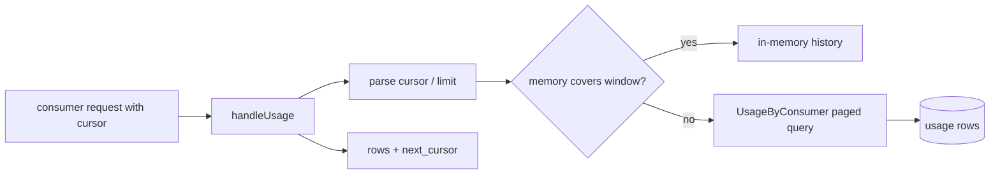
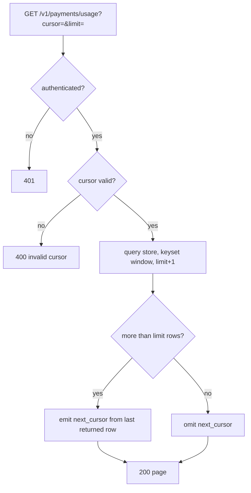

# ORP-030: Usage history pagination

> Last updated: 2026-09-25 · commit `b6f9574ed`

Darkbloom's usage history is hard-capped at the last 100 rows with no way to page deeper. Part of the OpenRouter-perspective review; see the [review index](../README.md).

## What

Darkbloom's `GET /v1/payments/usage` returns at most 100 rows: the in-memory history is capped at `usageHistoryLimit` = 100 (`coordinator/payments/payments.go`) and the Postgres fallback `UsageByConsumer` carries a fixed `LIMIT 100` (`coordinator/store/postgres.go`). There is no cursor, offset, or continuation token on the handler (`coordinator/api/consumer.go`, `handleUsage`). OpenRouter's usage and generation surfaces page over an account's full history (OpenRouter API reference, https://openrouter.ai/docs/api-reference/overview).

## Why

Any account with more than 100 lifetime requests loses auditability of older spend. The first charge a consumer ever made is unreachable through the API, so totals computed client-side from the usage list silently exclude history and disagree with the balance.

## Prompt

Add cursor pagination to `GET /v1/payments/usage`. Goal: the endpoint accepts `cursor` and `limit` query parameters, returns rows newest-first, and includes a `next_cursor` field when more rows exist; the cursor encodes `(timestamp, job_id)` so pagination is stable under concurrent writes and does not drift on duplicate timestamps. Constraints: (1) page from the durable store (`UsageByConsumer` in `coordinator/store/postgres.go`), not the 100-entry in-memory cache — the in-memory history stays as the fast path for the first page only if it can answer the exact window requested; (2) default `limit` stays 100, max 1000, out-of-range values clamp rather than error; (3) cursors are opaque to clients (base64 of the key pair) and invalid cursors return 400; (4) ordering is deterministic: `ORDER BY created_at DESC, job_id DESC`; (5) response shape is backward compatible — existing fields unchanged, pagination fields additive. Files to touch: `coordinator/api/consumer.go` (`handleUsage`), `coordinator/store/interface.go` and `coordinator/store/postgres.go` (paged query), `coordinator/api/types/types.go` (response envelope), plus tests. Acceptance criteria: a client can page through an account's full usage history in deterministic order with no gaps or duplicates across pages; an account with ≤100 rows gets `next_cursor` omitted.

## Workflow

1. Read `handleUsage` in `coordinator/api/consumer.go` and `UsageByConsumer` in `coordinator/store/postgres.go`.
2. Design the cursor as base64 of `(created_at, job_id)`; write encode/decode helpers with tests.
3. Add a paged variant of the store query: `WHERE (created_at, job_id) < ($cursor)` with `ORDER BY created_at DESC, job_id DESC LIMIT n+1` to detect a next page.
4. Decide the in-memory path: serve page one from memory only when it provably covers the window, otherwise fall through to the store.
5. Extend the response envelope in `coordinator/api/types/types.go` with `next_cursor`.
6. Parse and validate `cursor`/`limit` in `handleUsage`.
7. Add tests: multi-page traversal over a 250-row fixture, duplicate timestamps, invalid cursor 400, clamped limit.
8. Run `make coordinator-test`.

## Loop

Run `make coordinator-test` (or `go test ./coordinator/api/... ./coordinator/store/...` while iterating). Check: a 250-row fixture pages to exhaustion with every row seen exactly once; two rows sharing a timestamp do not break the cursor; page one from the memory path matches page one from Postgres. Definition of done: tests green and a full-history client walk returns a count matching the store row count.

## Graph

## Layout

- Modify `coordinator/api/consumer.go` — cursor and limit parsing in `handleUsage`.
- Modify `coordinator/store/postgres.go` — paged `UsageByConsumer` query.
- Modify `coordinator/store/interface.go` — store method signature.
- Modify `coordinator/api/types/types.go` — `next_cursor` on the usage response.
- Add tests in `coordinator/api` and `coordinator/store`.
- No UI surface.

## Flow

Severity: medium · Effort: S
