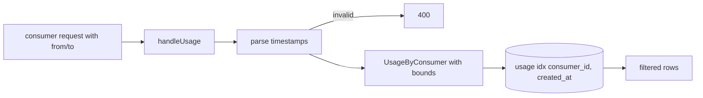
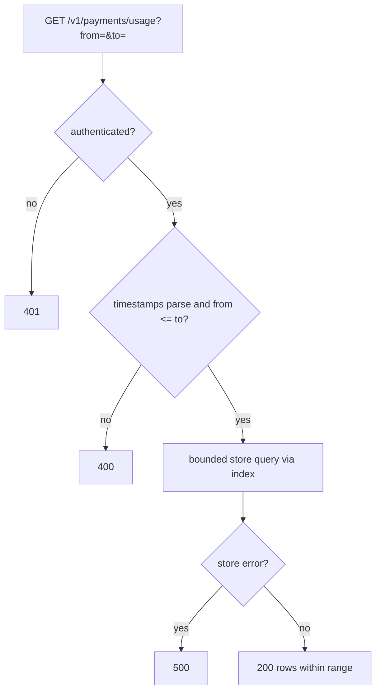

# ORP-031: Usage date-range filters

> Last updated: 2026-09-25 · commit `b6f9574ed`

Darkbloom's usage endpoint returns a fixed recent window with no way to ask for a specific date range. Part of the OpenRouter-perspective review; see the [review index](../README.md).

## What

`GET /v1/payments/usage` accepts no `from`/`to` parameters (`coordinator/api/consumer.go`, `handleUsage`); the only window is "the last 100 rows" enforced by `usageHistoryLimit` (`coordinator/payments/payments.go`) and the `LIMIT 100` in `UsageByConsumer` (`coordinator/store/postgres.go`). OpenRouter's usage and activity surfaces filter by date range (OpenRouter API reference, https://openrouter.ai/docs/api-reference/overview).

## Why

Monthly accounting exports — "everything I spent in August" — require fetching the whole available history and filtering client-side, and anything beyond the 100-row cap cannot be reached even then. Finance workflows that run per calendar month have no API support.

## Prompt

Add `from` and `to` query parameters to `GET /v1/payments/usage`, backed by a database index. Goal: `from` and `to` are RFC 3339 timestamps (date-only `YYYY-MM-DD` accepted and interpreted as UTC day bounds); the store query applies `created_at >= from AND created_at < to`; results compose with the pagination from ORP-030 if present. Constraints: (1) add a composite index on the usage table keyed `(consumer_id, created_at)` (migration alongside `coordinator/store/postgres.go`) so filtered queries do not seq-scan; (2) the in-memory path applies the same filter, or the handler always uses the store when a filter is present — pick one and test it; (3) `from > to` returns 400; unparseable timestamps return 400 with a clear message; (4) filters combine with the existing per-account scoping only — no cross-account access; (5) default behavior with no parameters is unchanged. Files to touch: `coordinator/api/consumer.go` (`handleUsage`), `coordinator/store/postgres.go` (query + migration), `coordinator/store/interface.go` (method signature), plus tests. Acceptance criteria: a range query returns exactly the rows whose timestamps fall inside the bounds; boundary inclusivity matches the spec (inclusive `from`, exclusive `to`); the migration adds the index; invalid ranges return 400.

## Workflow

1. Read `handleUsage` in `coordinator/api/consumer.go` and the `UsageByConsumer` query in `coordinator/store/postgres.go`.
2. Write the migration adding `CREATE INDEX ... ON usage (consumer_id, created_at)` following the repo's existing migration pattern.
3. Extend the store method to accept optional `from`/`to` bounds.
4. Add timestamp parsing to `handleUsage`: accept RFC 3339 and date-only forms, reject anything else with 400.
5. Apply the filter on the in-memory path or bypass it when filtered.
6. Add tests: exact-boundary rows, `from > to`, date-only parsing, index presence in the migrated schema.
7. Run `make coordinator-test`.

## Loop

Run `make coordinator-test` (or `go test ./coordinator/api/... ./coordinator/store/...` while iterating). Check with a fixture spanning several months: a one-month window returns exactly that month's rows; boundaries are inclusive-exclusive as specified; `EXPLAIN` on the filtered query uses the new index. Definition of done: tests green and a monthly export workflow fetches one bounded query per month.

## Graph

## Layout

- Modify `coordinator/api/consumer.go` — `from`/`to` parsing in `handleUsage`.
- Modify `coordinator/store/postgres.go` — bounded query plus index migration.
- Modify `coordinator/store/interface.go` — method signature.
- Add tests in `coordinator/api` and `coordinator/store`.
- No UI surface.

## Flow

Severity: low · Effort: S
