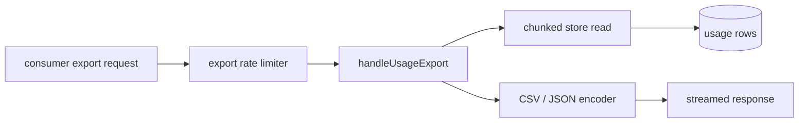
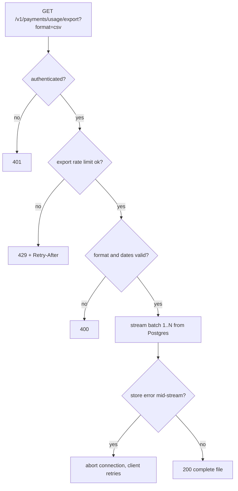

# ORP-032: Usage export endpoint (CSV/JSON)

> Last updated: 2026-09-25 · commit `b6f9574ed`

Darkbloom has no way for a consumer to export their usage history as a file. Part of the OpenRouter-perspective review; see the [review index](../README.md).

## What

The only consumer-facing usage surface is `GET /v1/payments/usage`, returning a JSON list capped at 100 rows (`coordinator/api/consumer.go`, `handleUsage`; cap at `coordinator/payments/payments.go`, `usageHistoryLimit`). There is no bulk export. OpenRouter's activity surface supports exporting full history (OpenRouter API reference, https://openrouter.ai/docs/api-reference/overview). Darkbloom's data exists in Postgres — the durable usage rows behind `UsageByConsumer` (`coordinator/store/postgres.go`) — but reaching beyond 100 rows requires admin SQL access.

## Why

Finance teams need ledger exports for bookkeeping, tax, and cost attribution. Today they would need someone with database access to run SQL by hand, which does not scale and puts account data in front of operators unnecessarily.

## Prompt

Add `GET /v1/payments/usage/export?format=csv&from=&to=` streaming the caller's usage history from Postgres. Goal: `format=csv` (default) streams a CSV with columns `job_id, model, prompt_tokens, completion_tokens, cost_micro_usd, timestamp`; `format=json` streams a JSON array or newline-delimited JSON with the same fields; `from`/`to` follow the parsing rules of ORP-031 and default to all time. Constraints: (1) read exclusively from the durable store (`coordinator/store/postgres.go`) — never the 100-row in-memory cache (`coordinator/payments/payments.go`); (2) stream the response — use a server-side cursor or keyset-chunked reads and flush per chunk, never load the full history into memory; (3) set `Content-Type: text/csv` and `Content-Disposition: attachment` for CSV; (4) strict per-account scoping on every chunk; (5) export is rate-limited more strictly than normal reads (export of a large history is expensive) — reuse the existing ratelimit package (`coordinator/ratelimit/`); (6) CSV fields containing commas or quotes are escaped per RFC 4180. Files to touch: `coordinator/api/consumer.go` (new handler), `coordinator/api/server.go` (route), `coordinator/store/postgres.go` (streaming/chunked query), `coordinator/ratelimit/` (export limiter), plus tests. Acceptance criteria: an account with 10,000 usage rows exports all of them in one request without a memory spike; CSV round-trips through a standard parser; the in-memory store absence of the endpoint returns 501 or the memory store implements the same read.

## Workflow

1. Read `handleUsage` in `coordinator/api/consumer.go` for auth and row shape.
2. Add a chunked store read: keyset-paginated batches of (created_at, job_id) over the caller's rows, honoring `from`/`to`.
3. Write the CSV writer: header line, per-row encoding, RFC 4180 escaping, flush every batch.
4. Add the handler `handleUsageExport` with format negotiation and date parsing.
5. Wire `GET /v1/payments/usage/export` in `coordinator/api/server.go` with the stricter rate limit.
6. Handle the memory store: either implement the chunked read or return a documented error.
7. Add tests: 10,000-row export completeness, CSV escaping, format negotiation, rate-limit rejection, cross-account isolation.
8. Run `make coordinator-test`.

## Loop

Run `make coordinator-test` (or `go test ./coordinator/api/... ./coordinator/store/...` while iterating). Check: exported row count equals store row count for a large fixture; memory usage stays flat during export (test with a capped allocator or measure batch sizes); the rate limiter rejects a burst of export requests. Definition of done: a finance workflow downloads a full-history CSV in one authenticated request.

## Graph

## Layout

- Modify `coordinator/api/consumer.go` — add `handleUsageExport`.
- Modify `coordinator/api/server.go` — wire the route.
- Modify `coordinator/store/postgres.go` — chunked history read.
- Modify `coordinator/ratelimit/` — export-specific limit.
- Add tests in `coordinator/api` and `coordinator/store`.
- No UI surface.

## Flow

Severity: low · Effort: M
