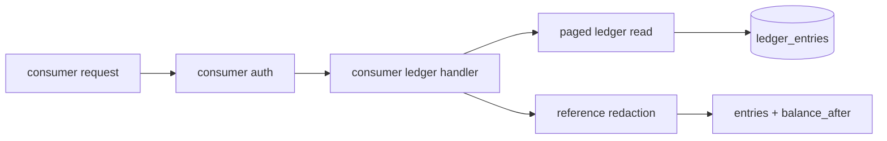
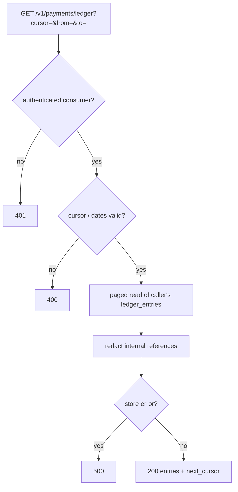

# ORP-033: Consumer ledger-history endpoint

> Last updated: 2026-09-25 · commit `b6f9574ed`

Darkbloom's ledger is the authoritative money trail but only providers can read their own slice of it; consumers have no ledger view. Part of the OpenRouter-perspective review; see the [review index](../README.md).

## What

Every balance change is recorded in `ledger_entries(account_id, entry_type, amount_micro_usd, balance_after, reference, created_at)` with 14 `LedgerEntryType` values (`coordinator/store/interface.go`), and the credit primitives write through it (`coordinator/store/postgres.go`, `Credit`/`CreditWithdrawable`/`CreditWithdrawableOnce`). A read endpoint exists — `handleLedgerHistory` (`coordinator/api/consumer.go`) — but it is wired for the provider wallet path only. A consumer can see their current balance (`handleBalance`) but not the sequence of deposits, reservation settlements, refunds, promo credits, and referral rewards that produced it. OpenRouter exposes credit history on its credits surface (OpenRouter API reference, https://openrouter.ai/docs/api-reference/get-credits).

## Why

Balance changes without a visible trail erode trust in a prepaid system. When a reservation settles for less than the held amount and the difference is refunded, the consumer sees their balance go down then partially back up with no explanation; a visible ledger turns that into two labeled entries.

## Prompt

Expose a consumer-scoped, read-only ledger history endpoint. Goal: `GET /v1/payments/ledger` returns the authenticated consumer's ledger entries newest-first — `{entry_type, amount_micro_usd, balance_after, reference, created_at}` — with the same cursor pagination as ORP-030 and the same optional `from`/`to` filters as ORP-031. Constraints: (1) reuse the existing store read behind `handleLedgerHistory` (`coordinator/api/consumer.go`) but scope it to the consumer's account via the consumer auth middleware, not the provider-wallet path; (2) entry types are surfaced as-is — the 14 `LedgerEntryType` values are already the public vocabulary of money movement and need no renaming; (3) the response includes `balance_after` per entry so clients can replay the balance forward and verify it against `handleBalance`; (4) references that embed internal identifiers (provider serials, Stripe IDs) are filtered or redacted to the consumer-safe portion; (5) no write surface — this endpoint never mutates the ledger. Files to touch: `coordinator/api/consumer.go` (handler), `coordinator/api/server.go` (route wiring for the consumer scope), `coordinator/store/interface.go` and `coordinator/store/postgres.go` (paged read if not already present), plus tests. Acceptance criteria: a consumer's ledger view replays to exactly the balance returned by `handleBalance`; entries include deposits, settlements, refunds, and grants with correct signs; pagination and date filters compose.

## Workflow

1. Read `handleLedgerHistory` in `coordinator/api/consumer.go` to see the existing provider-wallet wiring and the store read it uses.
2. Add a consumer-scoped handler that resolves the caller's account from consumer auth.
3. Wire `GET /v1/payments/ledger` in `coordinator/api/server.go` under the consumer auth middleware.
4. Add cursor pagination to the store read, keyed `(created_at, entry id)` to match ORP-030.
5. Audit the `reference` field for internal identifiers and redact as needed.
6. Add tests: replay-to-balance invariant over a mixed fixture, pagination, redaction, cross-account isolation.
7. Run `make coordinator-test`.

## Loop

Run `make coordinator-test` (or `go test ./coordinator/api/... ./coordinator/store/...` while iterating). Check: summing a fixture's entries in order reproduces each `balance_after`; the final `balance_after` equals `handleBalance`'s balance; no entry leaks a provider serial or payment-processor identifier. Definition of done: a consumer can explain every balance movement from API data alone.

## Graph

## Layout

- Modify `coordinator/api/consumer.go` — consumer-scoped ledger handler alongside `handleLedgerHistory`.
- Modify `coordinator/api/server.go` — wire `GET /v1/payments/ledger` under consumer auth.
- Modify `coordinator/store/interface.go`, `coordinator/store/postgres.go` — paged consumer ledger read.
- Add tests in `coordinator/api` and `coordinator/store`.
- No UI surface.

## Flow

Severity: low · Effort: S
