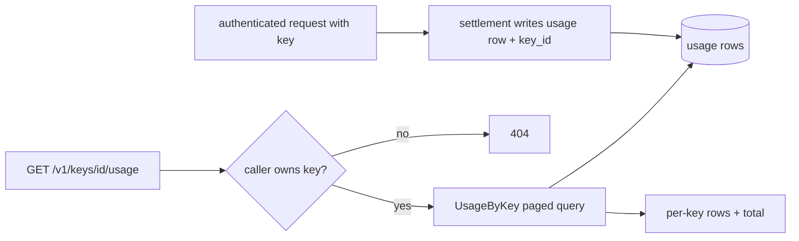
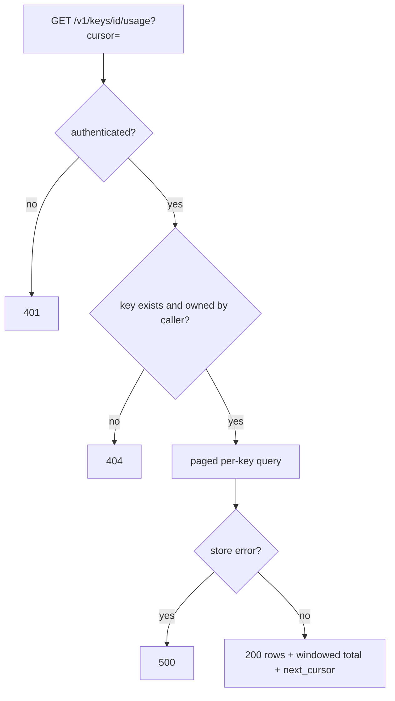

# ORP-034: Per-key usage history endpoint

> Last updated: 2026-09-25 · commit `b6f9574ed`

Darkbloom computes per-key spend for cap enforcement but exposes no per-key usage history. Part of the OpenRouter-perspective review; see the [review index](../README.md).

## What

When listing API keys, Darkbloom computes per-key `UsageUSD`, `LimitUSD`, and `RemainingUSD` via `store.KeySpendSince` (`coordinator/api/apikey_handlers.go`, `apiKeyToResponse`) — a windowed aggregate used for cap enforcement. There is no endpoint that lists the individual usage rows attributed to a specific key. OpenRouter's key surface reports per-key usage with daily/weekly/monthly windows (OpenRouter API reference, https://openrouter.ai/docs/api-reference/overview).

## Why

Teams issuing one key per environment — production, staging, CI — cannot attribute spend per environment beyond a single aggregate number. When a key's cap trips, there is no way to see which requests consumed it.

## Prompt

Add `GET /v1/keys/{id}/usage` returning the usage rows attributed to one API key. Goal: the response lists per-request rows — job ID, model, token counts, cost, timestamp — filtered to requests made with the specified key, with the same cursor pagination as ORP-030 and optional `from`/`to` as ORP-031. Constraints: (1) the usage rows must carry key attribution — if the usage write path does not currently record which key made the request, add a `key_id` column (migration alongside `coordinator/store/postgres.go`) and populate it at settlement; this is the bulk of the work; (2) the caller must own the key — a key ID belonging to another account returns 404; (3) deleted keys retain their history (rows are attributed by key ID, not by join to the live key record); (4) reuse the aggregate `KeySpendSince` path for a summary header (`total_micro_usd` over the window) so the history and the cap math can never disagree; (5) response excludes provider identity as in ORP-029. Files to touch: `coordinator/api/apikey_handlers.go` (new handler), `coordinator/api/server.go` (route), `coordinator/store/interface.go` and `coordinator/store/postgres.go` (key_id column, migration, paged per-key query), the usage write path in `coordinator/payments/payments.go` or the settlement path (`coordinator/api/provider.go`, `handleCompleteAt`) to record the key, plus tests. Acceptance criteria: requests made under two different keys appear only under their own key's history; per-key totals equal `KeySpendSince` over the same window; history survives key deletion.

## Workflow

1. Read `apiKeyToResponse` and `KeySpendSince` in `coordinator/api/apikey_handlers.go` and the store to confirm how key attribution is currently computed for caps.
2. Trace the usage-row write path (`handleCompleteAt` in `coordinator/api/provider.go` and the payments layer) to find where the authenticated key is known.
3. Add a `key_id` column to the usage table with a migration; backfill is not required (null for pre-migration rows).
4. Thread the key ID from request auth through to the usage-row write.
5. Add a paged store query `UsageByKey(keyID, cursor, from, to)`.
6. Add `handleKeyUsage` in `coordinator/api/apikey_handlers.go` with ownership check; wire the route.
7. Add tests: two-key attribution, deleted-key history, totals matching `KeySpendSince`, foreign key 404.
8. Run `make coordinator-test`.

## Loop

Run `make coordinator-test` (or `go test ./coordinator/api/... ./coordinator/store/...` while iterating). Check: a fixture issuing requests under two keys splits correctly; deleting a key does not drop its rows; the windowed total equals the cap-enforcement number exactly. Definition of done: a team can answer "what did the staging key spend last week" from the API.

## Graph

## Layout

- Modify `coordinator/api/apikey_handlers.go` — add `handleKeyUsage`.
- Modify `coordinator/api/server.go` — wire `GET /v1/keys/{id}/usage`.
- Modify `coordinator/store/postgres.go` — `key_id` column, migration, per-key paged query.
- Modify the usage write path (`coordinator/api/provider.go`, `coordinator/payments/payments.go`) — record the key ID at settlement.
- Add tests in `coordinator/api` and `coordinator/store`.
- No UI surface.

## Flow

Severity: medium · Effort: M
