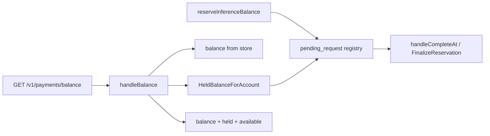
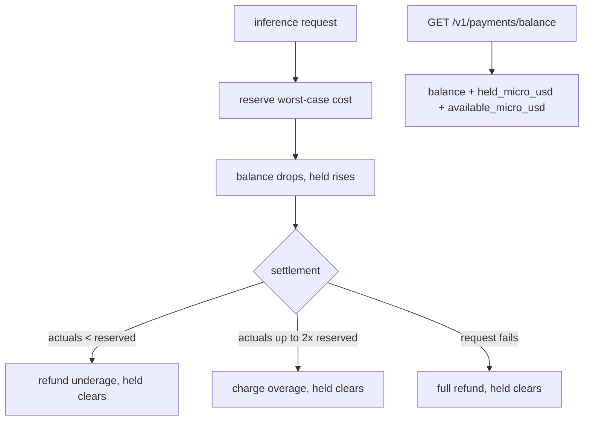

# ORP-035: In-flight reservation visibility in balance

> Last updated: 2026-09-25 · commit `b6f9574ed`

Darkbloom debits worst-case cost before dispatch and refunds on settle, but the held amount is invisible to the consumer. Part of the OpenRouter-perspective review; see the [review index](../README.md).

## What

Inference admission reserves the worst-case cost of a request before dispatch (`coordinator/api/inference_admission.go`, `reserveInferenceBalance`); settlement at `coordinator/api/provider.go` (`handleCompleteAt`) charges actuals with overage clamped to ≤2× reserved and underage refunded, finalized once via `coordinator/registry/pending_request.go` (`FinalizeReservation`). The consumer balance endpoint returns only the post-reservation balance (`coordinator/api/consumer.go`, `handleBalance`) — the sum currently held by unsettled reservations appears nowhere.

## Why

A user running many concurrent requests sees a balance far lower than their settled spend implies, then sees it jump back up as reservations settle and refund. Apparent balance swings with no explanation look like billing bugs and generate support load.

## Prompt

Add a `held_micro_usd` field to the balance response. Goal: `GET /v1/payments/balance` returns the existing fields plus `held_micro_usd` and `available_micro_usd` (= balance − held, clamped at ≥0), where held is the sum of outstanding reserved amounts for the caller's account across all pending requests. Constraints: (1) the source of truth is the pending-request registry (`coordinator/registry/pending_request.go`) — the same records `FinalizeReservation` settles, so the reported held amount can never diverge from what settlement will refund; (2) reservations live in-process in the registry, so the handler must query the registry, not the store — but expose it through a narrow registry method (`HeldBalanceForAccount`) rather than reaching into internals; (3) the field is per-account and computed at request time, never cached; (4) concurrent finalize must not double-count: read the pending set under the same lock discipline `FinalizeReservation` uses; (5) response remains backward compatible — additive fields only. Files to touch: `coordinator/api/consumer.go` (`handleBalance`), `coordinator/registry/pending_request.go` (held-balance query), `coordinator/api/types/types.go` (response fields), plus tests. Acceptance criteria: with N in-flight requests, `held_micro_usd` equals the sum of their reserved amounts; after each settles, held drops by exactly that reservation's amount; a quiescent account reports zero.

## Workflow

1. Read `reserveInferenceBalance` in `coordinator/api/inference_admission.go` to confirm where the reserved amount and account ID are recorded.
2. Read `FinalizeReservation` in `coordinator/registry/pending_request.go` for the pending-set structure and locking.
3. Add `HeldBalanceForAccount(accountID)` to the registry, summing reserved amounts over pending requests under the existing lock.
4. Extend the balance response type in `coordinator/api/types/types.go` with `held_micro_usd` and `available_micro_usd`.
5. Update `handleBalance` to call the registry method and populate the fields.
6. Add tests: held equals sum during flight, drops to zero after settle, concurrent finalize produces no double-count.
7. Run `make coordinator-test`.

## Loop

Run `make coordinator-test` (or `go test ./coordinator/api/... ./coordinator/registry/...` while iterating). Check with a concurrency test: fire N admissions, assert held equals the sum, settle them in random order, assert held returns to zero and balance returns to the settled value. Run with `-race`. Definition of done: a consumer watching their balance during a burst sees held and available explain every movement.

## Graph

## Layout

- Modify `coordinator/api/consumer.go` — `handleBalance` reads the held amount.
- Modify `coordinator/registry/pending_request.go` — add `HeldBalanceForAccount`.
- Modify `coordinator/api/types/types.go` — `held_micro_usd`, `available_micro_usd` fields.
- Add tests in `coordinator/api` and `coordinator/registry`.
- No UI surface.

## Flow

Severity: medium · Effort: S
