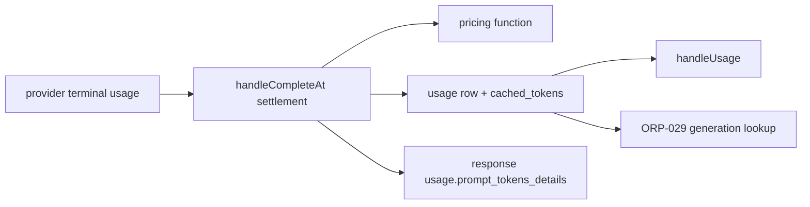
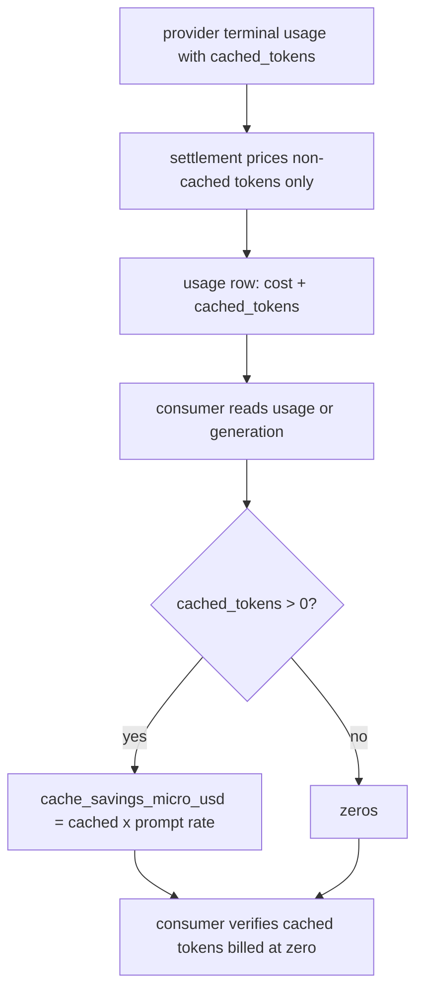

# ORP-036: Cached-token savings reporting

> Last updated: 2026-09-25 · commit `b6f9574ed`

Darkbloom bills cached tokens at zero by invariant, but consumers cannot see when a cache hit saved them money. Part of the OpenRouter-perspective review; see the [review index](../README.md).

## What

Cached tokens are free — billing invariant 5 (`docs/architecture/billing.md`) — and the cached-token count is already plumbed through the response path (`coordinator/api/types/types.go`, `CachedTokens`; terminal-usage handling in `coordinator/api/provider.go` and `coordinator/api/chat_response.go`), with cache telemetry recorded internally (`coordinator/api/exact_cache_telemetry.go`, `coordinator/api/cache_model_telemetry.go`). But the usage row written per request carries only `{job_id, model, prompt_tokens, completion_tokens, cost_micro_usd, timestamp}` (`coordinator/api/consumer.go`, `handleUsage`) — no cached-token count and no savings figure. OpenRouter reports per-generation `native_tokens_*` including cached tokens and a `cache_discount` (OpenRouter API reference, https://openrouter.ai/docs/api-reference/get-a-generation).

## Why

Cache savings are a selling point of the routing layer and are currently invisible to the people paying. Worse, the zero-billing invariant is unauditable from the outside: a consumer cannot verify that cached tokens were actually billed at zero without seeing the cached count alongside the cost.

## Prompt

Add cached-token and savings fields to the consumer usage surfaces. Goal: usage rows and the generation lookup (ORP-029) carry `cached_tokens` and `cache_savings_micro_usd`, where savings is the cached-token count priced at the model's prompt rate — the amount the request would have cost without the cache hit. Constraints: (1) add `cached_tokens` to the stored usage row (migration alongside `coordinator/store/postgres.go`; null/zero for pre-migration rows) and populate it at settlement from the terminal usage message (`coordinator/api/provider.go`, `handleCompleteAt`); (2) compute `cache_savings_micro_usd` in integer micro-USD using the same pricing function the settlement used — never a second rate table that can drift; (3) do not change billing: cached tokens remain free, this is reporting only; (4) surface both fields on `GET /v1/payments/usage` rows and on the generation lookup response; (5) include `cached_tokens` in the OpenAI-compatible response `usage.prompt_tokens_details.cached_tokens` on all skins where the field exists, since the value is already decoded (`coordinator/api/chat_response.go`). Files to touch: `coordinator/store/postgres.go` (column + migration), the settlement path (`coordinator/api/provider.go`), `coordinator/api/consumer.go` (`handleUsage` row shape), `coordinator/api/types/types.go`, the response usage emitters, plus tests. Acceptance criteria: a request with a cache hit shows `cached_tokens > 0`, `cost_micro_usd` unchanged from today (cached tokens excluded), and `cache_savings_micro_usd` equal to cached tokens × prompt rate; a request with no hit reports zeros.

## Workflow

1. Read the terminal-usage handling in `coordinator/api/provider.go` (`handleCompleteAt`) to find where `CachedTokens` is available at settlement.
2. Read the pricing function used at settlement so savings reuse it.
3. Add the `cached_tokens` column and migration to the usage table in `coordinator/store/postgres.go`.
4. Write `cached_tokens` into the usage row at settlement.
5. Extend the usage-row response shape in `coordinator/api/types/types.go` and `handleUsage` with `cached_tokens` and computed `cache_savings_micro_usd`.
6. Surface `prompt_tokens_details.cached_tokens` in each skin's response usage block.
7. Add tests: cache-hit request reports savings equal to rate × cached tokens; cost unchanged; no-hit reports zeros; both stores agree.
8. Run `make coordinator-test`.

## Loop

Run `make coordinator-test` (or `go test ./coordinator/api/... ./coordinator/store/...` while iterating). Check against a priced fixture: `cost + savings` equals the cost the request would have had with zero cached tokens; the invariant test that cached tokens are billed at zero still passes; savings never exceeds the prompt-token total × rate. Definition of done: a consumer can audit, per request, that cached tokens cost them nothing.

## Graph

## Layout

- Modify `coordinator/store/postgres.go` — `cached_tokens` column and migration.
- Modify `coordinator/api/provider.go` — write cached tokens at settlement.
- Modify `coordinator/api/consumer.go` — usage rows expose cached tokens and savings.
- Modify `coordinator/api/types/types.go`, `coordinator/api/chat_response.go` — surface cached tokens in response usage.
- Add tests in `coordinator/api` and `coordinator/store`.
- No UI surface.

## Flow

Severity: low · Effort: M
