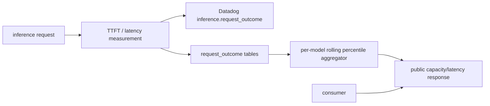
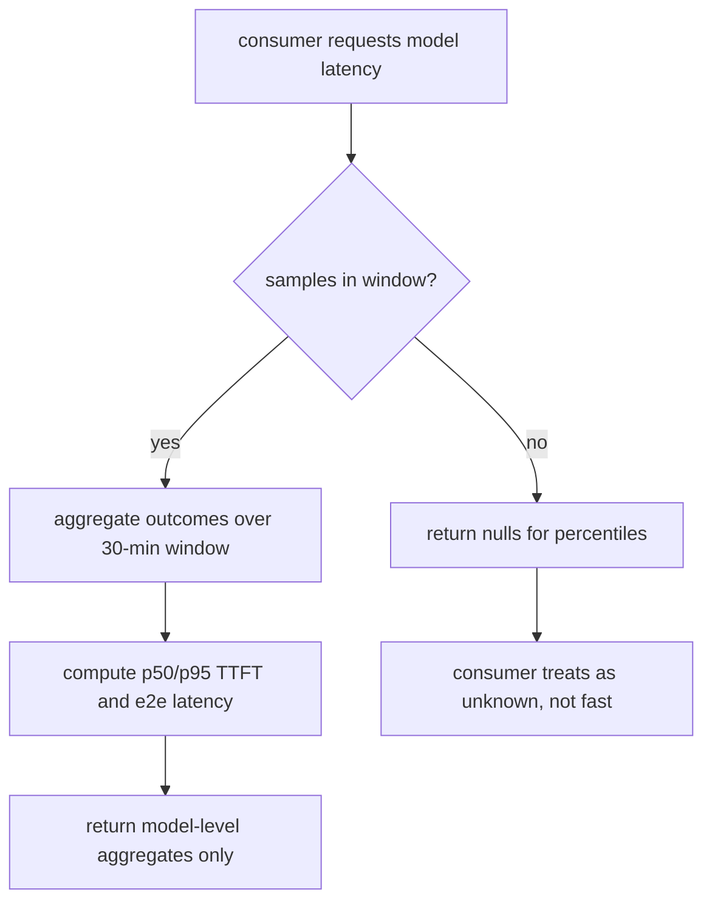

# ORP-037: Public per-model latency percentiles

> Last updated: 2026-09-25 · commit `b6f9574ed`

Darkbloom measures time-to-first-token per request but publishes only a best-case estimate, so consumers cannot compare real-world speed across models. Part of the OpenRouter-perspective review; see the [review index](../README.md).

## What

Every inference request already records its TTFT and end-to-end latency: per-request measurements flow to Datadog (`inference.request_outcome{model,class,kv_backend}`) and into the admin SQL tables (`request_outcome*`, `request_profiles`). What the public sees instead is `estimated_ttft_ms` on `GET /v1/models/capacity` (`coordinator/api/capacity.go`, `handleModelsCapacity`; `coordinator/registry/model_capacity.go`, `ModelCapacity`) — a best-case estimate, not a measurement. OpenRouter's model pages show per-provider measured latency and throughput (https://openrouter.ai/openai/gpt-4o) and per-endpoint live stats via `GET /api/v1/models/{author}/{slug}/endpoints` (https://openrouter.ai/docs/api-reference/list-endpoints-for-a-model). Darkbloom has no public measured latency surface at all.

## Why

Consumers choosing a private-inference network cannot tell whether a model is fast in practice, only what the scheduler hopes it will do when idle. A best-case estimate hides congestion, cold starts, and slow hours — exactly the information a latency-sensitive buyer needs before routing production traffic.

## Prompt

Publish rolling per-model latency percentiles. Goal: a public, unauthenticated endpoint (or an extension of `GET /v1/models/capacity`) returns, per model, p50/p95 of measured TTFT and p50/p95 of end-to-end request latency over a rolling window (suggest 30 minutes), computed from the same measurement pipeline that feeds `request_outcome*` / `request_profiles` and the Datadog `inference.request_outcome` metric. Constraints: (1) use existing measurement data — do not add a second instrumentation path; (2) aggregate across providers only, never per-provider breakdowns, consistent with the privacy floor in `coordinator/api/stats.go`; (3) percentiles must be computed server-side over a bounded in-memory or SQL rolling window, not on-demand scans of full history; (4) window length and sample size must be explicit in the response or its docs so consumers can judge confidence; (5) models with too few samples report nulls, not fabricated values. Files to touch: the outcome/profile aggregation in `coordinator/registry/model_capacity.go` (or a new sibling), `coordinator/api/capacity.go` or a new handler wired in `coordinator/api/server.go`, response types in `coordinator/api/types/`, plus tests. Acceptance criteria: a model with recorded outcomes returns p50/p95 values that match the underlying samples; a model with no recent traffic returns nulls; responses carry no provider identity.

## Workflow

1. Read `coordinator/registry/model_capacity.go` and the `request_outcome*` / `request_profiles` read paths to find where per-request TTFT is queryable per model.
2. Decide the aggregation home: rolling in-memory buckets alongside the capacity snapshot, or a windowed SQL aggregate against the outcome tables.
3. Implement p50/p95 computation for TTFT and end-to-end latency per model over a 30-minute rolling window.
4. Add the fields to the public capacity response (or a new `/v1/models/latency` route) with null semantics for sparse models.
5. Wire the handler in `coordinator/api/server.go` with the same cache discipline as `handleModelsCapacity`.
6. Add response types and tests covering populated, sparse, and empty models.
7. Update the public API reference and run `make coordinator-test` and `make docs-check`.

## Loop

Iterate with `go test ./coordinator/api/... ./coordinator/registry/...`, then `make coordinator-test`. Check: percentile math against a known sample set (insert synthetic outcomes, assert exact p50/p95); sparse models return null rather than zero; the public response contains only model-level aggregates — grep the serialized JSON for any provider identifier; cache TTL matches the capacity endpoint's. Definition of done: tests green, percentiles provably derived from measured outcomes, docs updated, `make docs-check` clean.

## Graph

## Layout

- Modify `coordinator/registry/model_capacity.go` — rolling per-model latency percentile aggregation.
- Modify `coordinator/api/capacity.go` (or add a new handler) — expose percentiles publicly.
- Modify `coordinator/api/server.go` — route wiring if a new endpoint is added.
- Modify `coordinator/api/types/` — response shape with null-for-sparse semantics.
- Add tests in `coordinator/api` and/or `coordinator/registry`.
- Modify the public API reference doc under `docs/reference/`.
- No UI surface.

## Flow

Severity: medium · Effort: M
