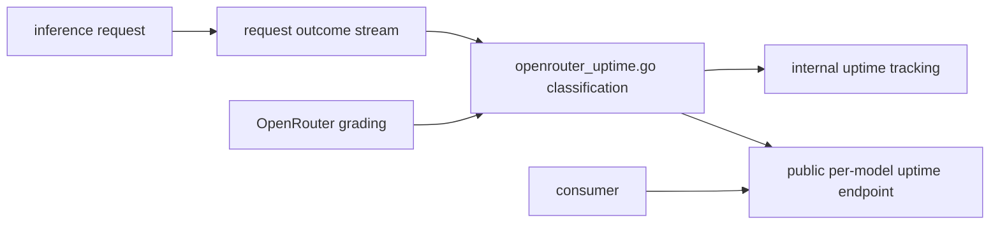
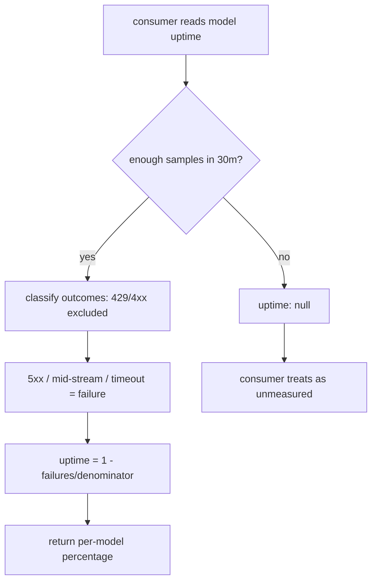

# ORP-038: Public per-model uptime metric

> Last updated: 2026-09-25 · commit `b6f9574ed`

Darkbloom already computes OpenRouter-compatible uptime internally, but the result never reaches consumers. Part of the OpenRouter-perspective review; see the [review index](../README.md).

## What

The coordinator tracks per-model uptime with exactly the formula OpenRouter applies to its upstreams: 429s and other 4xx are excluded from the denominator, while 5xx, mid-stream failures, and timeouts count as failures (`coordinator/api/openrouter_uptime.go`). The per-request inputs already exist in the outcome stream (`inference.request_outcome{model,class,kv_backend}` to Datadog; `request_outcome*` tables in admin SQL). But no public endpoint exposes the computed percentages. OpenRouter exposes `uptime_last_30m` per endpoint on `GET /api/v1/models/{author}/{slug}/endpoints` (https://openrouter.ai/docs/api-reference/list-endpoints-for-a-model) and shows uptime on model pages (https://openrouter.ai/openai/gpt-4o).

## Why

The network already grades itself with the same ruler its largest potential upstream uses — consumers simply cannot see the grade. A buyer evaluating Darkbloom as a failover path has no public reliability signal and must either trust marketing or run their own measurement period, which most will not do.

## Prompt

Publish per-model uptime percentages computed by the existing formula. Goal: a public, unauthenticated surface — an extension of `GET /v1/models/capacity` or a field set on `GET /v1/stats` — returns, per model, `uptime_last_30m` and (if the data supports it cheaply) longer-window uptime, each computed with the exact classification in `coordinator/api/openrouter_uptime.go`: 429/4xx excluded from the denominator; 5xx, mid-stream failure, and timeout counted as failures. Constraints: (1) one formula, one implementation — the public number must call the same classification code as the internal tracker, never a reimplementation that can drift; (2) model-level aggregates only, no per-provider uptime, consistent with the privacy floor in `coordinator/api/stats.go`; (3) models with too few requests in the window report null uptime, not a misleading 100%; (4) document the window and minimum-sample threshold in the response or its reference doc. Files to touch: `coordinator/api/openrouter_uptime.go` (expose a queryable computation), `coordinator/api/capacity.go` or `coordinator/api/stats.go` (public surface), `coordinator/api/server.go` if wiring changes, response types in `coordinator/api/types/`, plus tests. Acceptance criteria: for a synthetic outcome stream with known success/failure mix, the public endpoint returns the percentage the formula predicts; 429-heavy streams do not depress uptime; sparse models return null.

## Workflow

1. Read `coordinator/api/openrouter_uptime.go` to pin the exact classification and where its results currently live.
2. Decide the public carrier: extend `handleModelsCapacity` or `handleStats`, or add a dedicated route.
3. Refactor the formula into a callable that both the internal tracker and the public endpoint share.
4. Compute per-model uptime over the 30-minute window with a minimum-sample floor.
5. Add the response fields with null semantics for sparse models.
6. Add tests for the classification edge cases (429 excluded, timeout counted, mid-stream counted) and for the public serialization.
7. Update the API reference, run `make coordinator-test` and `make docs-check`.

## Loop

Iterate with `go test ./coordinator/api/...`, then `make coordinator-test`. Check: a table-driven test covers every outcome class against the published formula; the public number is byte-identical to what the internal tracker would report for the same stream; JSON output contains model ids and percentages only. Definition of done: tests green, single shared classification implementation, docs updated.

## Graph

## Layout

- Modify `coordinator/api/openrouter_uptime.go` — shared, queryable uptime computation.
- Modify `coordinator/api/capacity.go` or `coordinator/api/stats.go` — public surface.
- Modify `coordinator/api/types/` — response fields with null-for-sparse semantics.
- Add tests in `coordinator/api`.
- Modify the public API reference doc under `docs/reference/`.
- No UI surface.

## Flow

Severity: medium · Effort: M
