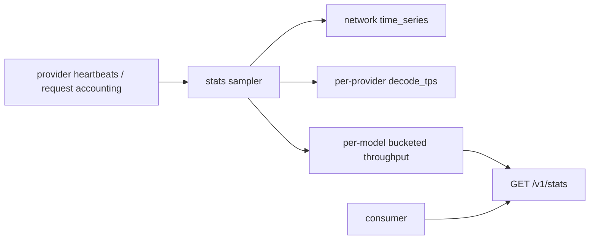
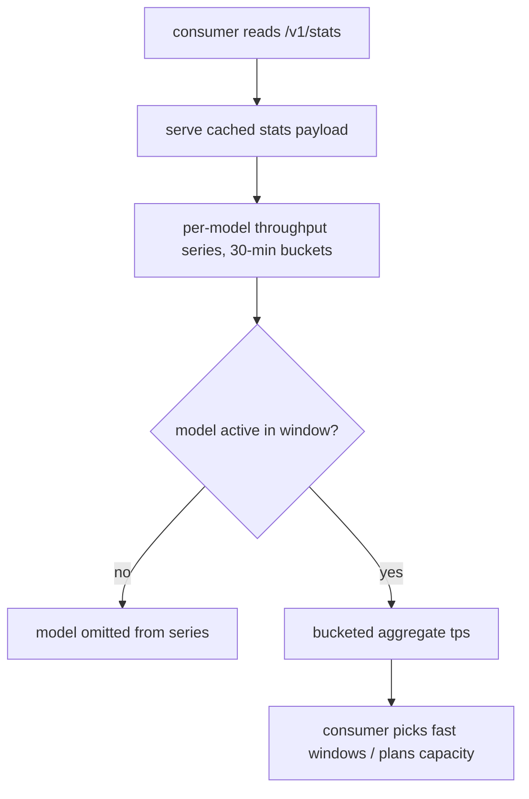

# ORP-039: Public per-model throughput time series

> Last updated: 2026-09-25 · commit `b6f9574ed`

Darkbloom publishes a network-wide throughput history and instantaneous per-model snapshots, but no per-model history. Part of the OpenRouter-perspective review; see the [review index](../README.md).

## What

`GET /v1/stats` (`coordinator/api/stats.go`, `handleStats`) carries a 30-minute aggregate `time_series` for the whole network, plus per-provider instantaneous `decode_tps` in its provider rows. `GET /v1/models/capacity` (`coordinator/api/capacity.go`, `handleModelsCapacity`; `coordinator/registry/model_capacity.go`, `ModelCapacity`) reports instantaneous `aggregate_tps` per model. Neither offers per-model throughput over time. OpenRouter's model pages show per-provider throughput history so buyers can see how speed varies across the day (https://openrouter.ai/openai/gpt-4o).

## Why

Capacity planning needs history, not snapshots. "Will this model be fast at my peak hour?" is unanswerable from an instantaneous `aggregate_tps` that a consumer happened to sample at 3am. A per-model series lets consumers schedule batch work into fast windows and detect chronic congestion before it bites.

## Prompt

Add a public per-model throughput time series. Goal: `GET /v1/stats` gains a per-model series (or a new public endpoint returns one): for each model, bucketed aggregate tokens-per-second across all serving providers over a rolling window (suggest 30-minute buckets over 24 hours, matching the granularity of the existing `time_series`). Constraints: (1) aggregate across providers only — the per-provider `decode_tps` data that feeds this must never be regroupable back to a provider, consistent with the privacy floor in `coordinator/api/stats.go`; (2) reuse the sampling pipeline that already produces the network-level `time_series` and per-provider rows rather than adding a second recorder; (3) bound response size: only models active in the window appear, buckets are fixed-width; (4) the endpoint stays cheap — precompute buckets on the stats cadence, serve from the existing cache, no on-request history scans. Files to touch: `coordinator/api/stats.go` (`handleStats` response assembly), the underlying stats sampling it reads from, response types in `coordinator/api/types/`, plus tests. Acceptance criteria: a model serving known load shows bucketed throughput matching the samples; an idle model is absent from the series; no provider-identifying field appears in the payload.

## Workflow

1. Read `coordinator/api/stats.go` to see how `time_series` buckets and per-provider rows are produced.
2. Extend the sampler to accumulate per-model token counts per bucket alongside the network totals.
3. Add the per-model series to the stats response shape, aggregated across providers.
4. Bound the payload: drop models with zero traffic in the window.
5. Add tests: known load → expected buckets; idle model absent; privacy audit of the serialized JSON.
6. Update the public API reference; run `make coordinator-test` and `make docs-check`.

## Loop

Iterate with `go test ./coordinator/api/...`, then `make coordinator-test`. Check: bucket boundaries align with the existing `time_series` cadence; sum of per-model buckets reconciles with the network aggregate within measurement tolerance; response size stays bounded with many models. Definition of done: tests green, docs updated, payload provably free of provider identity.

## Graph

## Layout

- Modify `coordinator/api/stats.go` — per-model bucketed series in `handleStats`.
- Modify the stats sampling path `handleStats` reads from — per-model bucket accumulation.
- Modify `coordinator/api/types/` — response shape.
- Add tests in `coordinator/api`.
- Modify the public API reference doc under `docs/reference/`.
- No UI surface (optional console chart is a follow-up, not required here).

## Flow

Severity: low · Effort: M
