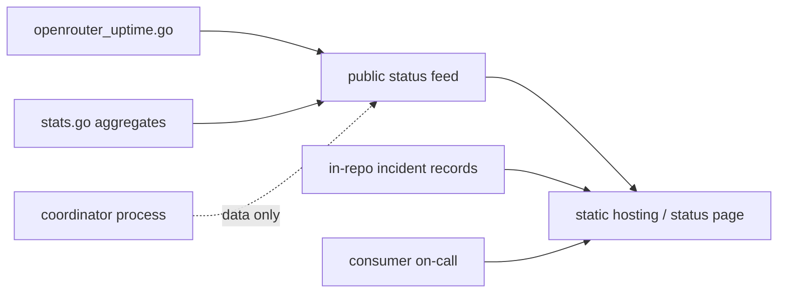
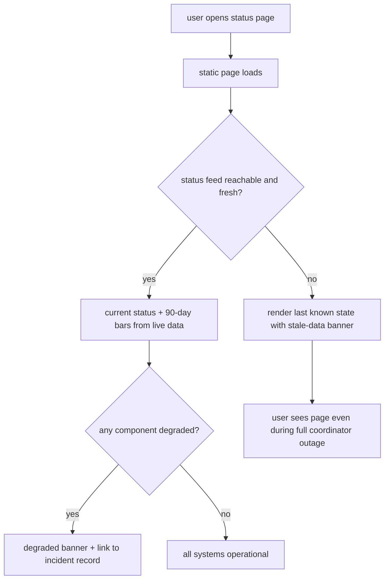

# ORP-040: Public status page with history

> Last updated: 2026-09-25 · commit `b6f9574ed`

Darkbloom has no public status surface beyond bare liveness probes, so production adopters have nothing to watch or point their own status dependencies at. Part of the OpenRouter-perspective review; see the [review index](../README.md).

## What

The only public health signals are `/health` (always-200 liveness) and `/readyz` (`coordinator/api/consumer.go`, `coordinator/api/drain.go`) — binary probes, not a status page. The raw material for a real one already exists: the internal uptime computation (`coordinator/api/openrouter_uptime.go`), admin-only operational views (`/v1/admin/utilization`, `/v1/admin/routes`, `/v1/admin/rejections`, `/v1/admin/snapshots` in `coordinator/api/server.go`), and public network aggregates (`coordinator/api/stats.go`, `handleStats`). OpenRouter runs a dedicated status page with per-service 90-day uptime (https://status.openrouter.ai).

## Why

Production adopters require a status page before depending on an API: it is where their on-call looks during an incident, and its absence reads as immaturity. It also converts outages from "is it me or them?" support tickets into a canonical public record.

## Prompt

Stand up a public status page with uptime history and incident records. Goal: a publicly reachable page — a route on the landing app or a `status.` subdomain — showing current overall status, per-component status (API, inference capacity, billing), 90-day per-day uptime bars fed by the coordinator's uptime metrics, and a manually curated incident history. Constraints: (1) automated signals come from the existing uptime computation (`coordinator/api/openrouter_uptime.go`) and public aggregates (`coordinator/api/stats.go`) — do not build a second measurement pipeline; (2) the page must stay up when the coordinator is down: serve it from static hosting or the landing app's infra, with the coordinator as a data source only, never as the serving dependency; (3) components and their rollup rules are defined once in the page's config, not hardcoded per render; (4) incident entries are human-authored markdown/JSON records in-repo so they are reviewed in PRs; (5) no per-provider or per-user data anywhere on the page. Files to touch: a new `status/` page or app (landing app or standalone static site), a small public status feed endpoint or a static JSON the coordinator publishes, `coordinator/api/server.go` only if a new feed route is added, deploy config under `deploy/`. Acceptance criteria: the page renders current status and 90-day bars from live data; it still renders (with stale-data labeling) when the coordinator is unreachable; an incident record added in-repo appears after deploy.

## Workflow

1. Decide hosting: landing-app route vs. static `status.` subdomain; confirm it does not depend on the coordinator process for serving.
2. Define the component list and rollup rules (API, inference capacity, billing).
3. Define the status feed: either a tiny public coordinator endpoint or a periodically published static JSON built from the existing uptime computation.
4. Build the page: current status banner, per-component rows, 90-day bars, incident list.
5. Add stale-data labeling when the feed is unreachable or old.
6. Add the in-repo incident record format and seed it with any known past incidents.
7. Wire deploy config under `deploy/`; verify with `make ui-build` (if landing-based) and `make coordinator-test` (if a feed route was added).

## Loop

If a coordinator feed route is added, iterate with `go test ./coordinator/api/...` and `make coordinator-test`. For the page, run `make ui-build` / the landing app's build and route tests. Check: page renders with a live feed; page renders with the coordinator process killed (serve-from-static, stale banner); uptime bars match the source metric for a known window. Definition of done: page live at its public URL, renders under coordinator outage, incident workflow documented for operators.

## Graph

## Layout

- Add a status page (landing-app route or standalone static site) — current status, components, 90-day bars, incidents.
- Add a small public status feed (coordinator endpoint or published static JSON) sourced from `coordinator/api/openrouter_uptime.go` and `coordinator/api/stats.go`.
- Modify `coordinator/api/server.go` only if a feed route is added.
- Add in-repo incident records and the operator doc for adding them.
- Modify `deploy/` for hosting.

## Flow

Severity: medium · Effort: L
