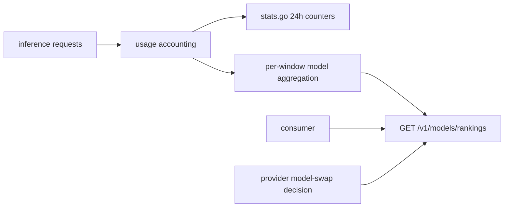
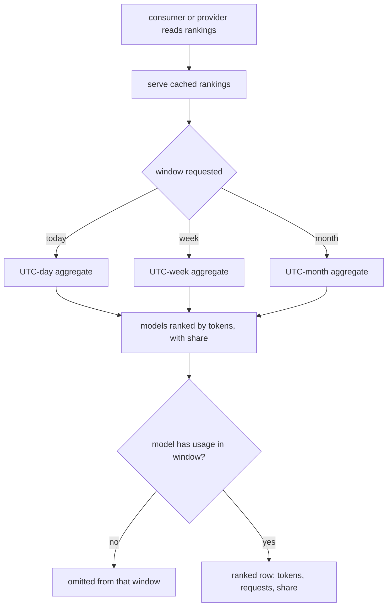

# ORP-041: Model usage rankings

> Last updated: 2026-09-25 · commit `b6f9574ed`

Darkbloom ranks providers but not models, so the discovery signal that drives both consumer choice and provider capacity allocation is missing. Part of the OpenRouter-perspective review; see the [review index](../README.md).

## What

`/v1/leaderboard` (`coordinator/api/leaderboard.go`) ranks providers by pseudonymized earnings, tokens, and jobs, and the console's `/leaderboard` page is provider-side. Public stats (`coordinator/api/stats.go`, `handleStats`) already expose `models[]` with a provider count and network-wide 24h counters, but nothing ranks models by usage. OpenRouter's rankings page ranks models by token usage across today/week/month/trending windows with a market-share chart (https://openrouter.ai/rankings).

## Why

Model popularity is the discovery mechanism on both sides of the marketplace. Consumers use it to find which models actually work on the network; providers use it to decide which model to swap into a slot. Without it, both sides guess, and under-used capacity stays warm on the wrong models.

## Prompt

Add public model usage rankings. Goal: a public endpoint (or an extension of `GET /v1/stats`) returns models ranked by tokens served and request count over today / this week / this month windows, sourced from the usage aggregates the coordinator already maintains. Constraints: (1) model-level aggregates only — no per-provider or per-app breakdown, consistent with the privacy floor in `coordinator/api/stats.go`; (2) reuse existing usage accounting (the same counters behind `handleStats` 24h numbers), do not add a parallel accounting path; (3) window boundaries must be explicit (UTC day/week/month) and documented; (4) the endpoint is cached like the other public stats surfaces and cheap to serve; (5) include enough context to be useful — tokens, requests, and each model's share of total tokens — without exposing absolute revenue. Files to touch: `coordinator/api/stats.go` or a new handler, `coordinator/api/server.go` (route wiring), response types in `coordinator/api/types/`, plus tests. Acceptance criteria: with a known usage fixture, rankings order correctly per window; shares sum to 1.0; a model with no usage in a window is absent from that window's list.

## Workflow

1. Read `coordinator/api/stats.go` to find the usage aggregates behind the 24h counters and how models are enumerated.
2. Decide the carrier: extend `handleStats` or add `GET /v1/models/rankings`.
3. Implement per-window (today/week/month) model aggregation of tokens and requests.
4. Compute token share per model within each window.
5. Wire the route in `coordinator/api/server.go` with the public-stats cache discipline.
6. Add tests: ordering, share sums, window boundaries, absent-model semantics.
7. Update the public API reference; run `make coordinator-test` and `make docs-check`.

## Loop

Iterate with `go test ./coordinator/api/...`, then `make coordinator-test`. Check: a fixture with staggered usage across window boundaries ranks correctly in each window; shares sum to 1.0 within float tolerance; the serialized payload contains model ids and counters only. Definition of done: tests green, docs updated, rankings provably derived from the existing usage counters.

## Graph

## Layout

- Modify `coordinator/api/stats.go` or add a new rankings handler.
- Modify `coordinator/api/server.go` — route wiring.
- Modify `coordinator/api/types/` — response shape.
- Add tests in `coordinator/api`.
- Modify the public API reference doc under `docs/reference/`.
- Optional follow-up: console chart consuming the endpoint (not required here).

## Flow

Severity: low · Effort: M
