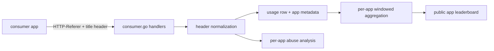
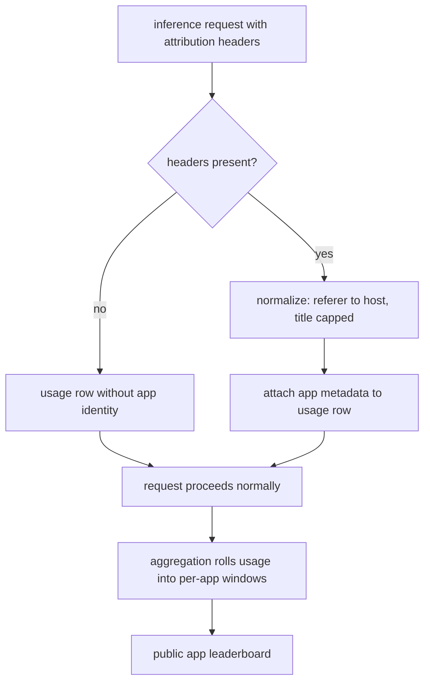

# ORP-042: App attribution headers and leaderboard

> Last updated: 2026-09-25 · commit `b6f9574ed`

Darkbloom has no app-attribution ingestion, so it cannot see which applications drive its traffic and gets none of the discovery loop that attribution powers. Part of the OpenRouter-perspective review; see the [review index](../README.md).

## What

OpenRouter ingests `HTTP-Referer` and `X-OpenRouter-Title` on inference requests and turns them into public app leaderboards (https://openrouter.ai/docs/app-attribution, https://openrouter.ai/rankings). Darkbloom's consumer path has no handling for either header: `handleChatCompletions` and its siblings (`coordinator/api/consumer.go`) ignore them entirely, and no app-level aggregate exists anywhere in stats (`coordinator/api/stats.go`) or admin reporting.

## Why

App leaderboards are OpenRouter's organic marketing loop: apps compete for placement, and the leaderboard sends users to the apps. Attribution data also powers per-app abuse analysis — today a single abusive application is indistinguishable from the network's background traffic until billing or rate limits trip.

## Prompt

Ingest app attribution headers on inference requests and expose per-app usage aggregates. Goal: the coordinator reads `HTTP-Referer` and a title header (mirror OpenRouter's `X-OpenRouter-Title`, or accept both spellings) on consumer inference requests, stores them as request metadata, aggregates usage per app, and exposes a public per-app usage ranking. Constraints: (1) metadata only — headers are stored as short normalized strings alongside the usage row; prompt content is never touched, consistent with the hop-by-hop encryption model where the coordinator does not log or retain prompt content; (2) header values are untrusted input: length-cap, strip control characters, and store a normalized host for referers rather than full URLs with query strings; (3) public aggregates are per-app token/request counters over today/week/month windows only — no per-user or per-key breakdown; (4) attribution is best-effort and never blocks or fails a request; (5) document the headers in the consumer API reference. Files to touch: `coordinator/api/consumer.go` (`handleChatCompletions` and the sibling skins — parse + normalize), the usage-row write path, `coordinator/api/stats.go` or a new rankings handler for the public aggregate, `coordinator/api/server.go` if a new route is added, response types in `coordinator/api/types/`, plus tests. Acceptance criteria: a request with attribution headers produces a usage row carrying the normalized app identity; per-app public aggregates rank correctly over a fixture; requests without headers are unaffected; overlong or hostile header values are safely normalized.

## Workflow

1. Read `coordinator/api/consumer.go` to find where usage rows are written per request.
2. Define normalization: referer → host, title → length-capped printable string; decide both-header precedence.
3. Parse and normalize the headers in each consumer skin's handler, best-effort.
4. Carry the app identity onto the usage row at the existing write point.
5. Add per-app aggregation over today/week/month windows and a public ranking surface.
6. Add tests: normalization edge cases, aggregation ordering, no-header passthrough.
7. Update the consumer API reference; run `make coordinator-test` and `make docs-check`.

## Loop

Iterate with `go test ./coordinator/api/...`, then `make coordinator-test`. Check: normalization table tests (query strings stripped, control characters removed, length caps enforced); rankings match fixture; the request hot path adds no measurable latency and no failure mode. Definition of done: tests green, docs updated, stored data provably limited to normalized metadata.

## Graph

## Layout

- Modify `coordinator/api/consumer.go` — parse and normalize attribution headers in each skin.
- Modify the usage-row write path — persist normalized app identity.
- Modify `coordinator/api/stats.go` or add a rankings handler — public per-app aggregates.
- Modify `coordinator/api/server.go` — route wiring if a new endpoint is added.
- Modify `coordinator/api/types/` — response shape.
- Modify the consumer API reference doc under `docs/consumer/` or `docs/reference/`.
- No UI surface (a public leaderboard page is a follow-up).

## Flow

Severity: low · Effort: M
