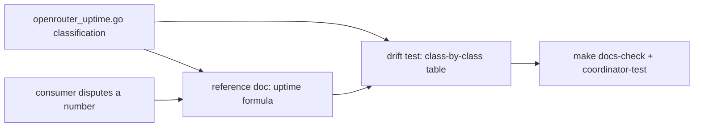
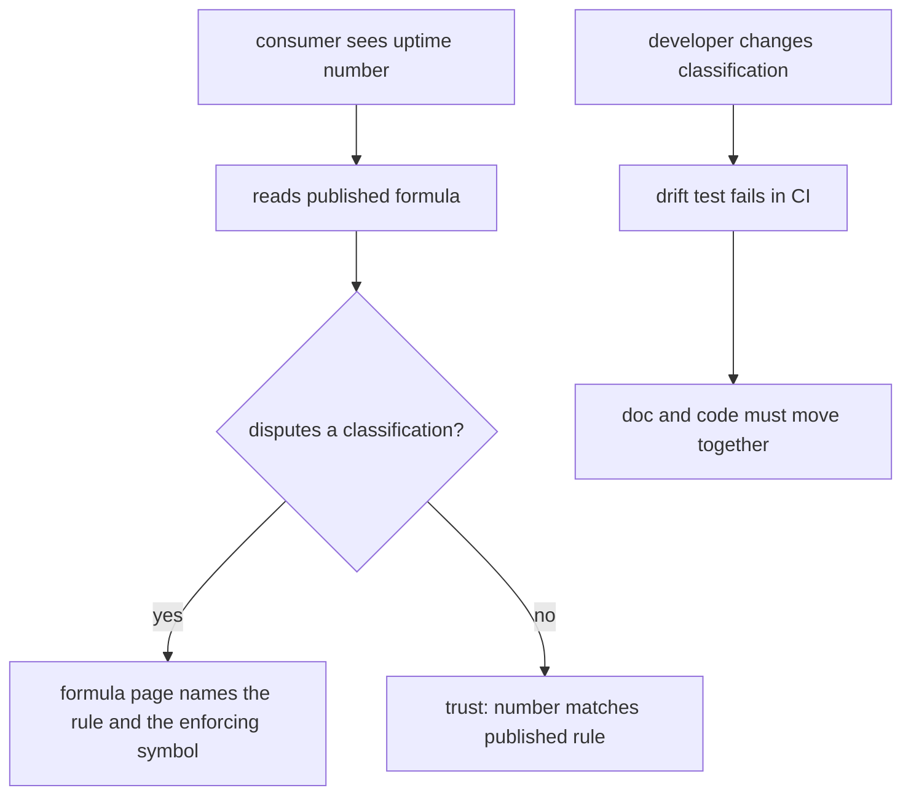

# ORP-043: Published uptime formula, kept aligned with code

> Last updated: 2026-09-25 · commit `b6f9574ed`

The formula Darkbloom uses to grade its own uptime exists only in code, so consumers cannot verify or dispute any uptime number the network publishes. Part of the OpenRouter-perspective review; see the [review index](../README.md).

## What

`coordinator/api/openrouter_uptime.go` defines exactly what counts as a failure for uptime purposes: 429s and other 4xx are excluded from the denominator; 5xx, mid-stream failures, and timeouts count as failures. This is the formula OpenRouter applies to upstreams, and it is the formula behind ORP-038's public uptime metric. But it is documented nowhere consumer-facing — the rule lives only in Go code. OpenRouter publishes per-endpoint uptime numbers (https://openrouter.ai/docs/api-reference/list-endpoints-for-a-model) whose meaning consumers can look up; Darkbloom's numbers would be unverifiable.

## Why

An unpublished SLA formula cannot be trusted or disputed. When the public uptime number says 99.2%, a consumer needs to know whether a mid-stream failure counted, whether their own 429s diluted the denominator, and what the measurement window was. Without a published formula, the number is an assertion, not a metric.

## Prompt

Publish the uptime formula as a reference doc and tie it to the code with a drift test. Goal: a page under `docs/reference/` states the uptime formula precisely — denominator exclusions (429 and other 4xx), failure classes (5xx, mid-stream failure, timeout), window length, and minimum-sample semantics — with each rule citing the enforcing symbol in `coordinator/api/openrouter_uptime.go`. A drift test in `coordinator/api` asserts the classification the doc describes, so a code change that silently alters the formula fails CI. Constraints: (1) the doc cites symbols, not line numbers, per the docs citation rules; (2) the test enumerates every outcome class the code classifies — a new class that lands unclassified must fail the test, forcing a doc decision; (3) the doc gets a freshness stamp and is registered in its directory index per the docs rules; (4) no code behavior changes — this is documentation plus a pinning test only. Files to touch: a new `docs/reference/` page, `coordinator/api/openrouter_uptime.go` (at most, comments aligning terminology), a new test in `coordinator/api`, and the `docs/reference/` index. Acceptance criteria: `make docs-check` passes with the new page; the drift test fails if any outcome class's classification changes; every rule in the doc has a corresponding test case.

## Workflow

1. Read `coordinator/api/openrouter_uptime.go` and enumerate every outcome class and its classification.
2. Write the reference doc: formula, inclusions, exclusions, window, minimum samples, each citing the enforcing symbol.
3. Add a table-driven test in `coordinator/api` asserting the classification of every outcome class.
4. Add a completeness guard so an outcome class missing from the test table fails the test.
5. Register the page in the `docs/reference/` index and stamp it.
6. Run `make coordinator-test` and `make docs-check`.

## Loop

Run `go test ./coordinator/api/...` and `make docs-check`. Check: the test table covers every outcome class in the code (verify by enumeration, not sampling); flipping any classification in code turns the test red; every rule sentence in the doc maps to at least one test case. Definition of done: doc published, indexed, stamped; drift test green and provably sensitive to classification changes.

## Graph

## Layout

- Add `docs/reference/` uptime-formula page — the published formula with symbol citations.
- Add a drift test in `coordinator/api` — classification table plus completeness guard.
- Modify the `docs/reference/` index — register the page.
- Modify `coordinator/api/openrouter_uptime.go` — comment terminology alignment only, if needed.
- No UI surface.

## Flow

Severity: low · Effort: S
