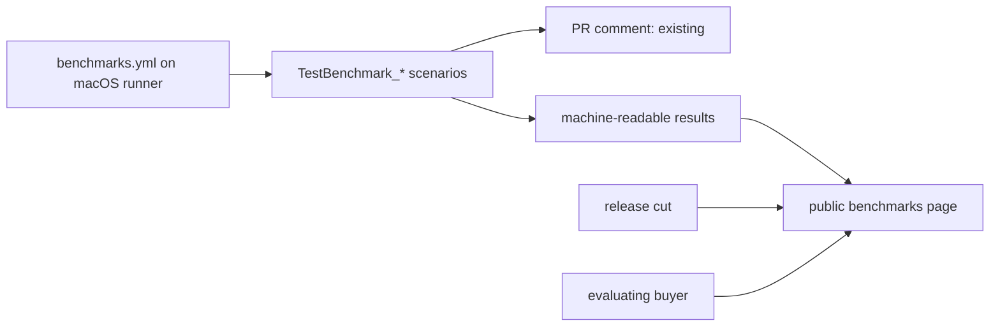
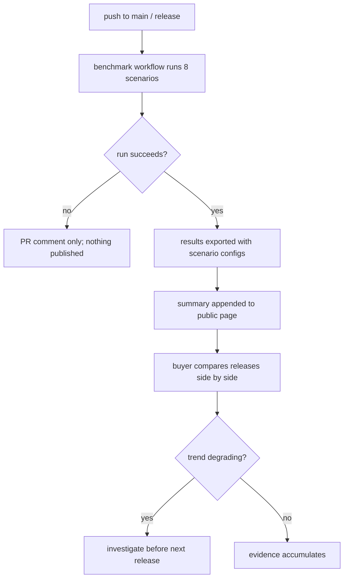

# ORP-044: Public benchmark results page

> Last updated: 2026-09-25 · commit `b6f9574ed`

Darkbloom runs benchmark suites in CI and discards the results in PR comments, so the performance evidence buyers ask for is produced and thrown away. Part of the OpenRouter-perspective review; see the [review index](../README.md).

## What

Eight `TestBenchmark_*` scenarios run in CI on macOS runners (`e2e/benchmark_test.go`, driven by `.github/workflows/benchmarks.yml`), measuring TTFT and tokens-per-second under load. Their results are posted only as PR comments — ephemeral, attached to no release, invisible to anyone evaluating the network. Nothing public summarizes what the benchmarks measured.

## Why

Buyers ask for performance evidence before committing to an inference provider, and Darkbloom's answer today is anecdote. The measurements already exist and already run on every relevant PR; publishing per-release summaries costs a pipeline step, not a new benchmark program.

## Prompt

Publish per-release benchmark summaries. Goal: each release (or each benchmark workflow run on the main branch) produces a durable, public summary — a docs page under `docs/` or a console page — listing, per `TestBenchmark_*` scenario, the measured TTFT and TPS with the scenario's load parameters, hardware class, and date. Constraints: (1) the published numbers come from the actual CI run artifacts — the workflow writes them to a durable location (in-repo markdown under `docs/`, or a JSON artifact the console renders), not a hand-copied table; (2) each summary names the scenario configuration (concurrency, prompt/output sizes) so numbers are interpretable, matching how `e2e/benchmark_test.go` parameterizes its scenarios; (3) historical summaries accumulate so trend is visible — append, never overwrite; (4) state plainly that benchmarks run on CI macOS runners, not on the production fleet; (5) the summary format is one canonical template so releases are comparable. Files to touch: `.github/workflows/benchmarks.yml` (publish step), `e2e/benchmark_test.go` only if the result payload needs a machine-readable export, a new `docs/` benchmarks page or index, and optionally a console page. Acceptance criteria: a benchmark run on the main branch lands a public summary without manual copying; two consecutive releases render side-by-side comparable rows; the page states the runner/hardware caveat.

## Workflow

1. Read `e2e/benchmark_test.go` to enumerate the eight scenarios and their result fields.
2. Read `.github/workflows/benchmarks.yml` to see how results are formatted for PR comments.
3. Add a machine-readable results export to the workflow (JSON or markdown written to a durable path).
4. Decide the public carrier: docs page under `docs/` or a console page; prefer docs for immutability.
5. Add the publish step: append the run summary, keyed by release/commit and date.
6. Build or update the page rendering the accumulated summaries with scenario configs.
7. Verify with a real benchmark workflow run; run `make docs-check` if docs are touched.

## Loop

Trigger the benchmark workflow (or run `go test ./e2e/... -run TestBenchmark -v` locally where hardware permits) and confirm the summary lands at the public path with correct scenario fields. Check: every `TestBenchmark_*` scenario appears; numbers match the workflow's PR comment for the same run; older summaries are untouched by new appends. Definition of done: the pipeline publishes without human steps, and the public page shows at least two comparable entries.

## Graph

## Layout

- Modify `.github/workflows/benchmarks.yml` — export and publish benchmark summaries.
- Modify `e2e/benchmark_test.go` only if the result payload needs a machine-readable form.
- Add a benchmarks page or index under `docs/` (or a console page).
- Optional: console page consuming the published summaries.
- No new measurement infrastructure — reuse the existing CI benchmarks.

## Flow

Severity: low · Effort: M
