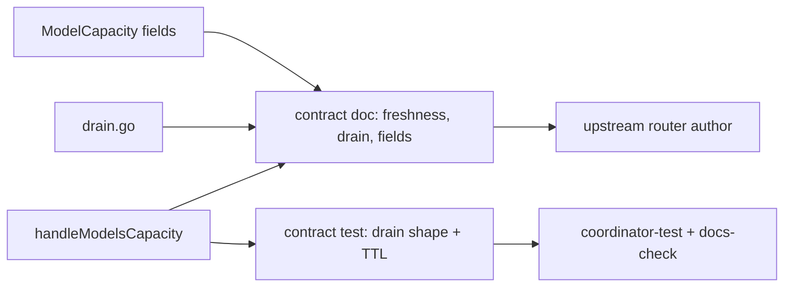
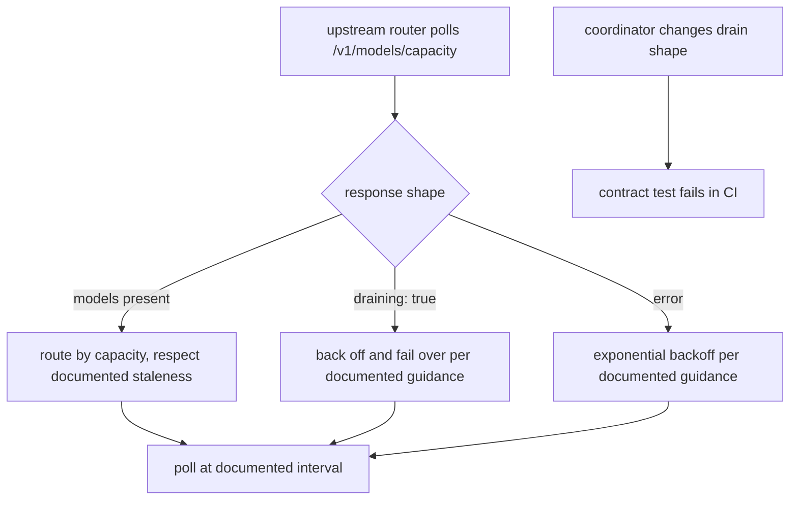

# ORP-045: `/v1/models/capacity` freshness/SLO documentation

> Last updated: 2026-09-25 · commit `b6f9574ed`

The public capacity endpoint's freshness semantics and draining behavior are undocumented, yet upstream routers already build retry and failover logic on top of it. Part of the OpenRouter-perspective review; see the [review index](../README.md).

## What

`GET /v1/models/capacity` (`coordinator/api/capacity.go`, `handleModelsCapacity`; data from `coordinator/registry/model_capacity.go`, `ModelCapacity`) is unauthenticated, cached for 2 seconds, and is the surface upstream routers — including OpenRouter itself when Darkbloom is an upstream — poll to decide where to send traffic. Its contract is knowable only by reading the handler: how stale the cached snapshot can be, what a draining coordinator returns (`{models: [], draining: true}`), how `estimated_ttft_ms` should be interpreted (best-case), and how often a poller should call it. None of this is written down anywhere consumer-facing.

## Why

Upstream routers build retry/failover logic on undocumented semantics. A router that polls too aggressively wastes both sides' capacity; one that treats `draining: true` as "no capacity" rather than "coordinator is draining, back off and fail over" makes the wrong move at exactly the wrong moment — during a deploy. Undocumented freshness means a router cannot know whether a zero-capacity reading is a real outage or a stale cache.

## Prompt

Document the capacity endpoint's operational contract and make the code's guarantees match the doc. Goal: a consumer-facing reference doc (under `docs/reference/` or `docs/consumer/`) that states precisely: the cache TTL and what staleness a reader can observe, the draining response shape and what a poller should do when it sees it, the meaning and limitations of `estimated_ttft_ms`, per-field semantics of `ModelCapacity` (ready, can_accept, routable/warm/running/cold, active/queued requests, token budget), and polling guidance (recommended interval, backoff on errors, behavior during drain). Constraints: (1) every stated number must cite the enforcing symbol in code — the cache TTL cites `handleModelsCapacity`, the drain shape cites `coordinator/api/drain.go`; (2) where the doc and code disagree, fix the code or the doc — do not paper over; (3) add a contract test that pins the draining response shape so a refactor cannot silently change what upstream routers parse; (4) the doc gets a freshness stamp and index registration per the docs rules. Files to touch: a new doc under `docs/reference/` or `docs/consumer/`, `coordinator/api/capacity.go` and `coordinator/api/drain.go` (only where the documented contract needs code alignment), a new contract test in `coordinator/api`, and the directory index. Acceptance criteria: the doc's every claim has a symbol citation that `make docs-check` accepts; the draining response shape is pinned by a test; the doc's polling guidance is consistent with the actual cache TTL.

## Workflow

1. Read `coordinator/api/capacity.go` (`handleModelsCapacity`) and `coordinator/api/drain.go` to pin the actual cache TTL, drain response, and field sources.
2. Read `coordinator/registry/model_capacity.go` (`ModelCapacity`) to document each field's meaning.
3. Write the reference doc: freshness, staleness bounds, draining semantics, field-by-field table, polling guidance.
4. Where doc intent and code disagree, align the code (or correct the doc).
5. Add a contract test pinning the draining response shape and cache behavior.
6. Register and stamp the doc; run `make coordinator-test` and `make docs-check`.

## Loop

Run `go test ./coordinator/api/...`, then `make coordinator-test` and `make docs-check`. Check: the contract test fails if the drain shape or cache TTL changes; every numeric claim in the doc traces to a code constant; the docs lint accepts every citation. Definition of done: an upstream-router author can implement correct polling and failover from the doc alone, and CI pins the parts of the contract they will parse.

## Graph

## Layout

- Add a consumer-facing reference doc under `docs/reference/` or `docs/consumer/` — the endpoint contract.
- Add a contract test in `coordinator/api` — draining shape and cache behavior pinned.
- Modify `coordinator/api/capacity.go` / `coordinator/api/drain.go` — only where code must align with the documented contract.
- Modify the docs directory index — register the page.
- No UI surface.

## Flow

Severity: low · Effort: S
