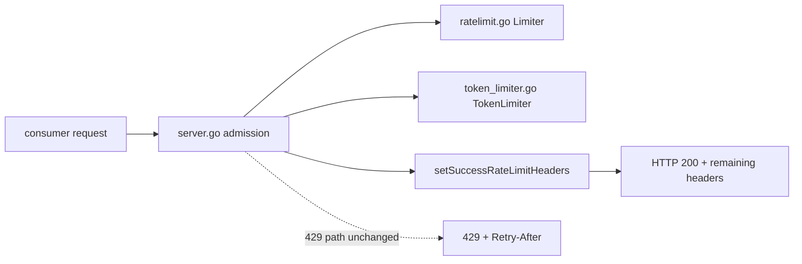
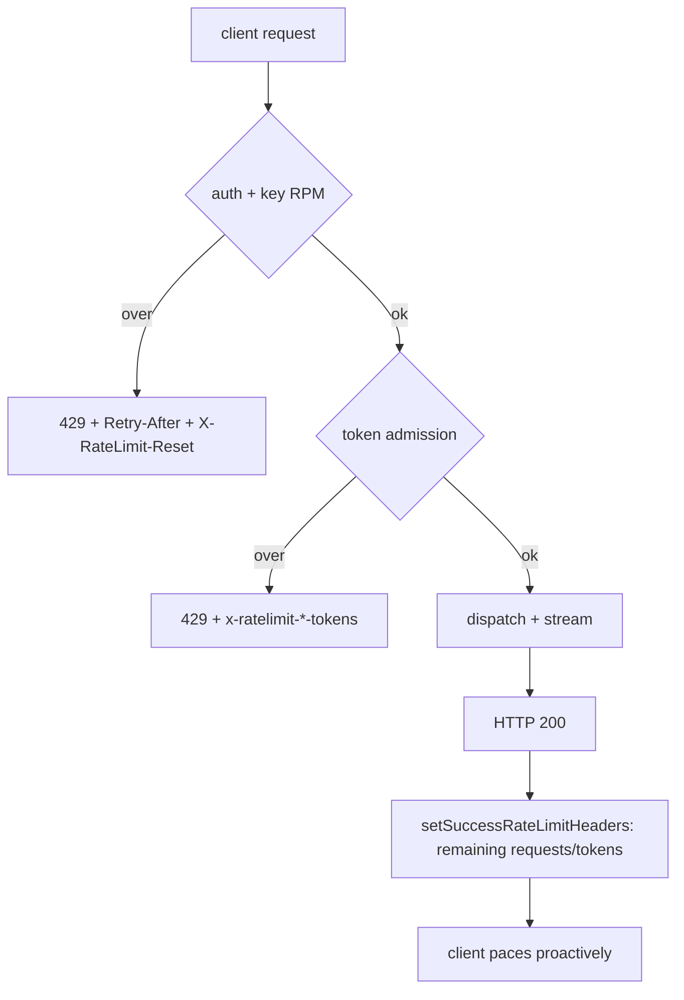

# ORP-046: Rate-limit headers on success responses

> Last updated: 2026-09-25 · commit `b6f9574ed`

Rate-limit headers appear only on rejection responses, so clients cannot see their remaining capacity until they exceed it. This issue is part of the OpenRouter-perspective review; see the [review index](../README.md).

## What

Darkbloom emits rate-limit metadata only on the limited path. `Retry-After` and `X-RateLimit-Reset` are set inside `rateLimitWithTier` on 429s, and `x-ratelimit-limit/remaining/reset-{input,output}-tokens` are set by `setTokenRateLimitHeaders` on token-limited paths — all in `coordinator/api/server.go`. The underlying buckets already know their state: `coordinator/ratelimit/ratelimit.go` (`Limiter`) and `coordinator/ratelimit/token_limiter.go` (`TokenLimiter`). Success responses carry no rate-limit headers at all.

OpenRouter's convention (OpenRouter limits, https://openrouter.ai/docs/api-reference/limits) likewise puts `X-RateLimit-*` only on its own 429s, so this is one place where the two already match — the gap is proactive visibility, not rejection-shape parity.

## Why

Clients discover their limits only by violating them. A consumer running close to the 20 rps consumer Inference tier or the 5M ITPM token budget has no in-band signal to slow down before the first 429 arrives, which converts a smooth ramp into hard errors and wasted retries.

## Prompt

Add low-cost rate-limit headers to successful consumer inference responses. Goal: on HTTP 200 responses from the chat/completions/responses/messages paths, emit at least `x-ratelimit-remaining-input-tokens` and `x-ratelimit-remaining-output-tokens` reflecting the post-admission state of the account's `TokenLimiter` buckets, and `x-ratelimit-remaining-requests` from the RPM `Limiter` when cheaply readable. Constraints: header reads must be non-mutating (peek only — do not consume tokens; the admission commit already happened in `applyTokenRateLimitWithAdmission`), must add no allocations on the hot path beyond the header writes, and must not change any existing 429 header behavior. Files: `coordinator/api/server.go`, `coordinator/ratelimit/token_limiter.go`, `coordinator/ratelimit/ratelimit.go`, plus tests. Acceptance: a successful inference response carries the remaining headers with correct values; a 429 response is byte-identical in header semantics to today; `go test ./coordinator/...` passes.

## Workflow

1. Add read-only peek methods to `Limiter` (RPM) and `TokenLimiter` (ITPM/OTPM) returning remaining capacity without consuming.
2. Wire a `setSuccessRateLimitHeaders` helper in `coordinator/api/server.go` next to `setTokenRateLimitHeaders`.
3. Call it on the success path of the consumer inference handlers after admission commit.
4. Keep the header names identical to the rejection-path names so client parsing is shared.
5. Add unit tests asserting header presence/values on 200s and unchanged 429 behavior.
6. Benchmark the header path to confirm no hot-path regression.
7. Update `docs/reference/api-contracts.md` with the new headers (per docs/AGENTS.md §7).

## Loop

- Run `go test ./coordinator/api/ -run RateLimit` and `make coordinator-test`; all green.
- Manually drive a request against a local coordinator and confirm remaining counts decrease across successive requests.
- Definition of done: success responses carry remaining-capacity headers, 429 behavior unchanged, tests cover both, docs updated.

## Graph

## Layout

- `coordinator/ratelimit/ratelimit.go` — add peek method to `Limiter`
- `coordinator/ratelimit/token_limiter.go` — add peek method to `TokenLimiter`
- `coordinator/api/server.go` — `setSuccessRateLimitHeaders`, call on success paths
- `coordinator/api/*_test.go` — header assertions
- `docs/reference/api-contracts.md` — document new headers

No UI surface.

## Flow

Severity: low · Effort: S
