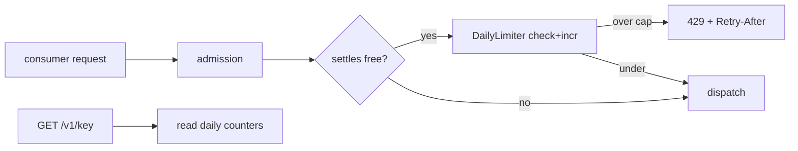
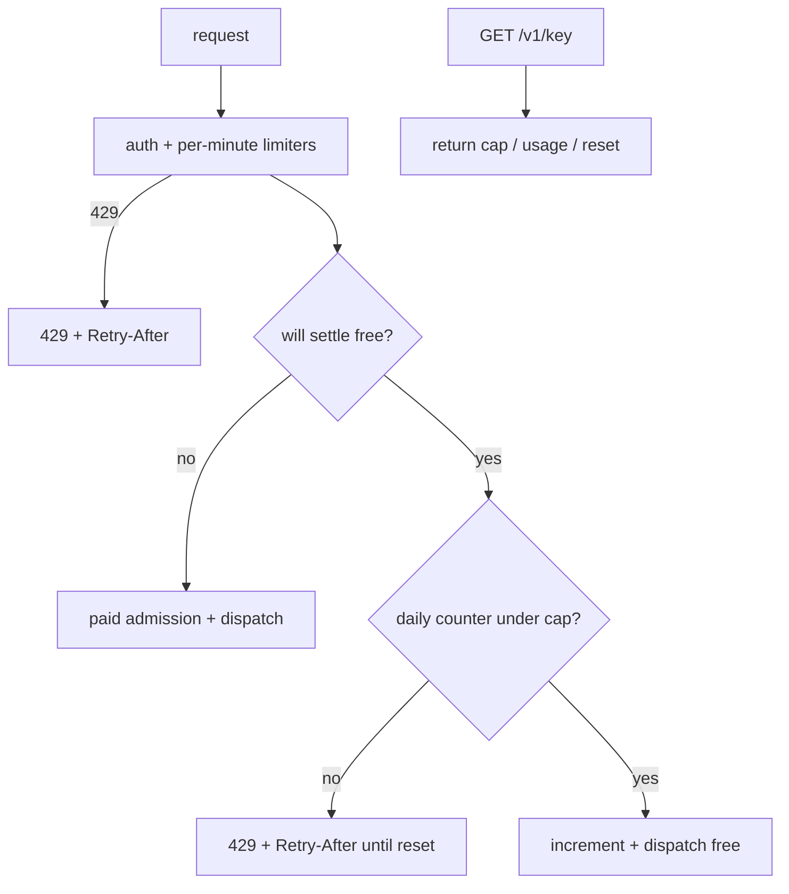

# ORP-047: Free-tier daily request caps surfaced in `/v1/key`

> Last updated: 2026-09-25 · commit `b6f9574ed`

If a free router or tier ships, it needs OpenRouter-style daily request caps tiered by lifetime spend, with live counters exposed on the key-info endpoint. This issue is part of the OpenRouter-perspective review; see the [review index](../README.md).

## What

Darkbloom has free-of-charge paths (self-route free settlement, model token promotions via `coordinator/api/model_token_promotions.go`) but no concept of a per-account daily request cap for free usage. Rate limiting today is purely per-minute: `coordinator/ratelimit/ratelimit.go` (`Limiter`) and `coordinator/ratelimit/token_limiter.go` (`TokenLimiter`), configured in `coordinator/ratelimit/config.go` (`ReadConfig`). The key-info endpoint `GET /v1/key` (`coordinator/api/server.go`, `handleGetCallingKey`) already exists as the natural place to surface counters.

OpenRouter (OpenRouter limits, https://openrouter.ai/docs/api-reference/limits) caps `:free` models at 20 RPM always, plus 50 requests/day when lifetime purchased credits are under $10 and 1000/day otherwise, with counters visible in `GET /api/v1/key`.

## Why

Uncapped free capacity on donated hardware is an abuse magnet: a free tier without a daily ceiling invites scripted exhaustion of volunteer GPU time. Caps without visibility generate support load, because users hit an undocumented wall and cannot tell whether they are blocked, broken, or banned.

## Prompt

Implement daily request caps for free-of-charge usage and surface them in `GET /v1/key`. Goal: when a request settles free of charge (self-route free settlement or a token promotion), increment a per-account daily counter; when the counter exceeds the account's daily cap, reject further free requests with 429 plus `Retry-After` until UTC midnight. Cap is tiered by lifetime purchased credit total (default tier and raised tier, both configurable via `coordinator/ratelimit/config.go`). Constraints: counters must survive coordinator restarts (persist via the store layer, Postgres-backed in prod), the check must sit after the free-settlement decision so paid traffic is never capped, and the paid path must see zero added latency. Files: `coordinator/ratelimit/` (new daily limiter), `coordinator/api/server.go` (`handleGetCallingKey` response fields), `coordinator/store/` (counter persistence). Acceptance: free requests beyond the daily cap get 429 with `Retry-After`; `GET /v1/key` returns the cap, usage, and reset time; paid accounts are unaffected; `go test ./coordinator/...` passes.

## Workflow

1. Define the daily-cap config (default cap, raised cap, lifetime-spend threshold) in `coordinator/ratelimit/config.go`.
2. Add a `DailyLimiter` in `coordinator/ratelimit/` with UTC-day buckets backed by the store.
3. Hook the increment into the free-settlement paths (self-route, token promotions).
4. Add the cap check to admission for requests that will settle free; return 429 + `Retry-After` on exceed.
5. Extend `handleGetCallingKey` with daily-cap fields (limit, usage, reset).
6. Add unit tests for tier selection, cap enforcement, reset at day boundary, and paid-path bypass.
7. Update `docs/reference/api-contracts.md` for the new `/v1/key` fields.

## Loop

- Run `go test ./coordinator/ratelimit/ ./coordinator/api/` and `make coordinator-test`; all green.
- Exercise with a test account: burn the daily cap, confirm 429 shape, confirm `/v1/key` counters, confirm reset at the next UTC day boundary (time-injected in tests).
- Definition of done: cap enforced only on free-settling traffic, counters visible, restart-safe, tests and docs green.

## Graph

## Layout

- `coordinator/ratelimit/daily_limiter.go` — new daily bucket limiter
- `coordinator/ratelimit/config.go` — cap tiers and threshold config
- `coordinator/api/server.go` — admission hook + `handleGetCallingKey` fields
- `coordinator/store/` — counter persistence
- `docs/reference/api-contracts.md` — document new `/v1/key` fields

No UI surface.

## Flow

Severity: medium · Effort: M
