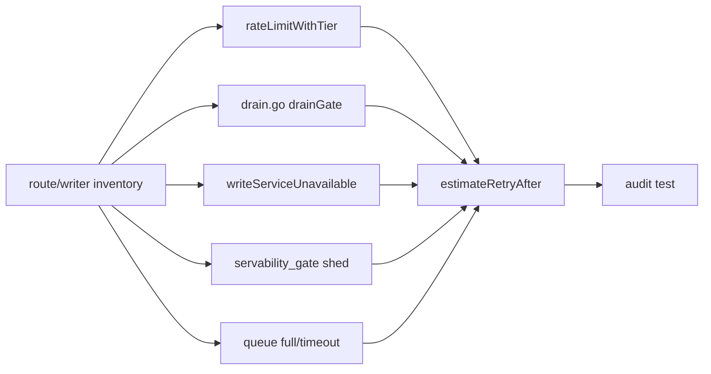
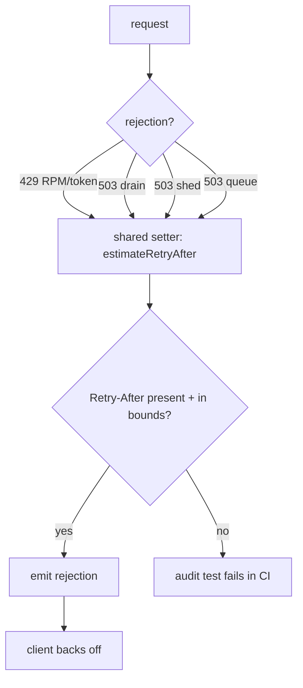

# ORP-048: `Retry-After` coverage audit on all 429/503 paths

> Last updated: 2026-09-25 · commit `b6f9574ed`

Not every 429/503 writer is verified to carry a well-formed `Retry-After`, and nothing tests that invariant across the route table. This issue is part of the OpenRouter-perspective review; see the [review index](../README.md).

## What

Darkbloom computes retry hints in `coordinator/api/consumer.go` (`estimateRetryAfter` — base 2s, queue-depth×3 capped 30s, distress-scaled by route-latency EWMA capped 60s, provider `feasible_after_ms` clamped [2,30]s). Known 429/503 writers include `rateLimitWithTier` and the token limiter (`coordinator/api/server.go`), the drain gate (`coordinator/api/drain.go`, `drainGate`), `writeServiceUnavailable` (`coordinator/api/consumer.go`, `coordinator/api/inference_admission.go`), the servability shed path (`coordinator/api/servability_gate.go`), and queue full/timeout rejections. Each sets headers independently; no test walks the route table asserting `Retry-After` presence and sanity on every retryable rejection.

OpenRouter (OpenRouter limits, https://openrouter.ai/docs/api-reference/limits) attaches `Retry-After` on its retryable rejections, including its in-flight-budget 402s.

## Why

One missing header on a hot path turns backoff-capable SDKs into retry storms: clients that honor `Retry-After` fall back to immediate or fixed-interval retries when it is absent. The 2026-08-31 OpenRouter 504 cascade ([root-cause report](../../2026-08-31-openrouter-504-cascade-root-cause.md)) showed what retry amplification does to this fleet.

## Prompt

Audit and enforce `Retry-After` coverage on every 429 and 503 the coordinator emits. Goal: produce an inventory of all 429/503 writers (at minimum: `rateLimitWithTier`, `setTokenRateLimitHeaders` path, `drainGate` in `coordinator/api/drain.go`, `writeServiceUnavailable` in `coordinator/api/consumer.go` and `coordinator/api/inference_admission.go`, servability shed in `coordinator/api/servability_gate.go`, queue full/timeout), fix any writer missing the header or emitting a malformed value (must be a positive integer number of seconds, consistent with `estimateRetryAfter` bounds), and add a regression test that walks the route table or writer inventory and asserts coverage. Constraints: do not change rejection status codes or body shapes; use `estimateRetryAfter` (or a shared helper) rather than inventing new retry math per site. Files: `coordinator/api/consumer.go`, `coordinator/api/server.go`, `coordinator/api/drain.go`, `coordinator/api/servability_gate.go`, `coordinator/api/inference_admission.go`, plus a new test file. Acceptance: every 429/503 path emits a well-formed `Retry-After`; the audit test fails if a new rejection path is added without one; `go test ./coordinator/...` passes.

## Workflow

1. Grep for every `WriteHeader(http.StatusTooManyRequests)` and `WriteHeader(http.StatusServiceUnavailable)` call site; build the inventory.
2. For each site, record whether `Retry-After` is set and whether the value is well-formed.
3. Route any missing/incorrect site through `estimateRetryAfter` or a shared setter helper.
4. Write a table-driven test that enumerates the rejection paths and asserts header presence and bounds.
5. Add a lint-style guard or test hook so future rejection writers register in the inventory.
6. Update `docs/reference/api-contracts.md` to state the `Retry-After` guarantee on 429/503.

## Loop

- Run `go test ./coordinator/api/ -run RetryAfter` plus `make coordinator-test`; all green.
- Grep the diff to confirm no rejection site bypasses the shared setter.
- Definition of done: inventory complete and encoded in a test, all sites fixed, `make coordinator-test` green.

## Graph

## Layout

- `coordinator/api/consumer.go` — `estimateRetryAfter`, shared setter
- `coordinator/api/server.go` — `rateLimitWithTier`, token-limit rejection
- `coordinator/api/drain.go` — `drainGate`
- `coordinator/api/servability_gate.go` — shed path
- `coordinator/api/inference_admission.go` — `writeServiceUnavailable` sites
- `coordinator/api/retry_after_audit_test.go` — new route-table audit test
- `docs/reference/api-contracts.md` — header guarantee

No UI surface.

## Flow

Severity: medium · Effort: S
