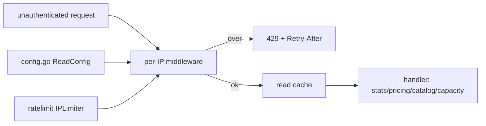
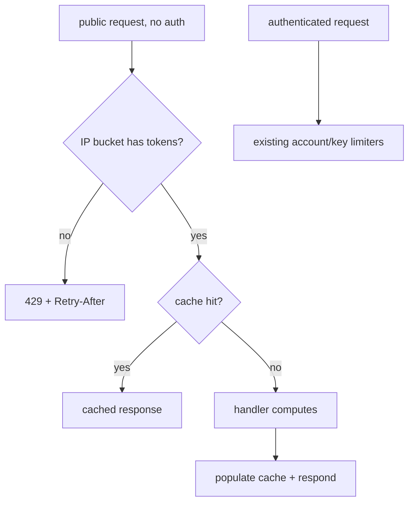

# ORP-049: Per-IP abuse limiting on unauthenticated endpoints

> Last updated: 2026-09-25 · commit `b6f9574ed`

Darkbloom's public, unauthenticated endpoints have no per-IP limiting; caches absorb reads but nothing stops enumeration or scan abuse. This issue is part of the OpenRouter-perspective review; see the [review index](../README.md).

## What

Identity in Darkbloom rate limiting is always the account or key: `coordinator/ratelimit/ratelimit.go` (`Limiter`) buckets per account, `coordinator/ratelimit/key_token_limiter.go` (`KeyTokenLimiter`) per key. There is no per-IP limiting anywhere. The unauthenticated public endpoints — `/v1/models/capacity`, `/v1/stats`, `/v1/pricing`, `/v1/models/catalog`, served from `coordinator/api/server.go` and `coordinator/api/stats.go` — rely on caching only.

OpenRouter's documented limits (OpenRouter limits, https://openrouter.ai/docs/api-reference/limits) are account-scoped like Darkbloom's, but its public API sits behind edge protection; Darkbloom's equivalent protection does not exist at the coordinator layer.

## Why

The public catalog and capacity feeds are designed for upstream routers that poll them; unauthenticated scraping at scale is free today. A single client can enumerate the catalog, hammer the capacity feed, or scan pricing at arbitrary rate, and the only mitigation is the read cache absorbing repeated identical queries — nothing stops distinct-path enumeration or cache-busting scans.

## Prompt

Add a lightweight per-IP token bucket in front of the unauthenticated public endpoints. Goal: requests to `/v1/models/capacity`, `/v1/stats`, `/v1/pricing`, and `/v1/models/catalog` are rate-limited per client IP (configurable rps and burst, generous defaults sized for legitimate router polling); over-limit requests get 429 with `Retry-After`. Constraints: IP extraction must honor the deployment's trusted-proxy setup (use the same remote-addr handling the server already uses, if any; otherwise document the direct-IP assumption); the limiter must be memory-bounded (evict idle IP buckets); authenticated endpoints must not be affected; the per-IP check must run before cache lookup so abuse cannot ride the cache for free. Files: `coordinator/ratelimit/` (new IP limiter), `coordinator/ratelimit/config.go` (`ReadConfig`), `coordinator/api/server.go` (route wiring). Acceptance: a scripted burst from one IP against `/v1/stats` gets 429 + `Retry-After` after the burst allowance; other IPs unaffected; authenticated routes unaffected; `go test ./coordinator/...` passes.

## Workflow

1. Add an `IPLimiter` in `coordinator/ratelimit/` reusing the token-bucket mechanics of `Limiter`, keyed by IP with idle-bucket eviction.
2. Add per-IP rate/burst config to `coordinator/ratelimit/config.go` with defaults sized above normal router polling cadence.
3. Wire a middleware in `coordinator/api/server.go` applied only to the four public routes, placed before the cache.
4. Extract client IP consistently with the existing server remote-addr handling; document the proxy assumption.
5. Emit 429 with `Retry-After` on exceed (well-formed, per ORP-048 conventions).
6. Add unit tests: burst exhaustion, multi-IP independence, eviction, authenticated-route bypass.
7. Update `docs/reference/api-contracts.md` and `docs/reference/configuration.md`.

## Loop

- Run `go test ./coordinator/ratelimit/ ./coordinator/api/` and `make coordinator-test`; all green.
- Load-check: burst one public endpoint from a test client and observe 429s with `Retry-After`; confirm a second IP is unaffected.
- Definition of done: per-IP cap enforced on the four public routes pre-cache, bounded memory, tests and docs green.

## Graph

## Layout

- `coordinator/ratelimit/ip_limiter.go` — new per-IP bucket limiter
- `coordinator/ratelimit/config.go` — per-IP defaults
- `coordinator/api/server.go` — middleware wiring on public routes
- `coordinator/api/stats.go` — verify ordering vs cache
- `docs/reference/api-contracts.md`, `docs/reference/configuration.md` — document limits and config

No UI surface.

## Flow

Severity: medium · Effort: M
