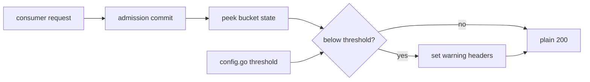
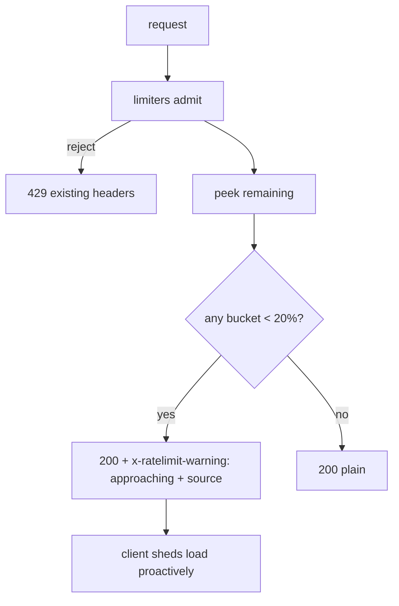

# ORP-050: Limit-approaching warning headers

> Last updated: 2026-09-25 · commit `b6f9574ed`

Darkbloom emits no soft signal as a client nears its RPM or TPM caps; the first sign of trouble is a hard 429. This issue is part of the OpenRouter-perspective review; see the [review index](../README.md).

## What

The limiters know how close a client is: `coordinator/ratelimit/ratelimit.go` (`Limiter`) holds the RPM bucket state and `coordinator/ratelimit/token_limiter.go` (`TokenLimiter`) holds the ITPM/OTPM state, peeked during admission in `coordinator/api/server.go` (`applyTokenRateLimitWithAdmission`). No response carries an "approaching limit" indicator; headers exist only on rejections (`setTokenRateLimitHeaders`, `rateLimitWithTier`).

OpenRouter does not document a warning-header convention (OpenRouter limits, https://openrouter.ai/docs/api-reference/limits), so this is a place where Darkbloom would go beyond parity rather than catch up to it.

## Why

Soft warnings let clients shed load before hard 429s. A consumer that can see `x-ratelimit-warning: approaching` when its remaining RPM or token budget drops below a threshold can queue, downgrade models, or fan out across keys — all cheaper than emergency backoff after rejections have already started failing user requests.

## Prompt

Emit limit-approaching warning headers on successful consumer inference responses. Goal: when the post-admission remaining capacity of the RPM bucket or either token bucket falls below a configurable fraction of its limit (default 20%), set `x-ratelimit-warning: approaching` and a machine-readable `x-ratelimit-warning-source` header naming which bucket is hot (`requests`, `input-tokens`, `output-tokens`, comma-joined if several). Constraints: read-only peeks only — never consume capacity for warning computation; zero behavior change to admission decisions; threshold configurable via `coordinator/ratelimit/config.go`; combine cleanly with the remaining-capacity headers of ORP-046 (share the peek helper if both land). Files: `coordinator/api/server.go`, `coordinator/ratelimit/ratelimit.go`, `coordinator/ratelimit/token_limiter.go`, `coordinator/ratelimit/config.go`, plus tests. Acceptance: responses near the cap carry the warning headers naming the correct source; responses with ample headroom carry none; rejection paths unchanged; `go test ./coordinator/...` passes.

## Workflow

1. Add (or reuse, if ORP-046 landed) read-only peek methods on `Limiter` and `TokenLimiter`.
2. Add the warning-threshold fraction to `coordinator/ratelimit/config.go` (`ReadConfig`).
3. Implement `setRateLimitWarningHeaders` in `coordinator/api/server.go`, called on the inference success path.
4. Cover single-source and multi-source warning cases in unit tests.
5. Verify no headers appear when all buckets are above threshold.
6. Update `docs/reference/api-contracts.md` with the header semantics.

## Loop

- Run `go test ./coordinator/api/ ./coordinator/ratelimit/` and `make coordinator-test`; all green.
- Drive a test account near its RPM cap and confirm the warning appears before the first 429.
- Definition of done: warnings fire at the configured threshold with correct source attribution, tests and docs green.

## Graph

## Layout

- `coordinator/ratelimit/ratelimit.go` — peek support
- `coordinator/ratelimit/token_limiter.go` — peek support
- `coordinator/ratelimit/config.go` — warning threshold
- `coordinator/api/server.go` — `setRateLimitWarningHeaders`
- `docs/reference/api-contracts.md` — header documentation

No UI surface.

## Flow

Severity: low · Effort: S
