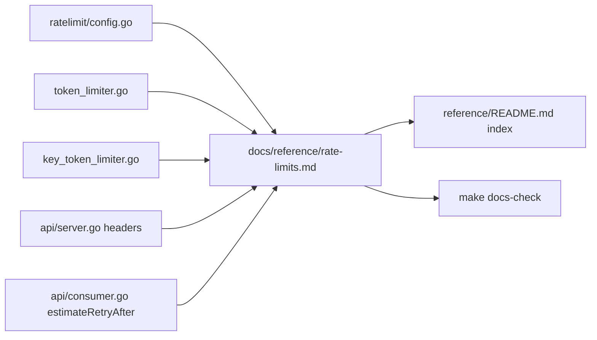
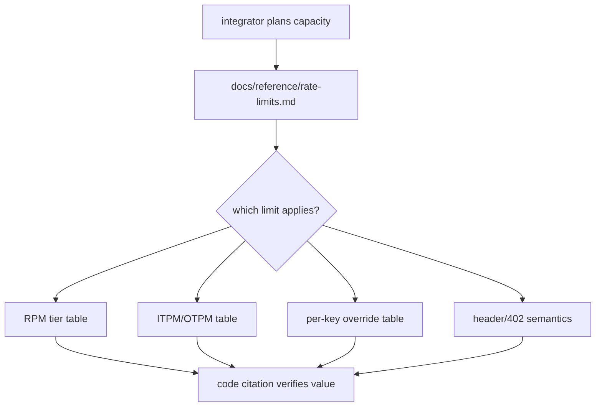

# ORP-051: Limits reference doc

> Last updated: 2026-09-25 · commit `b6f9574ed`

Every rate-limit tier, default, and header semantic exists only in code; there is no single reference page an integrator can plan against. This issue is part of the OpenRouter-perspective review; see the [review index](../README.md).

## What

The numbers live scattered in source: RPM tiers and bursts in `coordinator/ratelimit/config.go` (`ReadConfig` — consumer Inference 20 rps / burst 120, Financial 0.2 rps / burst 3, Service 200 rps / burst 600), token budgets in `coordinator/ratelimit/token_limiter.go` (`TokenLimiter` — consumer 5M ITPM burst 1M / 500K OTPM burst 64K; service 50M/5M), per-key overrides in `coordinator/ratelimit/key_token_limiter.go` (`KeyTokenLimiter`), header semantics in `coordinator/api/server.go` (`rateLimitWithTier`, `setTokenRateLimitHeaders`), and retry-hint math in `coordinator/api/consumer.go` (`estimateRetryAfter`). No `docs/reference/` page consolidates them.

OpenRouter publishes exactly this as a single page (OpenRouter limits, https://openrouter.ai/docs/api-reference/limits) covering both its credit-limit and rate-limit families.

## Why

Integrators cannot plan capacity against numbers they cannot read. Every consumer tuning a batch job or sizing a retry policy today must grep the coordinator source, and any drift between an integrator's assumptions and the shipped defaults surfaces only as production 429s.

## Prompt

Write `docs/reference/rate-limits.md`, a reference page consolidating Darkbloom's rate-limit surface. Goal: one page with tables for (a) RPM tiers and burst sizes per account tier including the service-role tier, (b) ITPM/OTPM token budgets and bursts, (c) per-key override mechanics (`KeyTokenLimiter`, `applyKeyRPMLimit`), (d) header semantics on 429 (`Retry-After`, `X-RateLimit-Reset`, `x-ratelimit-*-tokens`) and their absence on success, (e) 402 shapes (balance/spend-cap, no `Retry-After`), (f) `estimateRetryAfter` bounds. Constraints: follow docs/AGENTS.md — reference-type skeleton, every row cites code as `path` (`symbol`), quote defaults exactly as the code spells them, no freshness stamp in this review context (added centrally); add the page to the `docs/reference/README.md` index; verify with `make docs-check`. Files: `docs/reference/rate-limits.md` (new), `docs/reference/README.md` (index entry). Acceptance: every number on the page greps to the cited code; `make docs-check` passes; page reachable from the reference index.

## Workflow

1. Re-read `coordinator/ratelimit/config.go`, `token_limiter.go`, `key_token_limiter.go`, and the header writers in `coordinator/api/server.go` to extract exact values.
2. Draft the page skeleton per docs/AGENTS.md §3 (reference type: tables, one-lede-sentence sections, code citations per row).
3. Fill the tier, token-budget, override, header, and 402 tables.
4. Add the index entry in `docs/reference/README.md`.
5. Run `make docs-check` and fix any citation or link failures.
6. Re-verify each quoted default against code before finalizing.

## Loop

- Run `make docs-check`; green.
- Spot-check: every numeric value on the page matches its cited source line.
- Definition of done: page lands, index links it, docs lint passes, no number uncited.

## Graph

## Layout

- `docs/reference/rate-limits.md` — new reference page
- `docs/reference/README.md` — index entry

No UI surface.

## Flow

Severity: low · Effort: S
