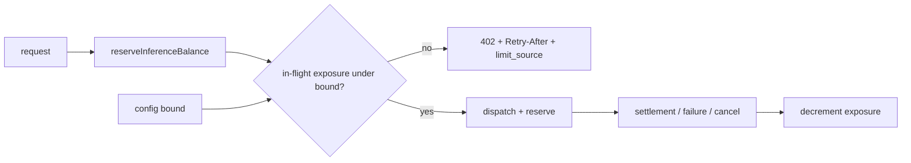
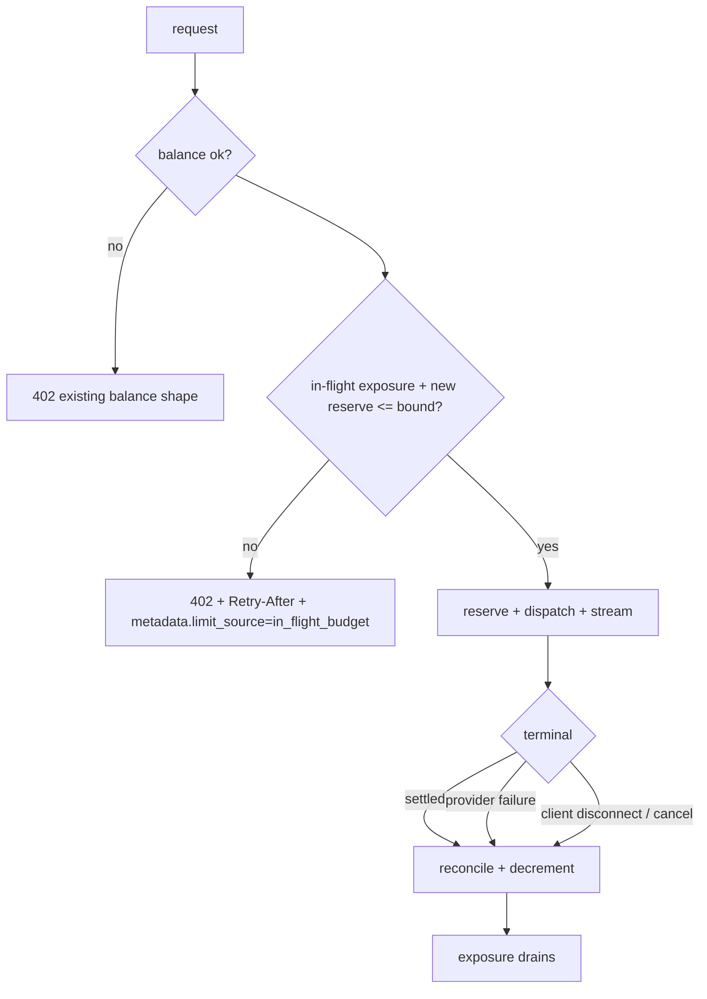

# ORP-052: In-flight budget 402 with `Retry-After`

> Last updated: 2026-09-25 · commit `b6f9574ed`

Darkbloom bounds balance and spend caps but not the total value of concurrent unsettled reservations per account; OpenRouter rejects that case with a typed 402 carrying `Retry-After`. This issue is part of the OpenRouter-perspective review; see the [review index](../README.md).

## What

Admission reserves worst-case cost per request in `coordinator/api/inference_admission.go` (`reserveInferenceBalance`), and per-key caps are enforced in `checkKeySpendCap`. Both produce 402s, but neither carries `Retry-After` or limit metadata, and neither bounds the sum of simultaneously in-flight reservations: an account with balance B can hold arbitrarily many concurrent reservations so long as each fits. Post-hoc reconciliation (`coordinator/ratelimit/output_admission.go`, `reconcileOutputAdmission`) settles output after the fact but does not cap concurrent exposure.

OpenRouter (OpenRouter limits, https://openrouter.ai/docs/api-reference/limits) rejects with 402 + `Retry-After` when in-flight reservations exceed the account's supported exposure, tagging the error body with `metadata.limit_source`.

## Why

A prepaid network carrying many concurrent unsettled reservations per account has unbounded unsettled exposure by default. Long-running streams hold reservations for their whole duration; a client fanning out hundreds of slow streams multiplies the coordinator's unsettled liability far beyond the account balance check performed once at admission.

## Prompt

Add a bounded-exposure check at inference admission with a typed 402 response. Goal: track the sum of active (unsettled) reservation value per account; when a new reservation would push the sum above a configurable multiple of the account's current balance (or an absolute cap, configurable in `coordinator/ratelimit/config.go` or the billing config), reject with HTTP 402, a well-formed `Retry-After`, and an error body carrying `metadata.limit_source: "in_flight_budget"` (aligned with ORP-025's limit_source work). Constraints: the counter must decrement on every settlement path including error and client-disconnect paths (reconciliation, failures, cancels); no change to the existing balance or key-cap 402 shapes; tracking must be consistent under coordinator restarts to the same degree the reservation ledger is. Files: `coordinator/api/inference_admission.go`, `coordinator/ratelimit/output_admission.go`, settlement/cancel call sites, config, plus tests. Acceptance: exceeding the exposure bound returns 402 + `Retry-After` + typed body; normal concurrency is unaffected; exposure returns to zero after all streams settle or fail; `go test ./coordinator/...` passes.

## Workflow

1. Add an in-flight exposure tracker (per-account sum of active reservations) alongside `reserveInferenceBalance`.
2. Define the bound (balance multiple and/or absolute cap) in config with a safe default.
3. Check the bound at admission before reserving; emit the typed 402 with `Retry-After` via the shared retry-hint path.
4. Decrement exposure on every terminal path: success settlement, provider failure, cancel, client disconnect.
5. Add tests: exceed-bound rejection, decrement-on-failure, decrement-on-disconnect, restart behavior.
6. Coordinate the `metadata.limit_source` value with ORP-025.
7. Update `docs/reference/api-contracts.md` with the new 402 shape.

## Loop

- Run `go test ./coordinator/api/ -run Admission` and `make coordinator-test`; all green.
- Integration-check: open many concurrent long streams on one test account, observe the typed 402 once the bound trips, then confirm exposure drains to zero as streams end.
- Definition of done: bound enforced and drained on all terminal paths, typed error body, tests and docs green.

## Graph

## Layout

- `coordinator/api/inference_admission.go` — exposure check + typed 402
- `coordinator/ratelimit/output_admission.go` — decrement on reconcile
- `coordinator/api/` cancel/failure call sites — decrement hooks
- `coordinator/ratelimit/config.go` or billing config — bound settings
- `docs/reference/api-contracts.md` — 402 shape

No UI surface.

## Flow

Severity: medium · Effort: M
