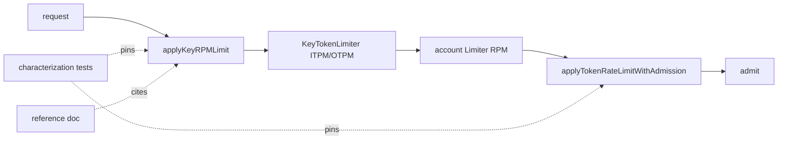
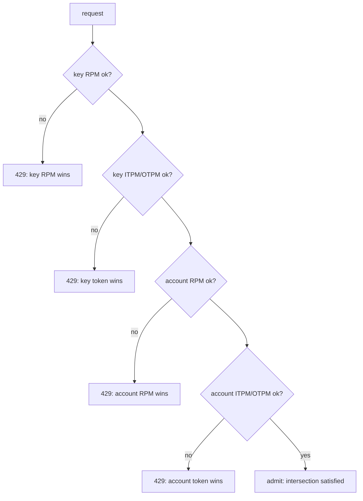

# ORP-053: Account ∩ key limit intersection semantics, documented and tested

> Last updated: 2026-09-25 · commit `b6f9574ed`

Per-key limiters run before account limiters, producing an effective intersection that is nowhere documented or tested as a contract. This issue is part of the OpenRouter-perspective review; see the [review index](../README.md).

## What

Admission applies key-scoped limits before account-scoped ones: `applyKeyRPMLimit` and the `KeyTokenLimiter` checks (`coordinator/ratelimit/key_token_limiter.go`) run ahead of the account `Limiter` and `TokenLimiter` admission (`coordinator/api/server.go`, `applyTokenRateLimitWithAdmission`). The effective limit for any request is the intersection of the key's overrides and the account's tier — but the precedence order, the interaction of a tighter key limit with a looser account limit (and vice versa), and which rejection the client sees first are implicit in call order and untested as a contract.

OpenRouter documents its two limit families and tags rejections with `metadata.limit_source` (OpenRouter limits, https://openrouter.ai/docs/api-reference/limits), so a client can tell credit limits from rate limits; Darkbloom has no equivalent attribution (see ORP-025).

## Why

"Which limit did I hit" is undebuggable without written precedence rules. A consumer with a custom per-key cap who gets a 429 cannot tell whether the key override or the account tier fired, and neither can a support engineer reading the logs — the rejection looks identical either way.

## Prompt

Document and test the limit-intersection contract. Goal: (1) write down the precedence rules — evaluation order of key RPM, key ITPM/OTPM, account RPM, account ITPM/OTPM; which limiter consumes on success; which rejection a client sees when several limits are simultaneously exceeded — as a section in the limits reference doc (ORP-051) or a dedicated `docs/reference/` section; (2) encode the rules as characterization tests in `coordinator/api/` covering: key-tighter-than-account, account-tighter-than-key, simultaneous exceed (assert which 429 wins), and key-override-with-default-tier. Constraints: this issue is contract-pinning, not behavior change — if a test reveals the current order is surprising, record the finding in the issue thread rather than silently reordering; coordinate any response-body attribution with ORP-025's `metadata.limit_source`. Files: `docs/reference/rate-limits.md` (or sibling), `coordinator/api/` test files. Acceptance: every precedence rule has a passing characterization test; the doc cites the enforcing code per rule; `go test ./coordinator/...` and `make docs-check` pass.

## Workflow

1. Trace the admission call order in `coordinator/api/server.go` and write down the actual evaluation sequence.
2. Enumerate the intersection cases (key vs account, RPM vs TPM, simultaneous exceed).
3. Write characterization tests pinning current behavior for each case.
4. Document the rules with per-rule code citations in the limits reference page.
5. Note any surprising orderings as follow-up findings; do not change behavior here.
6. Run `make docs-check` and the new tests.

## Loop

- Run `go test ./coordinator/api/ -run Limit` and `make coordinator-test`; all green.
- Cross-check the doc against the tests: every documented rule has a test, every test maps to a doc row.
- Definition of done: precedence contract written, cited, and pinned by tests; docs lint green.

## Graph

## Layout

- `docs/reference/rate-limits.md` — precedence/intersection section (with ORP-051)
- `coordinator/api/` — new characterization test file for limit intersection
- Optionally `coordinator/api/server.go` — code comments naming the contract

No UI surface.

## Flow

Severity: low · Effort: S
