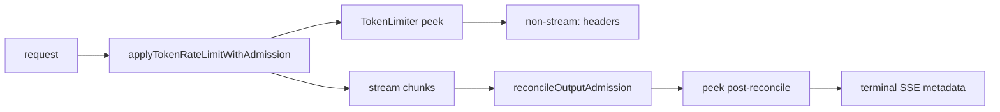
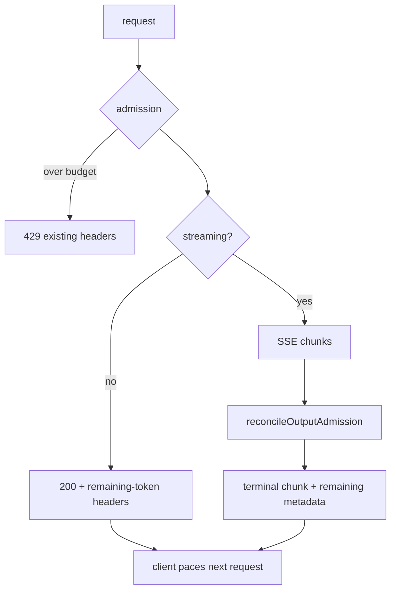

# ORP-054: Remaining-budget observability per response

> Last updated: 2026-09-25 · commit `b6f9574ed`

Inference responses carry no token-budget headroom, so streaming clients pacing long generations get budget feedback only at admission failure. This issue is part of the OpenRouter-perspective review; see the [review index](../README.md).

## What

Token admission charges the account's ITPM/OTPM buckets upfront in `coordinator/api/server.go` (`applyTokenRateLimitWithAdmission`) and reconciles output post-hoc in `coordinator/ratelimit/output_admission.go` (`reconcileOutputAdmission`). The bucket state after these operations is not echoed anywhere: success responses carry no rate-limit headers at all, and rejection headers (`setTokenRateLimitHeaders`) appear only on the limited path. This issue is distinct from ORP-046, which covers rate-window (RPM) visibility — here the subject is token budget headroom.

OpenRouter surfaces usage accounting on responses and key metadata (OpenRouter limits, https://openrouter.ai/docs/api-reference/limits), giving clients a way to track consumption against their budget mid-session.

## Why

Streaming clients pacing long generations need budget feedback mid-session, not only at admission failure. A client generating a 100K-token response that discovers its OTPM headroom only when the next request is rejected has already committed to a pacing strategy it can no longer afford; per-response headroom lets it throttle generation rate or split work before the wall.

## Prompt

Echo post-admission token-budget headroom on inference responses. Goal: after admission commit (and again in the final stream chunk / response footer after output reconciliation), include ITPM and OTPM remaining values — as response headers on non-streaming responses (`x-ratelimit-remaining-input-tokens`, `x-ratelimit-remaining-output-tokens`, consistent with the rejection-path names in `setTokenRateLimitHeaders`) and as a metadata field on the terminal SSE chunk for streaming responses. Constraints: read-only peeks of `TokenLimiter` state, no extra consumption; header values must reflect post-admission state for the initial response and post-reconciliation state for the terminal chunk; must not break the existing SSE chunk shape for clients that ignore unknown fields; coordinate header names with ORP-046 so both use one shared peek helper. Files: `coordinator/api/server.go`, `coordinator/api/consumer.go` (streaming terminal chunk), `coordinator/ratelimit/token_limiter.go`, `coordinator/ratelimit/output_admission.go`, plus tests. Acceptance: non-streaming responses carry remaining-budget headers; streaming terminal chunks carry the reconciled remaining values; rejection behavior unchanged; `go test ./coordinator/...` passes.

## Workflow

1. Add a read-only remaining-budget peek to `TokenLimiter` (shared with ORP-046 if landed).
2. Set remaining headers on non-streaming success responses after admission commit.
3. After `reconcileOutputAdmission`, attach the reconciled remaining values to the terminal SSE chunk metadata.
4. Verify unknown-field tolerance of the SSE shape against existing client parsing.
5. Add unit tests for both non-streaming headers and streaming terminal metadata.
6. Update `docs/reference/api-contracts.md` with the fields and their timing semantics.

## Loop

- Run `go test ./coordinator/api/ ./coordinator/ratelimit/` and `make coordinator-test`; all green.
- Drive one streaming and one non-streaming request against a local coordinator; confirm header values match bucket state and the terminal chunk carries reconciled values.
- Definition of done: both response modes expose budget headroom, values verified against bucket state, docs updated.

## Graph

## Layout

- `coordinator/ratelimit/token_limiter.go` — peek method
- `coordinator/api/server.go` — success-path headers
- `coordinator/api/consumer.go` — terminal SSE chunk metadata
- `coordinator/ratelimit/output_admission.go` — expose post-reconcile state
- `docs/reference/api-contracts.md` — field documentation

No UI surface.

## Flow

Severity: low · Effort: S
