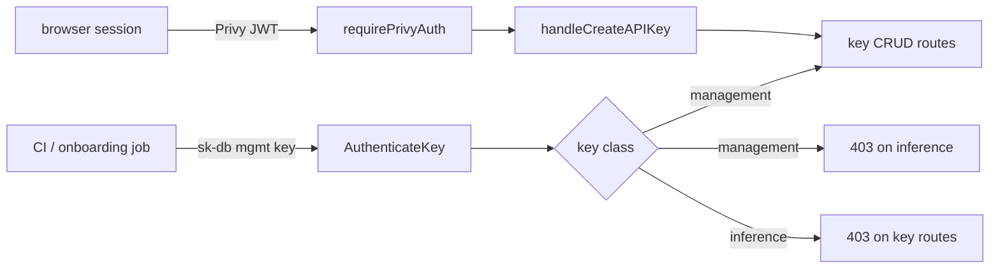
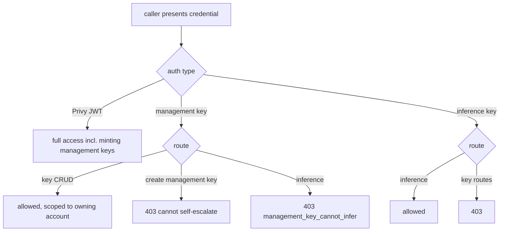

# ORP-055: Management/provisioning API keys

> Last updated: 2026-09-25 · commit `b6f9574ed`

Darkbloom can only mint API keys from a browser-authenticated Privy session, so there is no way to provision keys programmatically from CI/CD or onboarding automation. Part of the OpenRouter-perspective review; see the [review index](../README.md).

## What

OpenRouter supports Management API keys: a separate key class with full CRUD over `/api/v1/keys` that cannot itself run inference (OpenRouter management API keys, https://openrouter.ai/docs/guides/overview/auth/management-api-keys). Darkbloom's key-management routes (`POST /v1/keys`, list/get, `PATCH`, `DELETE`, `POST /v1/keys/{id}/rotate` in `coordinator/api/apikey_handlers.go`, `handleCreateAPIKey`) are gated behind `requirePrivyAuth` (`coordinator/api/server.go`), so an API key presented to them gets 403. Key authentication (`store.AuthenticateKey` in `coordinator/store/apikey.go`) has no scope or class concept — a key is an inference credential, nothing more. There is no provisioning key that can mint other keys.

## Why

Every B2B integration needs programmatic key provisioning — one key per end user, per environment, per CI job. Today each key requires a human in a browser, which blocks customer-onboarding automation and forces integrators to share one long-lived key across workloads.

## Prompt

Add a management-key class to the coordinator. Goal: a key flagged as a management key can call the key CRUD routes (create, list, get, patch, delete, rotate) for its owning account, and cannot run inference or call any other consumer endpoint. Constraints: (1) management keys must be mintable only by a Privy-authenticated session — a management key cannot create another management key, so privilege never self-escalates; (2) management keys cannot raise scope: they cannot patch `limit_usd`, rate limits, or `allowed_models` on themselves, and keys they create must default to bounded limits; (3) they inherit the existing wire format (`sk-db-<64 hex>`, SHA-256 hash at rest, `key_<24 hex>` public ID from `GenerateRawKey`/`GenerateKeyID`); (4) inference routes must reject management keys with a distinct 403 error code so integrators can detect misuse; (5) management keys never expose provider identity — they touch key records only. Files to touch: `coordinator/store/apikey.go` (key class field on the key record and auth result), `coordinator/api/apikey_handlers.go` (admit management-key auth on CRUD routes, block scope escalation), `coordinator/api/server.go` (middleware that routes key-class checks), `coordinator/api/consumer.go` or the auth middleware (reject management keys on inference), plus tests. Acceptance criteria: a management key can create/list/patch/delete/rotate inference keys for its account; a management key gets 403 on `/v1/chat/completions`; an inference key still gets 403 on key routes; a management key cannot mint another management key.

## Workflow

1. Read `requirePrivyAuth` and the key-route wiring in `coordinator/api/server.go` to map where auth is enforced today.
2. Add a key-class field (`inference` | `management`) to the key record in `coordinator/store/apikey.go`, with migration/default `inference`.
3. Surface the class from `store.AuthenticateKey` (and ensure the 60s/1000-entry auth cache carries it).
4. Add creation of management keys to `handleCreateAPIKey`, restricted to Privy-authenticated callers.
5. Add middleware that admits management keys on key CRUD routes and rejects them everywhere else.
6. Block management keys on inference routes with a distinct error code.
7. Enforce no-self-escalation in `applyKeyPatch` and key creation.
8. Add unit tests for each acceptance criterion.
9. Run `make coordinator-test`.

## Loop

Run `make coordinator-test` (or `go test ./coordinator/api/... ./coordinator/store/...` while iterating). Check: new auth-class tests pass; existing key CRUD and auth tests pass unchanged; the 403 split (management key on inference, inference key on key routes) is covered by explicit tests; rotate/delete behave identically for keys created via either path. Definition of done: all coordinator tests green and every acceptance criterion has a failing-then-passing test.

## Graph

## Layout

- Modify `coordinator/store/apikey.go` — key-class field, auth result, creation defaults.
- Modify `coordinator/api/apikey_handlers.go` — management-key auth on CRUD, no-self-escalation rules.
- Modify `coordinator/api/server.go` — key-class routing middleware.
- Add/extend tests in `coordinator/api` and `coordinator/store`.
- No UI surface.

## Flow

Severity: medium · Effort: M
