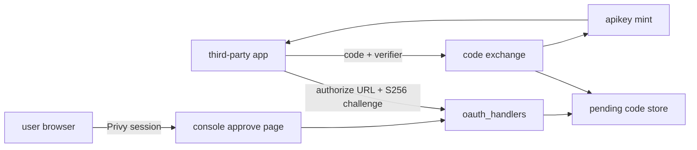
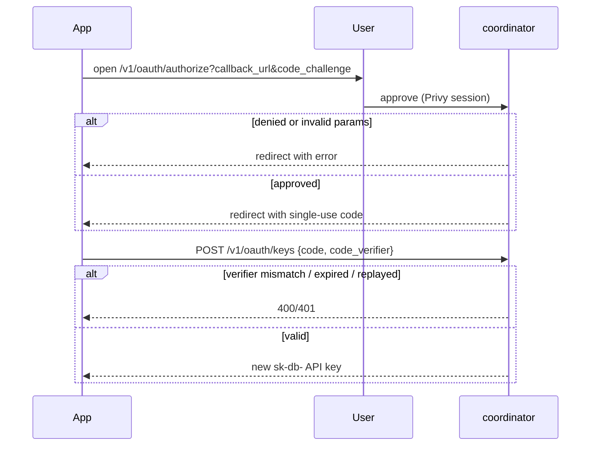

# ORP-056: PKCE OAuth flow for third-party CLIs

> Last updated: 2026-09-25 · commit `b6f9574ed`

Darkbloom has no authorization flow for third-party applications, so every integration must ask users to paste a raw API key. Part of the OpenRouter-perspective review; see the [review index](../README.md).

## What

OpenRouter offers a PKCE OAuth flow: a third-party app redirects to `https://openrouter.ai/auth?callback_url=…&code_challenge=…` (S256), the user authorizes in the browser, and the app exchanges a single-use, 10-minute-expiry code at `POST /api/v1/auth/keys` for a scoped API key (OpenRouter OAuth, https://openrouter.ai/docs/guides/overview/auth/oauth). Darkbloom's only redirect-style flow is the RFC 8628 device flow in `coordinator/api/device_auth.go` (`POST /v1/device/code` with 15-minute expiry, `POST /v1/device/approve` via Privy web, `POST /v1/device/token` polling), which issues a provider token `eigeninference-pt-…` (`coordinator/store`, `ProviderToken`). That flow links provider machines to user accounts; it is not third-party app authorization and does not issue consumer API keys.

## Why

Without an authorization-code flow, every third-party integration asks users to paste raw `sk-db-` keys into arbitrary apps — exactly the pattern phishing pages exploit, and the reason users cannot distinguish a legitimate client from a credential harvester.

## Prompt

Add a PKCE authorization-code flow for third-party apps that issues scoped consumer API keys. Goal: an app sends the user to a Darkbloom authorize URL with `callback_url` and an S256 `code_challenge`; after the user (Privy-authenticated) approves, Darkbloom redirects back with a single-use code; the app exchanges the code plus its `code_verifier` for a newly created API key. Constraints: (1) codes are single-use and expire in 10 minutes; (2) `code_challenge_method` must be `S256` only — reject `plain`; (3) `callback_url` must be validated (https, or localhost for CLI apps) at authorize time; (4) the issued key is an ordinary inference key (`sk-db-` from `GenerateRawKey`, hashed at rest, `key_<24 hex>` public ID), created with caller-requested but server-bounded limits (`limit_usd`, `rpm_limit`) and an optional `name`; (5) do not reuse the device-flow tables or endpoints — the device flow is machine-linking and must stay untouched; (6) the approve page never displays or transmits provider identity, only the app's requested scopes and limits. Files to touch: new `coordinator/api/oauth_handlers.go` (authorize, callback-redirect, code exchange), `coordinator/store` (pending-code table with expiry and single-use consume), `coordinator/api/server.go` (route wiring; authorize behind `requirePrivyAuth`, exchange unauthenticated), `console-ui` authorize/approve page, plus tests. Acceptance criteria: full round-trip issues a working inference key; replaying a consumed code fails; a wrong `code_verifier` fails; an expired code fails; `plain` challenge method is rejected.

## Workflow

1. Read `coordinator/api/device_auth.go` for the existing code-issue/poll/approve shape to mirror, not reuse.
2. Design the pending-authorization-code record (code hash, user ID, challenge, callback URL, requested limits, expiry, consumed flag) in `coordinator/store`.
3. Implement `GET /v1/oauth/authorize` behind `requirePrivyAuth`: validate params, create the code, redirect to `callback_url` with the code.
4. Implement `POST /v1/oauth/keys` (unauthenticated): verify verifier against challenge, consume code atomically, mint and return an API key.
5. Build the console-ui approve page showing app callback, requested limits, and an approve/deny choice.
6. Add store tests for expiry, single-use, and consume races.
7. Add handler tests for the full round-trip and each failure branch.
8. Run `make coordinator-test`, `make ui-lint`, `make ui-build`.

## Loop

Run `make coordinator-test` (or `go test ./coordinator/api/... ./coordinator/store/...` while iterating) plus `make ui-lint` and `make ui-build` for the approve page. Check: round-trip test passes; each failure branch (replay, wrong verifier, expiry, plain method, bad callback) has an explicit test; existing device-flow tests pass unchanged. Definition of done: coordinator and UI builds green, and a scripted end-to-end exchange (authorize → redirect → exchange → inference call) succeeds against a dev coordinator.

## Graph

## Layout

- Add `coordinator/api/oauth_handlers.go` — authorize and exchange handlers.
- Modify `coordinator/store` — pending-authorization-code persistence.
- Modify `coordinator/api/server.go` — route wiring.
- Add `console-ui/src/app/oauth/authorize/` approve page.
- Add/extend tests in `coordinator/api` and `coordinator/store`.

## Flow

Severity: low · Effort: L
