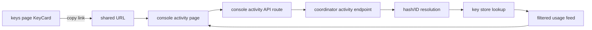
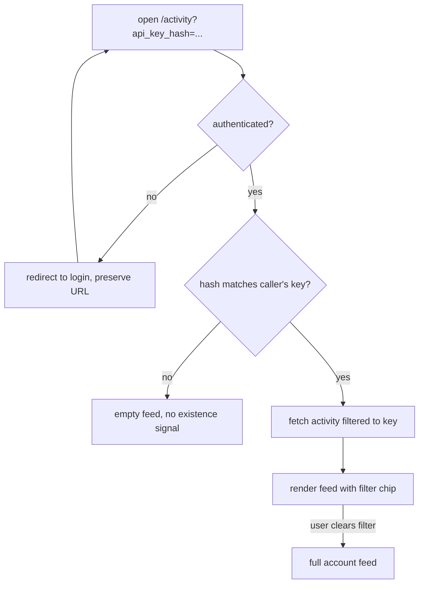

# ORP-057: Key-hash deep links into console activity

> Last updated: 2026-09-25 · commit `b6f9574ed`

Darkbloom has no shareable URL that filters activity or usage to a single API key, so operators cannot link each other to "this key's traffic". Part of the OpenRouter-perspective review; see the [review index](../README.md).

## What

OpenRouter supports key-hash deep links: `openrouter.ai/logs?api_key_hash=<sha256(key)>` opens the activity view pre-filtered to one key without exposing the key itself. Darkbloom already stores exactly this identifier — only the SHA-256 hash of each `sk-db-` key is persisted (`coordinator/store/apikey.go`, `GenerateRawKey`), with `key_<24 hex>` (`GenerateKeyID`) as the stable public ID — but no console route consumes either value as a filter. This issue depends on the console activity feed (ORP-064); the deep link is a filter over that feed, not a new data source.

## Why

Debugging a shared production key today means screenshots and log dredging instead of a link. On-call handoffs, incident tickets, and customer-support replies all need "look at this key's traffic" to be a URL.

## Prompt

Add a key-filtered deep link to the console activity view. Goal: a console URL (e.g. `/activity?key=key_<24 hex>` and/or `/activity?api_key_hash=<sha256>`) opens the activity/usage feed filtered to that key for the authenticated owner, and each key row in the keys page exposes a copyable "view activity" link. Constraints: (1) accept both the public key ID and the raw SHA-256 hash; resolve the hash server-side against the caller's own keys only — a hash belonging to another account returns an empty feed, not an error that confirms existence; (2) never accept, log, or echo raw `sk-db-` secrets; (3) the filter composes with the activity feed's existing filters (model, date range) from ORP-064 rather than replacing them; (4) the URL stays shareable — no ephemeral tokens in the query string; (5) the filtered view shows usage and error aggregates only, never provider identity. Files to touch: `console-ui` activity page (query-param parsing, filter wiring), the keys page (`console-ui/src/components/api-keys/`, per-key activity link), the activity API route under `console-ui/src/app/api/` and the coordinator endpoint it proxies (hash/ID → key resolution scoped to the caller), plus tests. Acceptance criteria: pasting a link with a valid key hash shows exactly that key's activity; a hash from another account yields an empty result; the link works after logout/login; no raw key material appears in URLs, logs, or responses.

## Workflow

1. Confirm the ORP-064 activity feed's filter parameters and extend them with a key filter if absent.
2. Add server-side resolution of `api_key_hash` / key ID to the caller's key record in the coordinator handler behind the activity endpoint.
3. Ensure cross-account hashes resolve to an empty set, not a 404/403 oracle.
4. Parse the query params on the console activity page and seed the filter UI from them.
5. Add a per-key "copy activity link" action to `console-ui/src/components/api-keys/KeyCard.tsx` (or its successor), using the key's public ID.
6. Add UI tests for param parsing and coordinator tests for scoping behavior.
7. Run `make ui-test`, `make ui-lint`, `make ui-build`, and `go test ./coordinator/api/...`.

## Loop

Run `go test ./coordinator/api/...` for the scoping behavior and `make ui-test && make ui-build` for the console. Check: scoping tests prove no cross-account oracle; the activity page renders pre-filtered from a cold URL load; the copied link round-trips. Definition of done: a shared link reproduces the filtered view for any authorized member of the owning account and shows nothing for anyone else.

## Graph

## Layout

- Modify the console activity page — query-param parsing and filter seeding.
- Modify `console-ui/src/components/api-keys/` — per-key copy-activity-link action.
- Modify the activity API route in `console-ui/src/app/api/` and the coordinator endpoint it proxies — key-hash/ID resolution scoped to the caller.
- Add/extend tests in `console-ui` and `coordinator/api`.

## Flow

Severity: low · Effort: S
