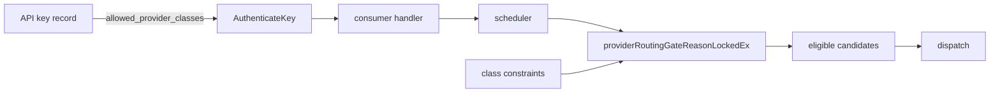
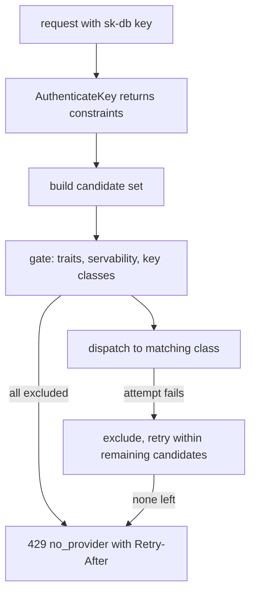

# ORP-058: Per-key provider-class allowlist

> Last updated: 2026-09-25 · commit `b6f9574ed`

Darkbloom API keys can restrict models but cannot restrict the class of providers their requests may run on, so compliance-shaped routing guarantees must be re-asserted on every request. Part of the OpenRouter-perspective review; see the [review index](../README.md).

## What

OpenRouter lets guardrails — provider allowlists and routing constraints — be attached to API keys so the constraint travels with the credential (OpenRouter guardrails, https://openrouter.ai/docs/guides/features/guardrails). Darkbloom keys support `allowed_models` (validated by `validateKeyLimitInputs` in `coordinator/api/apikey_handlers.go`) but nothing about routing. Candidate gating happens in the scheduler (`coordinator/registry/scheduler.go`, `providerRoutingGateReasonLockedEx`) with no input from the key record. Because Darkbloom never exposes provider identity to consumers, the constraint must be expressed as provider *classes* — attestation level, chip family, region, self-route — never as provider identities.

## Why

Enterprise customers need data-residency and compliance guarantees bound to the credential: "this key may only run on attested hardware in this region" must hold even when a developer forgets the request-level flag. A per-request-only control is a discipline, not a guarantee.

## Prompt

Add an `allowed_provider_classes` field to API keys, enforced in candidate gating. Goal: a key can carry a bounded list of class constraints (attestation level floor, chip-family set, region set, `self_route` requirement) and every request made with that key is routed only to candidates matching all of them. Constraints: (1) classes only — the schema must make provider identity inexpressible, and no error message may reveal which providers were excluded; (2) enforcement happens inside the scheduler's candidate gate (`providerRoutingGateReasonLockedEx`), not at the API edge, so all dispatch paths inherit it; (3) when the constraint empties the candidate set, return the existing no-provider error (429 with Retry-After) unchanged — do not leak that a key constraint caused it beyond a generic `key_routing_constraint` code visible only to the key's owner in their own error stream; (4) the field composes with `allowed_models` and `self_route_only` (intersection, never union); (5) `validateKeyLimitInputs` validates and bounds the field (max entries, closed enum of class keys). Files to touch: `coordinator/store/apikey.go` (persist the field on the key record), `coordinator/api/apikey_handlers.go` (create/patch validation), `coordinator/registry/scheduler.go` (thread key constraints into candidate gating), `coordinator/api/consumer.go` (pass the authenticated key's constraints into dispatch), plus tests. Acceptance criteria: a key restricted to a region never dispatches outside it, even with no request-level routing fields; relaxing the field via `PATCH` takes effect on the next request; empty/unset field behaves byte-identically to today.

## Workflow

1. Read `validateKeyLimitInputs` and `applyKeyPatch` in `coordinator/api/apikey_handlers.go` to mirror the `allowed_models` pattern.
2. Define the closed class schema (attestation floor, chip families, regions, self-route) and its validation bounds.
3. Persist `allowed_provider_classes` on the key record in `coordinator/store/apikey.go`, carried through `store.AuthenticateKey`.
4. Thread the authenticated key's constraints from `coordinator/api/consumer.go` into the scheduler.
5. Apply the constraint inside `providerRoutingGateReasonLockedEx` so every dispatch path is covered.
6. Define the owner-visible error code for constraint-emptied candidate sets.
7. Add unit tests: validation, gating per class, composition with `allowed_models`, unset-field regression.
8. Run `make coordinator-test`.

## Loop

Run `make coordinator-test` (or `go test ./coordinator/registry/... ./coordinator/api/...` while iterating). Check: gating tests prove exclusion per class; the unset-field regression shows identical candidate ordering to today; no test or log line emits provider identity. Definition of done: all coordinator tests green, constraint honored on every dispatch path, and a key PATCH flips routing behavior without recreating the key.

## Graph

## Layout

- Modify `coordinator/store/apikey.go` — persist and authenticate the new field.
- Modify `coordinator/api/apikey_handlers.go` — create/patch validation.
- Modify `coordinator/api/consumer.go` — thread constraints into dispatch.
- Modify `coordinator/registry/scheduler.go` — enforce in candidate gating.
- Add/extend tests in `coordinator/api`, `coordinator/store`, and `coordinator/registry`.
- No UI surface.

## Flow

Severity: medium · Effort: M
