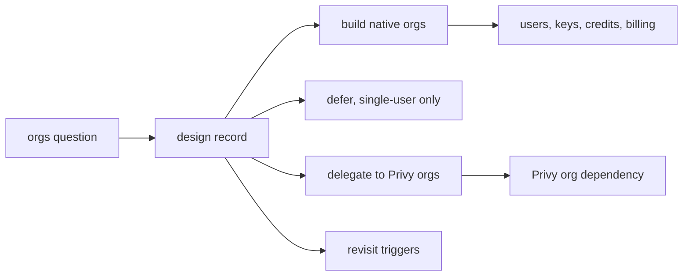
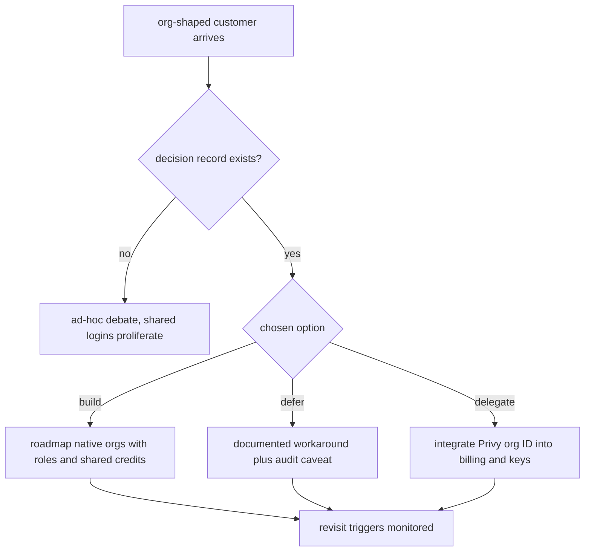

# ORP-059: Organizations/workspaces decision record

> Last updated: 2026-09-25 · commit `b6f9574ed`

Darkbloom accounts are single-user Privy identities, so teams, shared credits, and roles are inexpressible — and no recorded decision says whether that is intentional. Part of the OpenRouter-perspective review; see the [review index](../README.md).

## What

OpenRouter workspaces provide organizations with shared credits, roles, and per-workspace keys, routing defaults, and guardrails (OpenRouter workspaces, https://openrouter.ai/docs/guides/features/workspaces). In Darkbloom, accounts are single-user Privy identities (`GetOrCreateUser` in `coordinator/store`); the only multi-identity concept is `users.role="service"` set by admins (`handleAdminSetUserRole`). Credits, keys, and usage all hang off the single user record, so a team today shares one login or splits billing across personal accounts. This is a decision issue: the deliverable is a design record, not code.

## Why

Org-shaped customers are either blocked or hacking around the gap with shared logins — which destroys per-person auditability. Without a written decision, the orgs question is re-litigated every quarter and every adjacent feature (per-key limits, spend caps, guardrails) designs against an unknown future.

## Prompt

Produce a design record at `docs/design/org-workspaces.md` deciding Darkbloom's organizations strategy. The record must evaluate three options against the current architecture: (1) build native orgs — org table, membership with roles, keys and credits owned by the org, billing at org level; (2) defer orgs and formally support only single-user accounts, documenting the shared-login workaround and its audit consequences; (3) delegate identity grouping to Privy organizations, keeping Darkbloom's `users` table but keying billing and keys to a Privy org ID. Constraints: (1) the record must state the chosen option, the rejected options with reasons, and explicit revisit triggers (e.g. N enterprise requests, shared-login incidents, Privy feature changes); (2) it must enumerate what each option means for the existing key model (`sk-db-` keys owned by a `users` row), the spend-cap windows (`KeySpendWindowStart`, `KeySpendSince`), and referral rewards (`coordinator/billing/referral.go`, currently zeroed by `platformFeePercent` in `coordinator/payments/pricing.go`); (3) privacy constraint: org features must never expose provider identity to consumers regardless of role; (4) status line per `docs/AGENTS.md` design-record convention. Acceptance criteria: the record names a decision owner and date, states revisit triggers, and gives a migration sketch for how existing single-user accounts map into the chosen model. `make docs-check` passes.

## Workflow

1. Read `GetOrCreateUser`, `handleAdminSetUserRole`, and the key/spend-cap code to ground the current model.
2. Inventory what orgs would touch: users, keys, credits, spend windows, referrals, console-ui account pages.
3. Draft the three options with cost/risk per option.
4. Check Privy's organization support and document option 3's true dependency surface.
5. Write the record with status `Proposed`, decision owner, and revisit triggers.
6. Get the decision made; flip the status line accordingly.
7. Link the record from `docs/design/README.md` (or the design index).
8. Run `make docs-check`.

## Loop

Run `make docs-check` to validate links, stamps, and index entries. Check: every architectural claim in the record cites current code (`path`, symbol); revisit triggers are measurable, not vibes; the migration sketch covers existing keys and credits. Definition of done: the record is merged with a decided status and the orgs question has a single canonical answer to link to.

## Graph

## Layout

- Add `docs/design/org-workspaces.md` — the decision record.
- Modify `docs/design/README.md` (or design index) — index entry.
- No code changes. No UI surface.

## Flow

Severity: medium · Effort: S
