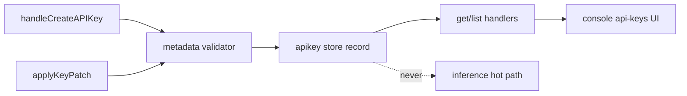
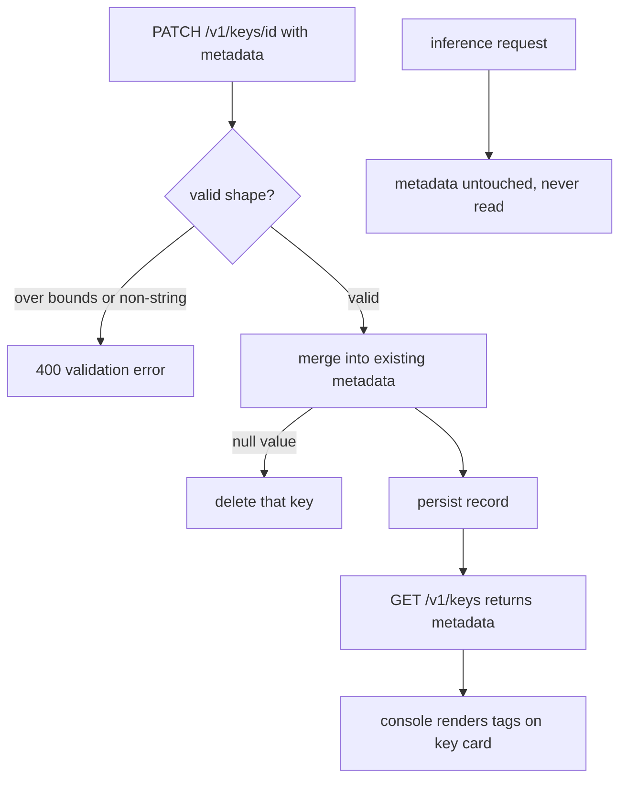

# ORP-060: Freeform key metadata/labels

> Last updated: 2026-09-25 · commit `b6f9574ed`

Darkbloom API keys carry only a `name`, so operators managing many keys encode structure into name strings and lose it. Part of the OpenRouter-perspective review; see the [review index](../README.md).

## What

OpenRouter lets keys carry management-facing attributes beyond a single name (OpenRouter management API keys, https://openrouter.ai/docs/guides/overview/auth/management-api-keys). In Darkbloom, a key record has `name`, limits, `allowed_models`, and lifecycle fields (`validateKeyLimitInputs` in `coordinator/api/apikey_handlers.go`), but no freeform metadata. Operators who need environment/owner/cost-center tagging have one flat string to abuse.

## Why

Dozens of keys per account are normal once CI, staging, and per-integration keys exist. Without structured labels, filtering, auditing, and rotating the right key depends on parsing conventions out of `name` — conventions that drift and break silently.

## Prompt

Add a bounded `metadata` object to API keys. Goal: create/patch/get/list accept and return a `metadata` JSON object of string keys to string values, for operator tagging (environment, owner, cost center). Constraints: (1) hard bounds — cap entry count (e.g. 16), key length (e.g. 64 chars), value length (e.g. 256 chars), and total serialized size (e.g. 4 KiB); reject with 400 beyond bounds; (2) string values only — reject nested objects, numbers, and arrays to keep the schema closed; (3) metadata is management-facing only: never returned on inference responses, never logged on the request hot path, and never used in routing; (4) metadata must never carry provider identity or secrets — document this at the API and enforce nothing beyond the bounds (it is the caller's data); (5) patch semantics: `applyKeyPatch` replaces keys present in the patch and leaves others untouched; `null` deletes a key. Files to touch: `coordinator/store/apikey.go` (persist metadata on the key record), `coordinator/api/apikey_handlers.go` (`handleCreateAPIKey`, `applyKeyPatch`, get/list serialization, validation in `validateKeyLimitInputs` or a sibling), `console-ui/src/components/api-keys/` (display and edit metadata on key cards), plus tests. Acceptance criteria: round-trip of metadata through create/get/patch/list; bounds enforced with 400s; patch merge/delete semantics covered by tests; existing keys without metadata behave exactly as before.

## Workflow

1. Read `validateKeyLimitInputs`, `handleCreateAPIKey`, and `applyKeyPatch` to mirror existing field handling.
2. Add the metadata column/field to the key record in `coordinator/store/apikey.go` with a default of empty.
3. Write the validator (entry count, lengths, total size, string-only) with unit tests at the bounds.
4. Wire validation into create and patch; serialize metadata on get/list.
5. Implement patch merge/delete semantics.
6. Surface metadata in the console keys UI (view + edit).
7. Add handler tests for round-trip, bounds, and patch semantics.
8. Run `make coordinator-test`, `make ui-lint`, `make ui-build`.

## Loop

Run `make coordinator-test` (or `go test ./coordinator/api/... ./coordinator/store/...` while iterating) plus `make ui-lint && make ui-build` for the console change. Check: bound-edge tests (exactly at cap, one over) pass; patch merge/delete covered; metadata absent from any inference-path response or log. Definition of done: coordinator and UI green, metadata round-trips, and the field is provably absent from the request hot path.

## Graph

## Layout

- Modify `coordinator/store/apikey.go` — persist metadata on the key record.
- Modify `coordinator/api/apikey_handlers.go` — validation, create/patch/get/list wiring.
- Modify `console-ui/src/components/api-keys/` — metadata display and editing.
- Add/extend tests in `coordinator/api` and `coordinator/store`.

## Flow

Severity: low · Effort: S
