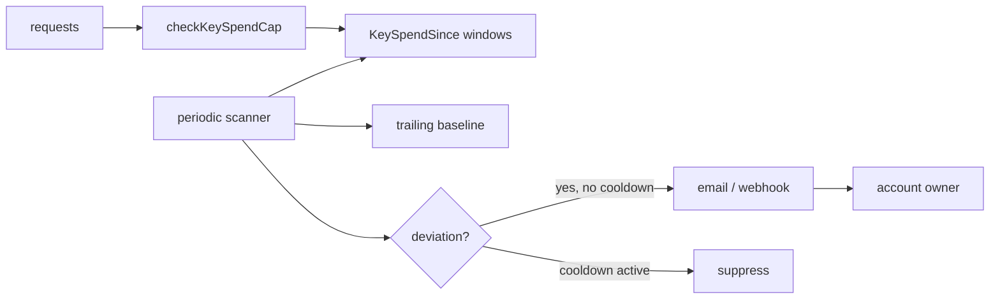
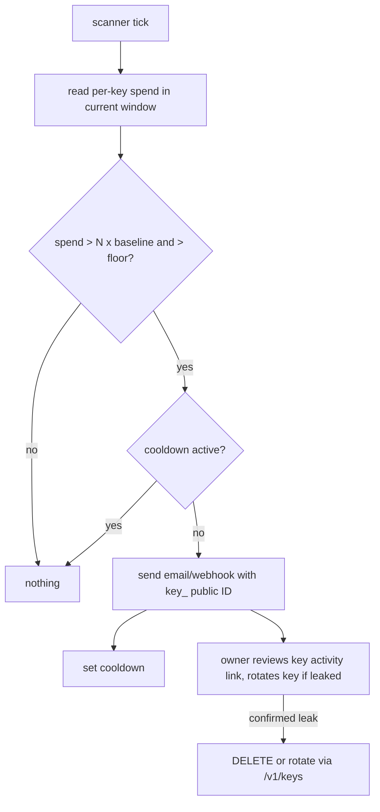

# ORP-061: Per-key spend/rate anomaly notifications

> Last updated: 2026-09-25 · commit `b6f9574ed`

A leaked Darkbloom API key drains until it hits its cap or the account balance runs out, because nothing watches per-key usage for anomalies. Part of the OpenRouter-perspective review; see the [review index](../README.md).

## What

Darkbloom enforces per-key spend caps after the fact — `checkKeySpendCap` (`coordinator/api/apikey_handlers.go`) rejects requests once a key exceeds `limit_usd` within its UTC calendar window (`KeySpendWindowStart`, `KeySpendSince` in `coordinator/store`) — but nothing notifies the owner when a key's spend or request rate deviates sharply from its own baseline. OpenRouter surfaces usage per key and pairs limits with owner-visible controls (OpenRouter management API keys, https://openrouter.ai/docs/guides/overview/auth/management-api-keys); the gap here is detection, not enforcement.

## Why

Credential leaks are detected by usage shape long before they are detected by humans. Today detection is manual: the owner notices a drained balance or a rejected request. An anomaly alert converts "key leaked at 02:00, found at 09:00" into "alert at 02:05".

## Prompt

Add per-key anomaly notifications. Goal: when a key's spend or request rate deviates sharply from its trailing baseline, the account owner gets an email and/or webhook notification identifying the key by its public ID (`key_<24 hex>`) and the observed deviation. Constraints: (1) reuse existing data — compute baselines from the spend windows already maintained for `checkKeySpendCap` (`KeySpendSince`); add a per-key request-rate counter only if the current store lacks one; (2) alert on deviation, not absolute thresholds: e.g. spend in the current hour exceeds N× the trailing 7-day hourly average, with a floor so fresh keys do not alert on their first dollar; (3) per-key cooldown so one incident sends one alert, not one per window tick; (4) notifications identify the key by public ID and show aggregates only — never the raw key, never provider identity, never prompt content; (5) notification channels (email, webhook URL) are account-level settings with a per-key opt-out flag; (6) the checker runs as a periodic job, not on the request hot path. Files to touch: `coordinator/store` (baseline/cooldown persistence, notification settings), a new `coordinator/api` or `coordinator/billing` notifier plus a periodic runner wired in `coordinator/cmd/coordinator/main.go`, `console-ui` settings surface for channels, plus tests. Acceptance criteria: a simulated spend spike triggers exactly one alert naming the key's public ID; normal usage triggers none; the hot path gains no new per-request store reads; cooldown suppresses repeat alerts.

## Workflow

1. Read `checkKeySpendCap`, `KeySpendWindowStart`, and `KeySpendSince` to see what per-key spend data already exists.
2. Decide the baseline model (trailing hourly average over 7 days) and the deviation rule with a fresh-key floor.
3. Add store support for baseline snapshots, alert cooldowns, and notification channel settings.
4. Implement the periodic anomaly scanner and wire it into coordinator startup with a sane interval.
5. Implement email and webhook delivery with the public key ID and aggregate figures only.
6. Add the per-key opt-out flag to key records and the console settings UI.
7. Add tests: spike triggers, normal usage silent, cooldown, fresh-key floor.
8. Run `make coordinator-test`, `make ui-lint`, `make ui-build`.

## Loop

Run `make coordinator-test` (or `go test ./coordinator/...` while iterating). Check: scanner tests use injected clocks so windows are deterministic; cooldown test proves single-alert behavior; a load test or benchmark shows the hot path untouched. Definition of done: coordinator tests green, a scripted spike against a dev coordinator produces exactly one notification, and no new reads land in the request path.

## Graph

## Layout

- Modify `coordinator/store` — baseline snapshots, cooldowns, notification settings.
- Add anomaly scanner + notifier in `coordinator/api` or `coordinator/billing`.
- Modify `coordinator/cmd/coordinator/main.go` — wire the periodic runner.
- Modify `console-ui` settings — notification channels and per-key opt-out.
- Add/extend tests in `coordinator` (scanner, store).

## Flow

Severity: low · Effort: M
