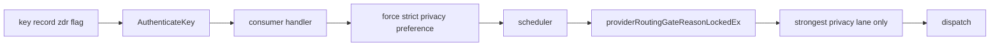
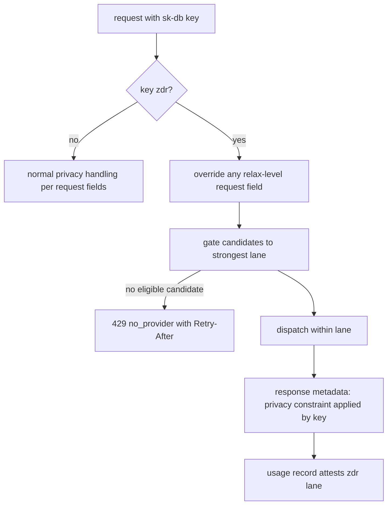

# ORP-062: Per-key zero-data-retention routing flag

> Last updated: 2026-09-25 · commit `b6f9574ed`

Darkbloom's privacy routing preferences live on individual requests, so a compliance customer gets the strongest privacy lane only if every caller remembers to ask for it. Part of the OpenRouter-perspective review; see the [review index](../README.md).

## What

OpenRouter lets privacy constraints (zero-data-retention provider restrictions) be enforced account- or key-side rather than per request (OpenRouter guardrails, https://openrouter.ai/docs/guides/features/guardrails). Darkbloom's request-level privacy controls are the data-collection preference and provider-class only/ignore filters covered by ORP-017 and ORP-018; neither is bound to a credential. The key model (`validateKeyLimitInputs` in `coordinator/api/apikey_handlers.go`) has no privacy flag, and the scheduler's candidate gating (`coordinator/registry/scheduler.go`, `providerRoutingGateReasonLockedEx`) therefore sees no credential-carried privacy constraint. This issue builds on ORP-017 and ORP-018: the flag composes those request-level controls into a key-level guarantee.

## Why

Compliance customers need the guarantee bound to the credential in the audit trail: "every request made with this key ran in the strongest privacy lane" must be provable from key configuration, not from caller discipline. A per-request control cannot answer an auditor.

## Prompt

Add a per-key zero-data-retention (ZDR) flag. Goal: a key created or patched with `zdr: true` has every request restricted to the strongest privacy lane — highest attestation class, no retention beyond billing aggregates — regardless of what the request itself asks for. Constraints: (1) the flag is implemented as a key-carried constraint that forces the ORP-017 data-collection preference to its strictest value and narrows provider classes per ORP-018, enforced inside candidate gating (`providerRoutingGateReasonLockedEx`) so all dispatch paths inherit it; (2) a request-level attempt to relax privacy under a ZDR key is overridden silently in routing and surfaced in the response metadata as applied-by-key, never as an error that breaks existing clients; (3) privacy-preserving: constraints are classes, never provider identities, and responses/errors never reveal which providers were excluded; (4) support an account-level "default new keys to ZDR" setting for enterprise onboarding; (5) the flag is recorded with the key so usage records can attest which requests ran under it. Files to touch: `coordinator/store/apikey.go` (persist the flag), `coordinator/api/apikey_handlers.go` (create/patch validation), `coordinator/api/consumer.go` (apply the forced preference), `coordinator/registry/scheduler.go` (gating), plus tests. Acceptance criteria: a ZDR key's requests never leave the strongest privacy lane even with a relax-level request field; the response notes the key-applied constraint; a non-ZDR key behaves byte-identically to today.

## Workflow

1. Read the ORP-017/ORP-018 issue files to align on the request-level privacy controls this flag composes.
2. Add the `zdr` boolean to the key record in `coordinator/store/apikey.go`, carried through `store.AuthenticateKey`.
3. Wire create/patch validation in `coordinator/api/apikey_handlers.go`, plus the account-level default-new-keys setting.
4. In `coordinator/api/consumer.go`, force the strictest data-collection preference and class narrowing when the authenticated key is ZDR.
5. Confirm enforcement lands inside `providerRoutingGateReasonLockedEx` so every dispatch path is covered.
6. Add response metadata marking the key-applied constraint.
7. Add tests: override behavior, gating, non-ZDR regression, account default.
8. Run `make coordinator-test`.

## Loop

Run `make coordinator-test` (or `go test ./coordinator/api/... ./coordinator/registry/...` while iterating). Check: override tests prove request-level relax attempts lose; regression tests prove non-ZDR keys are untouched; no log or response emits provider identity. Definition of done: coordinator tests green and an auditor-facing statement — "requests under key X ran only in the strongest lane" — is backed by key configuration plus usage records.

## Graph

## Layout

- Modify `coordinator/store/apikey.go` — persist the ZDR flag.
- Modify `coordinator/api/apikey_handlers.go` — create/patch validation, account default.
- Modify `coordinator/api/consumer.go` — force strict preference for ZDR keys.
- Modify `coordinator/registry/scheduler.go` — enforce in candidate gating.
- Add/extend tests in `coordinator/api`, `coordinator/store`, and `coordinator/registry`.
- No UI surface.

## Flow

Severity: medium · Effort: M
