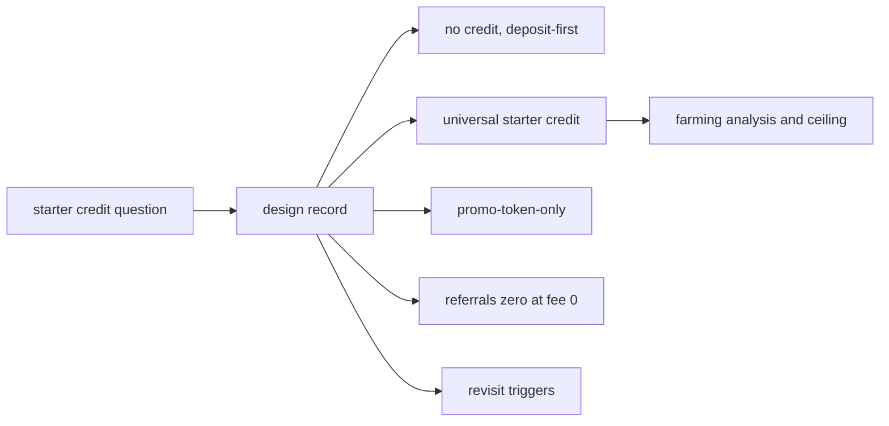
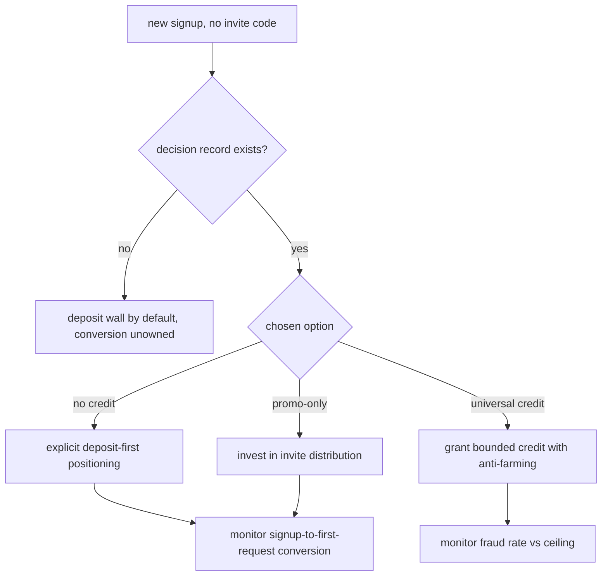

# ORP-063: Signup trial-credit decision

> Last updated: 2026-09-25 · commit `b6f9574ed`

A fresh Darkbloom signup with no invite code starts with zero balance, and no recorded decision says whether that is intentional. Part of the OpenRouter-perspective review; see the [review index](../README.md).

## What

Competitors auto-fund new accounts with a small trial credit so the first API call needs no payment step. Darkbloom's only free-credit path is invite codes: `POST /v1/invite/redeem` in `coordinator/api/invite_handlers.go` grants a non-withdrawable `invite_credit` balance. A signup without a code gets nothing and must deposit before the first request. Referrals (`coordinator/billing/referral.go`) cannot substitute: the reward is a share of the platform fee and the global fee is 0 (`platformFeePercent` in `coordinator/payments/pricing.go`), so rewards are currently always zero. This is a decision issue: the deliverable is a design record, not code.

## Why

The top-of-funnel decision is currently made by omission. Whether a new user can try the network in sixty seconds or must pull out a card first is a growth-shaping choice; leaving it implicit means nobody owns the conversion drop at the deposit wall, and invite-code distribution quietly becomes load-bearing growth infrastructure.

## Prompt

Produce a design record at `docs/design/signup-trial-credit.md` deciding Darkbloom's starter-credit policy. The record must evaluate three options: (1) no credit — keep deposit-first as today; (2) a small universal starter credit granted at signup (sized for a meaningful eval, e.g. enough for a few hundred requests against a mid-tier model); (3) promo-token-only — keep the invite-code path as the sole free credit and invest in distribution. Constraints: (1) each option needs an abuse analysis — signup farming via disposable Privy identities, multi-account credit harvesting, and the cost ceiling per fake account; (2) option 2 must specify anti-farming mechanics (identity signals available at `GetOrCreateUser` time, device/payment-instrument correlation, delayed credit vesting) or state that none exist and price the fraud; (3) the record must note that referral rewards are currently zero because `platformFeePercent` is 0, so "let referrals drive trials" is not a working option today; (4) the chosen option gets measurable revisit triggers (signup-to-first-request conversion, fraud rate, credit cost per converted user); (5) status line per `docs/AGENTS.md` design-record convention. Acceptance criteria: the record names a decision owner and date, quantifies the abuse ceiling for option 2, states revisit triggers, and `make docs-check` passes.

## Workflow

1. Read `coordinator/api/invite_handlers.go` (`invite_credit` mechanics) and `coordinator/payments/pricing.go` (`platformFeePercent`) to ground the current state.
2. Estimate the per-account farming cost ceiling for a universal credit from current pricing.
3. Inventory the anti-farming signals actually available at signup time.
4. Draft the three options with abuse analysis and revisit triggers.
5. Write the record with status `Proposed` and a decision owner.
6. Get the decision made; flip the status line accordingly.
7. Link the record from the design index.
8. Run `make docs-check`.

## Loop

Run `make docs-check` to validate links, stamps, and index entries. Check: every claim about current behavior cites code; the abuse ceiling is a number derived from current pricing, not an adjective; revisit triggers are measurable. Definition of done: the record is merged with a decided status and the trial-credit question has a single canonical answer to link to.

## Graph

## Layout

- Add `docs/design/signup-trial-credit.md` — the decision record.
- Modify `docs/design/README.md` (or design index) — index entry.
- No code changes. No UI surface.

## Flow

Severity: medium · Effort: S
