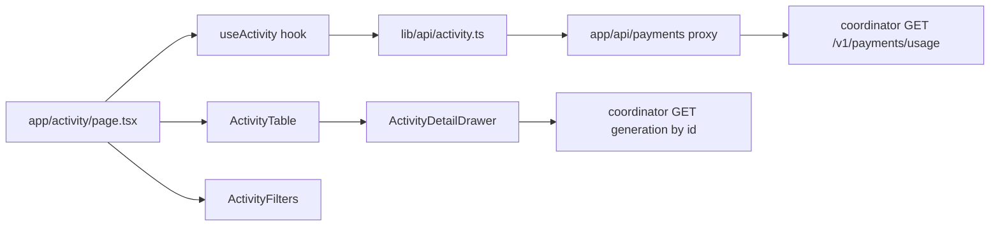
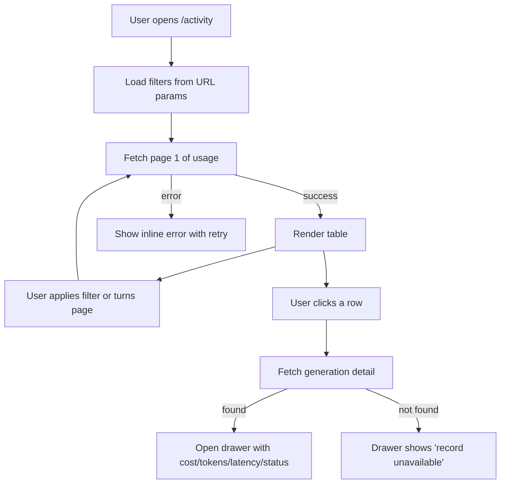

# ORP-064: Activity feed with per-generation detail

> Last updated: 2026-09-25 · commit `b6f9574ed`

Darkbloom's console shows usage only as a flat, last-100-rows table on the billing page, with no filters, pagination, or per-request detail. This issue is part of the OpenRouter-perspective review; see the [review index](../README.md).

## What

OpenRouter's console has an Activity tab: a per-generation history filterable by model, provider, and API key, with a detail view per generation ([OpenRouter docs](https://openrouter.ai/docs/faq)). Darkbloom's equivalent surface is the usage-history table inside `console-ui/src/app/billing/BillingContent.tsx` — per-request rows (timestamp, model, tokens, cost) sortable only by time and cost, backed by `/api/payments/usage` → coordinator `GET /v1/payments/usage`, hard-capped at 100 rows. There are no pagination controls, no date-range picker, and no per-request detail view.

Server-side dependencies: ORP-029 (generation lookup), ORP-030 (usage pagination), ORP-031 (usage date filters). This issue covers the console UI once those endpoints exist.

## Why

Any account with more than a few days of real traffic cannot answer "what did we run, with which key, and what did that specific request cost" — the 100-row window scrolls past and the table cannot be filtered, so debugging a cost spike or a failed integration means guessing.

## Prompt

Build an Activity view in the Darkbloom console (`console-ui/`, Next.js 16, React 19) listing the account's inference requests with filters and a per-request detail drawer.

Constraints:
- Place it as a new `/activity` page under `console-ui/src/app/activity/`; link it from the sidebar and from the billing page's usage table header.
- Data comes from the coordinator's paginated usage/generation endpoints (ORP-030, ORP-031) via a new function in `console-ui/src/lib/api/` and a thin proxy under `console-ui/src/app/api/`; the detail drawer uses the per-generation lookup (ORP-029).
- Filters: model (dropdown from `console-ui/src/lib/api/models.ts`), API key (from the keys list), date range, finish status (success/error). Filters map to query params; keep them in the URL for shareability.
- Detail drawer per row: timestamp, model, API key label, prompt/completion tokens, cost, latency, finish state, generation ID.
- Cursor/offset pagination controls; no hard 100-row cap on the UI side.
- Follow the modular structure used by `console-ui/src/components/api-keys/`: types, a data hook, row/drawer components, a thin orchestrator.

Acceptance criteria: filtering by model+key+date narrows the list correctly; opening a row shows the full detail; paging beyond 100 rows works; `make ui-lint`, `make ui-test`, `make ui-build` pass.

## Workflow

1. Read `console-ui/src/app/billing/BillingContent.tsx` and `console-ui/src/lib/api/billing.ts` to reuse the usage-row types.
2. Add an `activity.ts` client in `console-ui/src/lib/api/` for the paginated usage and generation-lookup endpoints.
3. Add thin proxy routes under `console-ui/src/app/api/payments/` forwarding filter/pagination params.
4. Create `console-ui/src/components/activity/` with `useActivity` hook, `ActivityTable`, `ActivityFilters`, `ActivityDetailDrawer`.
5. Create `console-ui/src/app/activity/page.tsx` wiring URL search params to the hook.
6. Add navigation links (sidebar; billing usage table header).
7. Add vitest coverage for filter state, pagination, and drawer rendering.

## Loop

- Run `make ui-lint` and `make ui-test`; add tests alongside components per existing `*.test.ts(x)` convention.
- Run `make ui-build` to catch type errors in the new page and proxies.
- Manually verify against a dev coordinator: apply each filter, paginate past 100 rows, open a detail drawer, reload with filters in the URL.
- Done when: all filters work, pagination exceeds the old 100-row cap, drawer shows all fields, lint/test/build green.

## Graph

## Layout

- Create: `console-ui/src/app/activity/page.tsx`, `console-ui/src/components/activity/` (`useActivity.ts`, `ActivityTable.tsx`, `ActivityFilters.tsx`, `ActivityDetailDrawer.tsx`, `types.ts`), `console-ui/src/lib/api/activity.ts`, proxy route under `console-ui/src/app/api/payments/`.
- Modify: sidebar navigation component, `console-ui/src/app/billing/BillingContent.tsx` (link from the usage table header).
- Wireframe: `/activity` page — a filter bar across the top (model dropdown, key dropdown, date-range picker, status select); below it a full-width table (time, model, key, tokens, cost, status) with pagination controls at the bottom; clicking a row slides in a right-side drawer showing the full request detail and generation ID.

## Flow

Severity: medium · Effort: M
