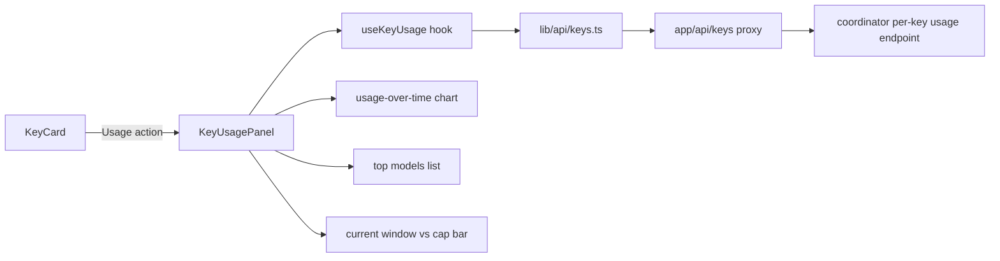
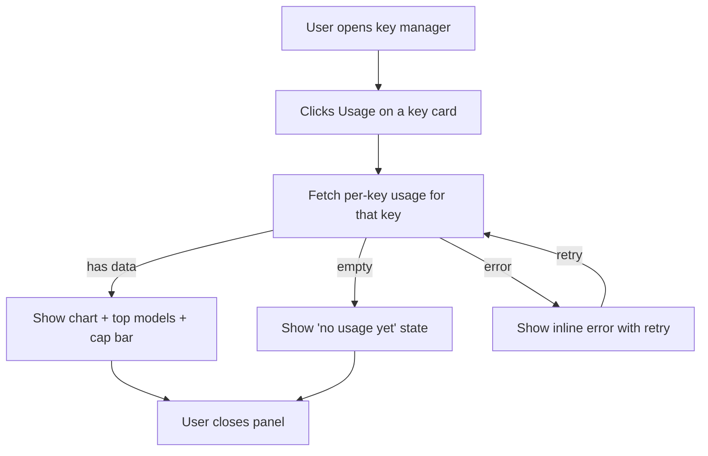

# ORP-065: Per-key usage analytics view

> Last updated: 2026-09-25 · commit `b6f9574ed`

Darkbloom's key manager shows a current-window usage bar per key but no usage history, so a key's past spend is invisible. This issue is part of the OpenRouter-perspective review; see the [review index](../README.md).

## What

OpenRouter exposes per-key usage through its analytics dashboard and `/logs` deep links per key hash ([OpenRouter docs](https://openrouter.ai/docs/faq)). Darkbloom's keys UI in `console-ui/src/components/api-keys/` (`ApiKeysManager`, `KeyCard`, `useApiKeys`) supports create/edit/rotate/revoke, spend caps, per-key RPM/TPM, allowed models, and expiry, and shows a current-window usage bar — but no per-key usage history, trend, or model breakdown.

Server-side dependency: ORP-034 (per-key usage history endpoint). This issue covers the console UI once that endpoint exists.

## Why

Teams that issue one key per environment (prod, staging, CI) cannot see per-environment burn; when the bill moves they cannot tell which key — which environment — caused it, and the current-window bar resets before anyone looks.

## Prompt

Add a per-key usage drill-down to the Darkbloom console key manager (`console-ui/`, Next.js 16, React 19).

Constraints:
- Entry point: a "Usage" action on each `KeyCard` in `console-ui/src/components/api-keys/` opens the drill-down (modal or routed panel).
- Data comes from the coordinator per-key usage endpoint (ORP-034) via a new function in `console-ui/src/lib/api/keys.ts` and a thin proxy under `console-ui/src/app/api/keys/`.
- The view shows: usage over time (small bar/line chart, daily buckets), top models by spend (ranked list), and current-window usage vs the configured cap (reuse the existing usage-bar formatting from `console-ui/src/components/api-keys/format.ts` / `limits.ts`).
- Respect the key's existing labels and cap display; show an empty state when the key has no usage.
- Follow the existing module structure of `console-ui/src/components/api-keys/` — add focused files, do not grow `KeyCard` into a monolith.

Acceptance criteria: each key opens a drill-down showing its own history only; chart and top-models list match the endpoint response; cap bar matches the current-window figure; `make ui-lint`, `make ui-test`, `make ui-build` pass.

## Workflow

1. Read `console-ui/src/components/api-keys/` (`KeyCard.tsx`, `useApiKeys.ts`, `format.ts`, `limits.ts`) for conventions.
2. Add the per-key usage client function to `console-ui/src/lib/api/keys.ts` (ORP-034 endpoint).
3. Add the thin proxy route under `console-ui/src/app/api/keys/`.
4. Create `KeyUsagePanel.tsx` (chart + top models + cap bar) and a `useKeyUsage.ts` hook in `console-ui/src/components/api-keys/`.
5. Wire a "Usage" action into `KeyCard.tsx` opening the panel (reuse `Modal.tsx`).
6. Add vitest coverage for the hook and the panel's empty/loaded states.

## Loop

- Run `make ui-lint` and `make ui-test` (tests live beside components in `console-ui/src/components/api-keys/`).
- Run `make ui-build`.
- Manually verify against a dev coordinator with two keys with distinct traffic: each panel shows only its own key's data; empty key shows the empty state.
- Done when: per-key data is correct and isolated, cap bar matches, lint/test/build green.

## Graph

## Layout

- Create: `console-ui/src/components/api-keys/KeyUsagePanel.tsx`, `console-ui/src/components/api-keys/useKeyUsage.ts`, proxy route under `console-ui/src/app/api/keys/`.
- Modify: `console-ui/src/components/api-keys/KeyCard.tsx` (add Usage action), `console-ui/src/lib/api/keys.ts` (client function), `console-ui/src/components/api-keys/index.ts` (exports).
- Wireframe: from the keys list, each key card gains a "Usage" button; clicking it opens a modal titled with the key label showing three stacked sections: a daily-usage bar chart (last 30 days), a "Top models" ranked list with per-model spend, and the existing current-window-vs-cap progress bar.

## Flow

Severity: low · Effort: M
