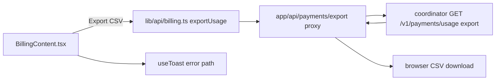
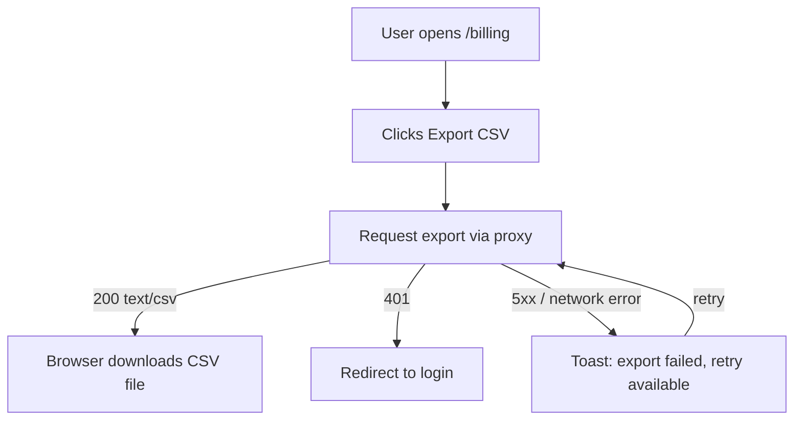

# ORP-066: CSV export on the billing page

> Last updated: 2026-09-25 · commit `b6f9574ed`

Darkbloom's console has no export anywhere: the only record of usage is an on-screen table capped at 100 rows. This issue is part of the OpenRouter-perspective review; see the [review index](../README.md).

## What

OpenRouter supports exporting usage history for accounting ([OpenRouter docs](https://openrouter.ai/docs/faq)). Darkbloom's billing page `console-ui/src/app/billing/BillingContent.tsx` renders a usage-history table (timestamp, model, tokens, cost) backed by `/api/payments/usage` → coordinator `GET /v1/payments/usage`, hard-capped at 100 rows, and there is no CSV/export capability anywhere in `console-ui/src`.

Server-side dependency: ORP-032 (usage export endpoint). This issue covers wiring the console UI to that endpoint once it exists.

## Why

Accounting teams reconcile spend from CSV; today the only way to get Darkbloom usage into a spreadsheet is copy-pasting a 100-row table from the browser, which loses everything older than the last 100 requests.

## Prompt

Add a CSV export control to the Darkbloom console billing page (`console-ui/`, Next.js 16, React 19).

Constraints:
- Add an "Export CSV" button in the usage-history section header of `console-ui/src/app/billing/BillingContent.tsx`, next to the existing sort controls.
- The button calls the coordinator usage-export endpoint (ORP-032) through a thin proxy under `console-ui/src/app/api/payments/`, streaming the response to a browser download (`usage-YYYYMMDD.csv`); do not buffer the whole file into component state.
- Export respects the same account scope as the table and passes through the current date filter when one exists (ORP-067).
- Show progress/disabled state while the export runs and surface failures via the existing toast hook (`console-ui/src/hooks/useToast.ts`).
- No new dependencies; use a plain anchor/`fetch` + blob download.

Acceptance criteria: clicking Export downloads a CSV whose rows match the account's usage beyond the 100-row UI cap; failures toast; `make ui-lint`, `make ui-test`, `make ui-build` pass.

## Workflow

1. Read `console-ui/src/app/billing/BillingContent.tsx` and `console-ui/src/lib/api/billing.ts`.
2. Add an export function to `console-ui/src/lib/api/billing.ts` returning the raw response for download.
3. Add the proxy route under `console-ui/src/app/api/payments/` forwarding auth and query params, passing through the CSV content type.
4. Add the Export button to the usage section of `BillingContent.tsx` with loading/disabled state.
5. Trigger download via object URL; revoke it after; toast on error.
6. Add vitest coverage for the button states and the client function.

## Loop

- Run `make ui-lint` and `make ui-test`.
- Run `make ui-build`.
- Manually verify against a dev coordinator: download the CSV, open it, confirm row count exceeds 100 and columns match the table; confirm an error path (e.g. coordinator down) shows a toast.
- Done when: CSV downloads correctly, error handling works, lint/test/build green.

## Graph

## Layout

- Create: proxy route under `console-ui/src/app/api/payments/` (export passthrough).
- Modify: `console-ui/src/app/billing/BillingContent.tsx` (Export button + handler), `console-ui/src/lib/api/billing.ts` (export client function).
- Wireframe: `/billing` page, usage-history section — the section header gains a right-aligned "Export CSV" button beside the sort dropdown; while exporting it shows a spinner and is disabled; on success the browser downloads `usage-YYYYMMDD.csv`; on failure a toast appears top-right.

## Flow

Severity: low · Effort: S
