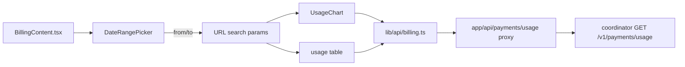
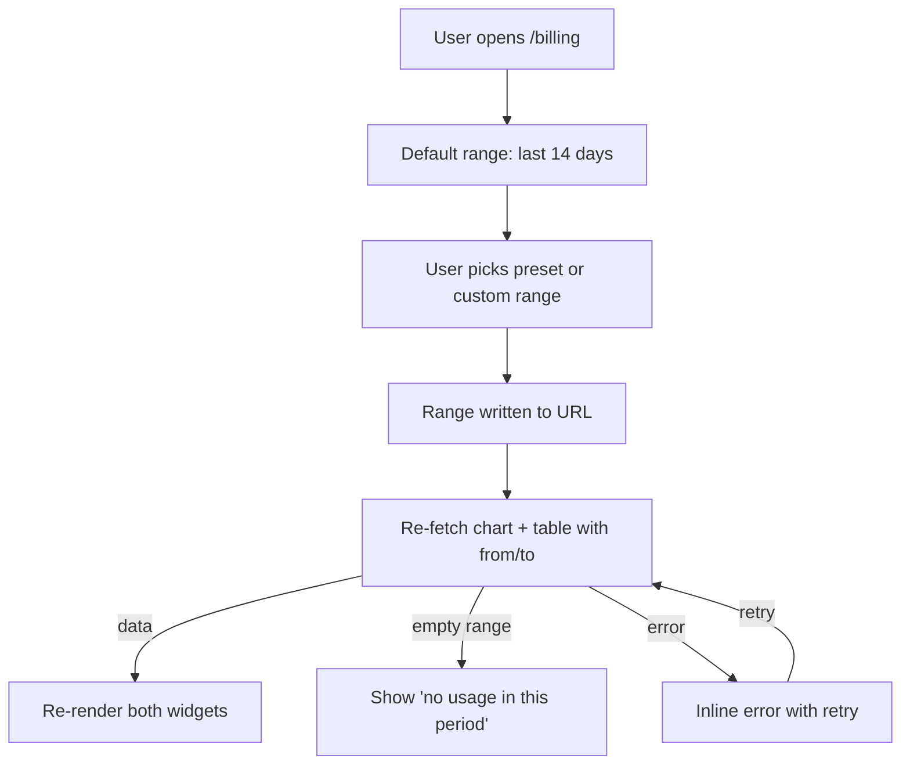

# ORP-067: Usage date-range picker

> Last updated: 2026-09-25 · commit `b6f9574ed`

Darkbloom's billing spend chart and usage table are locked to fixed windows — the last 14 days for the chart, the last 100 rows for the table — with no way to ask about any other period. This issue is part of the OpenRouter-perspective review; see the [review index](../README.md).

## What

OpenRouter's usage analytics let users scope history to a date range ([OpenRouter docs](https://openrouter.ai/docs/faq)). Darkbloom's billing page `console-ui/src/app/billing/BillingContent.tsx` shows a "Spend Over Time" bar chart (`console-ui/src/components/UsageChart.tsx`) fixed to daily bars over the last 14 days, and a usage-history table backed by `/api/payments/usage` → coordinator `GET /v1/payments/usage` with no date parameters.

Server-side dependency: ORP-031 (usage date filters). This issue covers the console UI once the endpoint accepts date-range params.

## Why

"Last 14 days, fixed" answers no finance question ever asked — monthly close, week-over-week comparison, and incident-window analysis all require choosing the period.

## Prompt

Add date-range controls to the Darkbloom console billing page (`console-ui/`, Next.js 16, React 19).

Constraints:
- Add a date-range control (presets: 7d, 14d, 30d, 90d, plus custom start/end) at the top of the usage section in `console-ui/src/app/billing/BillingContent.tsx`.
- The selected range drives both the spend chart (`console-ui/src/components/UsageChart.tsx`) and the usage-history table, passed as query params through `console-ui/src/lib/api/billing.ts` to the coordinator (ORP-031).
- Keep the current 14-day default so the page is unchanged for users who never touch the control.
- Reflect the range in the URL so a filtered view is shareable.
- No new dependencies; build the preset/select UI with existing components.

Acceptance criteria: selecting a range re-fetches and re-renders both chart and table for that period; URL params round-trip on reload; `make ui-lint`, `make ui-test`, `make ui-build` pass.

## Workflow

1. Read `console-ui/src/app/billing/BillingContent.tsx`, `console-ui/src/components/UsageChart.tsx`, and `console-ui/src/lib/api/billing.ts`.
2. Extend the billing API client and the `/api/payments/usage` proxy to pass `from`/`to` params.
3. Add a `DateRangePicker` component (presets + custom inputs) under `console-ui/src/components/`.
4. Wire range state in `BillingContent.tsx`, synced to URL search params, feeding both `UsageChart` and the table fetch.
5. Make `UsageChart` bucket daily bars across arbitrary ranges (cap bar count; widen buckets if needed).
6. Add vitest coverage for range state, URL sync, and param forwarding.

## Loop

- Run `make ui-lint` and `make ui-test`.
- Run `make ui-build`.
- Manually verify against a dev coordinator: each preset changes both chart and table; a custom range works; reload preserves the range from the URL; the 14-day default is untouched.
- Done when: both widgets honor the range, URL round-trips, lint/test/build green.

## Graph

## Layout

- Create: `console-ui/src/components/DateRangePicker.tsx` (+ test).
- Modify: `console-ui/src/app/billing/BillingContent.tsx` (range state + wiring), `console-ui/src/components/UsageChart.tsx` (arbitrary ranges), `console-ui/src/lib/api/billing.ts` (params), `/api/payments/usage` proxy route.
- Wireframe: `/billing` page — the usage section header gains a range control (preset chips "7d 14d 30d 90d" plus a "Custom" start/end date pair); the spend chart and the table below it both reload when the range changes; the chart title reads "Spend Over Time (Mar 1 – Mar 30)".

## Flow

Severity: low · Effort: S
