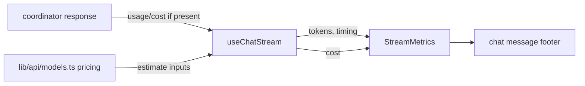
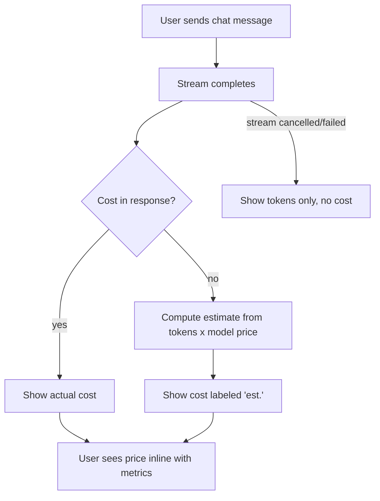

# ORP-068: Cost per message in chat

> Last updated: 2026-09-25 · commit `b6f9574ed`

Darkbloom's chat playground reports speed and tokens for every response but never its price. This issue is part of the OpenRouter-perspective review; see the [review index](../README.md).

## What

OpenRouter's playground and activity views show the cost of each generation ([OpenRouter docs](https://openrouter.ai/docs/faq)). Darkbloom's `/chat` page renders per-response stream metrics — TPS, TTFT, token counts — in `console-ui/src/components/chat/StreamMetrics.tsx`, with no cost figure, even though the coordinator records a per-request usage row (timestamp, model, tokens, cost) that backs the billing table in `console-ui/src/app/billing/BillingContent.tsx`.

## Why

The playground is where users form cost intuition about models; hiding cost there means the first time a user learns what a model costs is a surprise on the billing page after the spend already happened.

## Prompt

Show the cost of each response in the Darkbloom chat playground (`console-ui/`, Next.js 16, React 19).

Constraints:
- Extend `console-ui/src/components/chat/StreamMetrics.tsx` to display cost alongside TPS/TTFT/tokens.
- Cost source, in order of preference: an actual cost returned by the coordinator for the request (usage accounting already exists per request); otherwise a client-side estimate computed from the response's prompt/completion token counts and the model's per-1M-token input/output prices already shown on `/models` (`console-ui/src/components/models/ModelCatalog.tsx`). Label estimates as estimates.
- Thread the data through the chat streaming path (`console-ui/src/hooks/useChatStream.ts`) without changing the streaming protocol; if the coordinator does not return cost, compute the estimate client-side only.
- Format consistently with the billing page's cost display; keep the metrics strip compact.

Acceptance criteria: every completed response shows a cost figure; estimates are labeled; failed/cancelled streams show no cost or a zero; `make ui-lint`, `make ui-test`, `make ui-build` pass.

## Workflow

1. Read `console-ui/src/components/chat/StreamMetrics.tsx`, `console-ui/src/hooks/useChatStream.ts`, and the billing cost formatting in `console-ui/src/app/billing/BillingContent.tsx`.
2. Check whether the chat completion response already carries usage/cost fields; if not, load model pricing from `console-ui/src/lib/api/models.ts` for the estimate.
3. Add a `cost` field to the stream-metrics state in `useChatStream.ts` (actual when available, estimate otherwise).
4. Render cost in `StreamMetrics.tsx` with an "est." marker when estimated.
5. Add/update vitest coverage for the metrics component and the estimate math.

## Loop

- Run `make ui-lint` and `make ui-test` (tests live beside chat components).
- Run `make ui-build`.
- Manually verify in the chat playground: a completed response shows cost; a cancelled stream does not; switching models changes the estimate per the `/models` pricing.
- Done when: cost displays per response with correct actual/estimate semantics, lint/test/build green.

## Graph

## Layout

- Modify: `console-ui/src/components/chat/StreamMetrics.tsx` (render cost), `console-ui/src/hooks/useChatStream.ts` (carry cost/usage into metrics state), pricing lookup via `console-ui/src/lib/api/models.ts`; tests beside the components.
- Wireframe: `/chat` page — under each assistant response, the existing metrics strip ("182 tok · 41 TPS · TTFT 0.8s") gains a trailing segment "· $0.0012" (or "· ~$0.0012 est." when client-estimated); no layout shift, same single line.

## Flow

Severity: low · Effort: S
