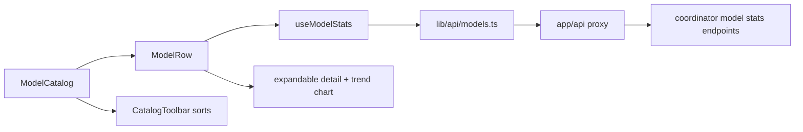
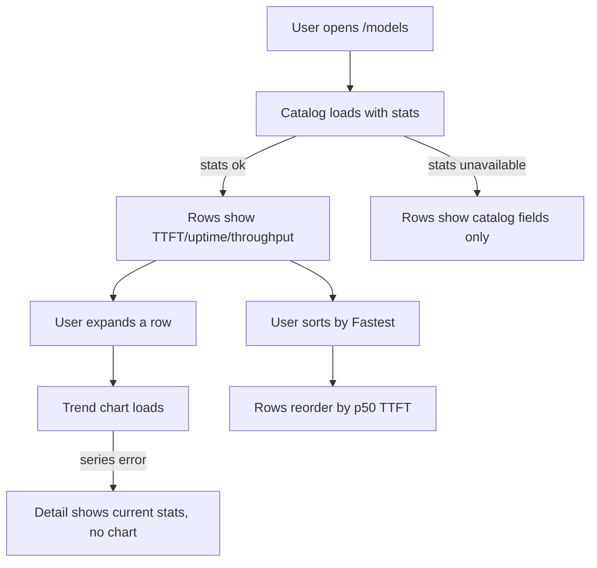

# ORP-069: Latency/throughput/uptime on model pages

> Last updated: 2026-09-25 · commit `b6f9574ed`

Darkbloom's model catalog shows price and context length but nothing about how fast or reliable a model actually is. This issue is part of the OpenRouter-perspective review; see the [review index](../README.md).

## What

OpenRouter surfaces per-model performance — latency, throughput, and uptime — on its model pages ([OpenRouter docs](https://openrouter.ai/docs/faq)). Darkbloom's `/models` page (`console-ui/src/components/models/ModelCatalog.tsx`) shows per model: name, description, feature tags, context length, input/output price per 1M tokens, provider count, attestation flag, and size, sortable by name/context/price — with no latency, throughput, or uptime stats.

Server-side dependencies: ORP-037 (model latency percentiles), ORP-038 (model uptime metric), ORP-039 (model throughput series). These public per-model stats endpoints feed this UI.

## Why

Model selection in the console is currently price-and-context-blind to performance: a user choosing between two similarly priced models has no in-console way to see that one is twice as slow or flaky this week, so they choose wrong or leave to check elsewhere.

## Prompt

Surface per-model performance stats in the Darkbloom console model catalog (`console-ui/`, Next.js 16, React 19).

Constraints:
- Add to each row of `console-ui/src/components/models/ModelCatalog.tsx` (via `ModelRow.tsx`): p50/p95 TTFT (ORP-037), uptime over a trailing window (ORP-038), and current throughput (ORP-039).
- Add an expandable detail per row with a small throughput trend chart over time (ORP-039 series).
- Add "fastest" / "most reliable" sort options alongside the existing name/context/price sorts (`CatalogToolbar.tsx`, `catalog.ts`).
- Fetch stats via `console-ui/src/lib/api/models.ts` through a thin proxy under `console-ui/src/app/api/`; degrade gracefully (hide stats) when the stats endpoints are unavailable.
- Follow the existing module split in `console-ui/src/components/models/`; add focused files rather than growing `ModelCatalog.tsx`.

Acceptance criteria: rows show p50/p95 TTFT, uptime, and throughput; detail expansion shows the trend chart; new sorts work; stats absence degrades cleanly; `make ui-lint`, `make ui-test`, `make ui-build` pass.

## Workflow

1. Read `console-ui/src/components/models/` (`ModelCatalog.tsx`, `ModelRow.tsx`, `catalog.ts`, `useModelCatalog.ts`) for the existing data flow.
2. Extend `console-ui/src/lib/api/models.ts` with per-model stats fetchers (ORP-037/038/039) and add the proxy route.
3. Add a `useModelStats` hook and stats formatting helpers in `console-ui/src/components/models/`.
4. Render compact stats on `ModelRow.tsx`; add the expandable detail with the throughput trend chart.
5. Add sort options in `CatalogToolbar.tsx` / `catalog.ts`.
6. Add vitest coverage for the hook, row rendering, and new sorts.

## Loop

- Run `make ui-lint` and `make ui-test` (tests live beside components in `console-ui/src/components/models/`).
- Run `make ui-build`.
- Manually verify against a dev coordinator: stats render per model, expansion shows the trend, sorts reorder correctly, and disabling the stats endpoints leaves the catalog usable.
- Done when: stats, expansion, and sorts all work with graceful degradation, lint/test/build green.

## Graph

## Layout

- Create: `console-ui/src/components/models/useModelStats.ts`, `console-ui/src/components/models/ModelStats.tsx` (row stats + trend chart), proxy route under `console-ui/src/app/api/`.
- Modify: `console-ui/src/components/models/ModelRow.tsx`, `CatalogToolbar.tsx`, `catalog.ts`, `useModelCatalog.ts`, `console-ui/src/lib/api/models.ts`.
- Wireframe: `/models` page — each model row gains a stats cluster right of the price columns: "TTFT 0.7s p50 / 1.9s p95 · 99.2% up · 38 tok/s"; clicking the row expands a detail strip below it with a 7-day throughput sparkline and the same figures with their windows labeled; the toolbar sort dropdown adds "Fastest" and "Most reliable".

## Flow

Severity: medium · Effort: M
