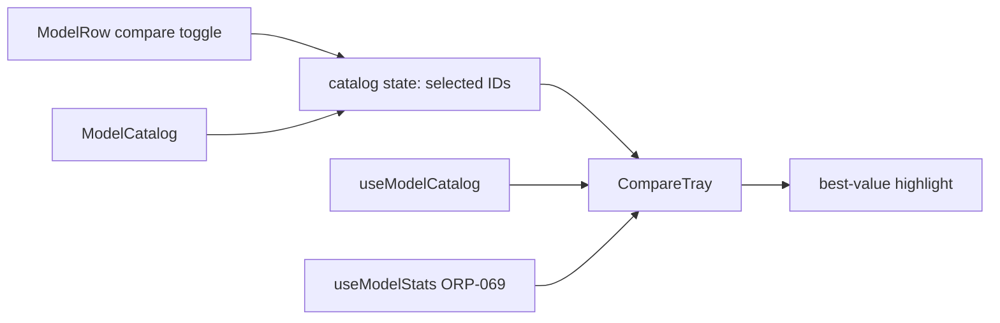
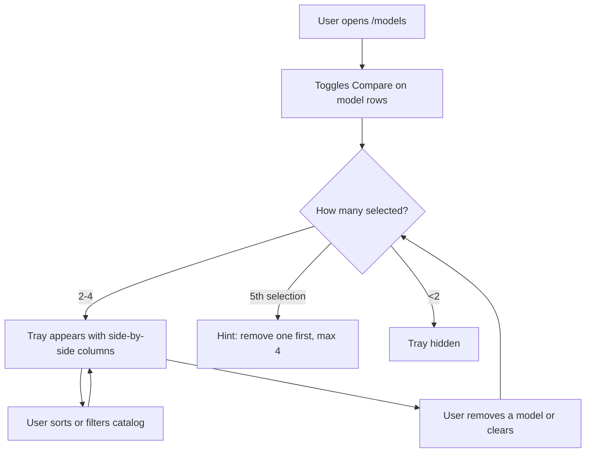

# ORP-070: Model comparison view

> Last updated: 2026-09-25 · commit `b6f9574ed`

Darkbloom's model catalog is a flat list with no way to compare models side by side. This issue is part of the OpenRouter-perspective review; see the [review index](../README.md).

## What

OpenRouter lets users compare models side by side when choosing between them ([OpenRouter docs](https://openrouter.ai/docs/faq)). Darkbloom's `/models` page (`console-ui/src/components/models/ModelCatalog.tsx`) renders one row per model — name, description, feature tags, context length, input/output price per 1M tokens, provider count, attestation flag, size — sortable by name/context/price, with no comparison view.

## Why

Choosing between similar builds (e.g. two Qwen or Gemma variants) requires opening each model in sequence and memorizing numbers; users mis-remember and pick on price alone, then churn when the choice underperforms.

## Prompt

Add a side-by-side comparison tray to the Darkbloom console model catalog (`console-ui/`, Next.js 16, React 19).

Constraints:
- Each row in `console-ui/src/components/models/ModelCatalog.tsx` (via `ModelRow.tsx`) gains a "Compare" checkbox/toggle; selecting 2–4 models pins them into a comparison tray docked at the bottom of the page.
- The tray shows a column per selected model with rows for: price in/out per 1M tokens, context length, feature tags, provider count, attestation flag, size — plus performance stats (p50/p95 TTFT, uptime, throughput) when ORP-069's stats are available.
- Differences that matter (cheapest price, longest context, lowest p50 TTFT) are highlighted per row.
- Tray state lives in the catalog state (`CatalogState.tsx` / `useModelCatalog.ts`); selection persists across sorts/filters within the session; a "Clear" and per-model remove control are required.
- Follow the existing module split in `console-ui/src/components/models/`; add a focused `CompareTray` component rather than growing `ModelCatalog.tsx`.

Acceptance criteria: 2–4 models compare side by side; a 5th selection is rejected with a hint; best-value cells are highlighted; tray survives sort/filter changes; `make ui-lint`, `make ui-test`, `make ui-build` pass.

## Workflow

1. Read `console-ui/src/components/models/` (`ModelCatalog.tsx`, `ModelRow.tsx`, `CatalogState.tsx`, `useModelCatalog.ts`, `catalog.ts`).
2. Add compare-selection state (ordered list of model IDs, max 4) to the catalog state hook.
3. Add a Compare toggle to `ModelRow.tsx`.
4. Create `CompareTray.tsx`: docked bottom panel, one column per model, highlight logic per attribute row.
5. Integrate perf stats from `useModelStats` when available (ORP-069); degrade to catalog fields otherwise.
6. Add vitest coverage for selection limits, tray rendering, and highlight logic.

## Loop

- Run `make ui-lint` and `make ui-test`.
- Run `make ui-build`.
- Manually verify: select 2, 3, 4 models; a 5th click is rejected with a hint; sort/filter the list and confirm the tray persists; remove one model and clear all.
- Done when: comparison works within the 2–4 bound, highlights render, lint/test/build green.

## Graph

## Layout

- Create: `console-ui/src/components/models/CompareTray.tsx` (+ test).
- Modify: `console-ui/src/components/models/ModelRow.tsx` (Compare toggle), `console-ui/src/components/models/CatalogState.tsx` and `useModelCatalog.ts` (selection state), `console-ui/src/components/models/ModelCatalog.tsx` (tray mount).
- Wireframe: `/models` page — each row's right edge gains a "Compare" toggle; once ≥2 models are selected, a tray docks along the bottom: a header row of model names with × remove buttons and a "Clear all", then attribute rows (price in/out, context, features, providers, attestation, size, TTFT p50/p95, uptime, throughput) with the best cell in each row tinted; the list scrolls above the tray.

## Flow

Severity: low · Effort: M
