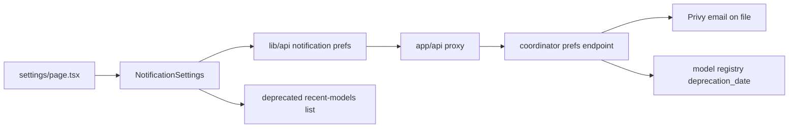
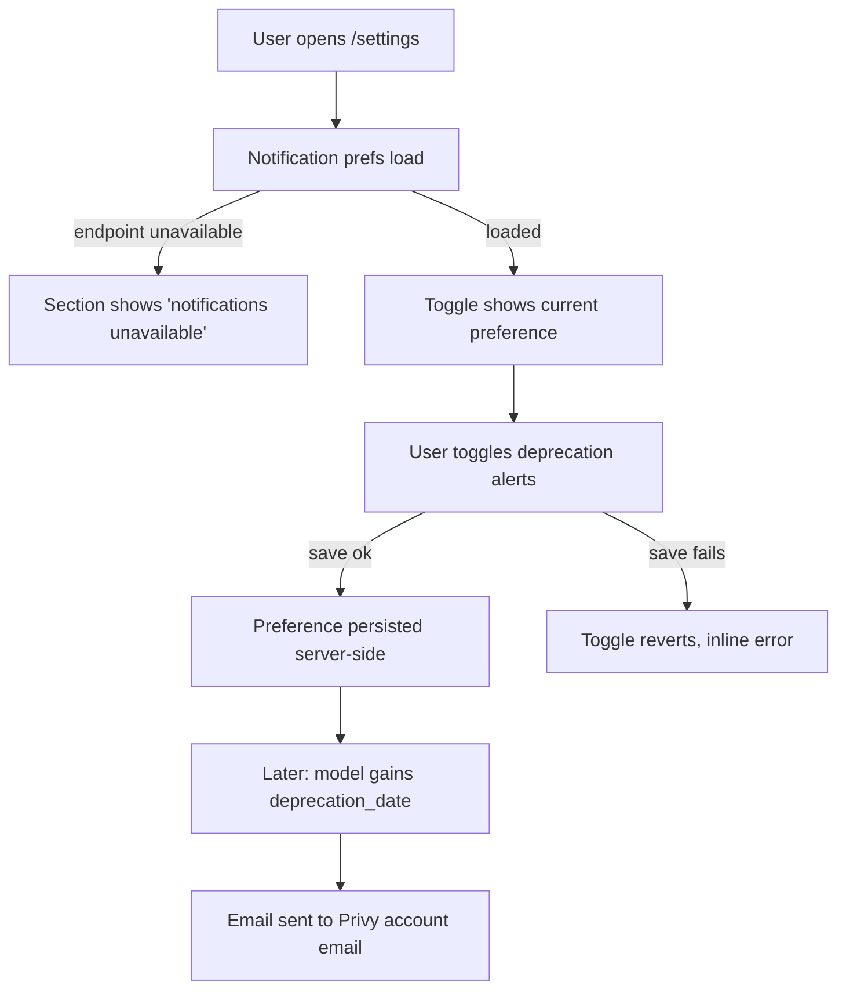

# ORP-071: Notification settings (deprecation alerts)

> Last updated: 2026-09-25 · commit `b6f9574ed`

Darkbloom's console has no notification settings at all, so a model going away reaches production users as a broken integration, not a warning. This issue is part of the OpenRouter-perspective review; see the [review index](../README.md).

## What

OpenRouter's Settings → Notifications includes a "model deprecation alert" for models the account recently used ([OpenRouter notifications docs](https://openrouter.ai/docs/guides/features/notifications)). Darkbloom's `/settings` page (`console-ui/src/app/settings/page.tsx`, `AppearanceSettings.tsx`, `useConsoleSettings.ts`) holds only browser-local preferences — theme, browser-side encryption toggle, API base URL override — and there are no notification settings anywhere in the console.

Related: ORP-078 — the model registry has `deprecation_date` support that these alerts build on.

## Why

A deprecated model silently breaking a production integration is a churn event: the user finds out from their own users' errors, not from Darkbloom, and learns the platform does not warn them.

## Prompt

Add an account notifications section to the Darkbloom console settings (`console-ui/`, Next.js 16, React 19), starting with model-deprecation alerts.

Constraints:
- Add a Notifications section to `/settings` (`console-ui/src/app/settings/`) with a toggle for "Model deprecation alerts" — emailed when a model the account has recently used gains a `deprecation_date` (ORP-078).
- Unlike the existing browser-local settings, notification preferences are account-level: persist them server-side via the coordinator (extend `console-ui/src/lib/api/` and add a thin proxy under `console-ui/src/app/api/`); do not store them in `useConsoleSettings.ts`.
- Show the destination as the Privy email already on file (auth via `console-ui/src/hooks/useAuth.ts`); read-only display, no email editing in this issue.
- The section lists the account's recently used models that currently carry a `deprecation_date`, if any, so the setting is concrete.
- Coordinator-side preference storage and the send pipeline are separate work; this issue covers the settings UI and its API contract. If the endpoints are not yet available, build behind the same thin proxy and handle unavailability gracefully.

Acceptance criteria: the toggle persists across browsers (server-side), the email destination is shown, deprecated-recently-used models are listed, `make ui-lint`, `make ui-test`, `make ui-build` pass.

## Workflow

1. Read `console-ui/src/app/settings/` (`page.tsx`, `SettingsSection.tsx`, `AppearanceSettings.tsx`, `useConsoleSettings.ts`) for section conventions.
2. Define the notification-preferences API contract with the coordinator (GET/PUT); add client functions in `console-ui/src/lib/api/` and proxies under `console-ui/src/app/api/`.
3. Create `NotificationSettings.tsx` with the deprecation-alert toggle, email destination display, and recently-used-deprecated-models list.
4. Mount the section in `console-ui/src/app/settings/page.tsx` beside the existing sections.
5. Handle loading, error, and endpoint-unavailable states distinctly.
6. Add vitest coverage for the section's states and toggle behavior.

## Loop

- Run `make ui-lint` and `make ui-test`.
- Run `make ui-build`; run `make coordinator-test` if the coordinator preference endpoints land in the same change.
- Manually verify: toggle persists after reload and in a second browser; the email shown matches the Privy account; a deprecated recently-used model appears in the list.
- Done when: server-side persistence works end to end, states render correctly, lint/test/build green.

## Graph

## Layout

- Create: `console-ui/src/app/settings/NotificationSettings.tsx` (+ test), client functions in `console-ui/src/lib/api/`, proxy route under `console-ui/src/app/api/`.
- Modify: `console-ui/src/app/settings/page.tsx` (mount the new section).
- Wireframe: `/settings` page — below the existing Appearance section, a "Notifications" section: a toggle row "Model deprecation alerts — email me when a model I've recently used is deprecated", a read-only line "Sending to: user@example.com (Privy account email)", and, when applicable, a list "Recently used models with a deprecation date: model-name (retires 2026-11-01)".

## Flow

Severity: low · Effort: M
