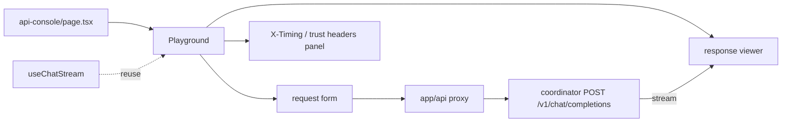
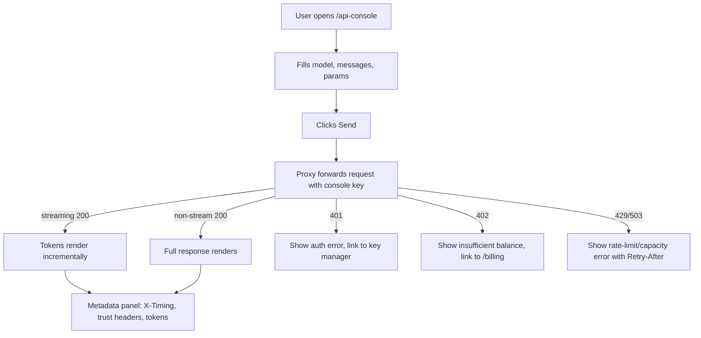

# ORP-072: Live request playground in the API console

> Last updated: 2026-09-25 · commit `b6f9574ed`

Darkbloom's API console is static documentation: SDK snippets and an endpoint reference, with no way to send a real request. This issue is part of the OpenRouter-perspective review; see the [review index](../README.md).

## What

OpenRouter's console lets users fire live requests against models without leaving the site ([OpenRouter docs](https://openrouter.ai/docs/faq)). Darkbloom's `/api-console` (`console-ui/src/app/api-console/page.tsx` + `content.ts`) renders SDK snippets with an auto-injected key, an embedded key manager, and an endpoint reference — but it is not a live request playground: a user cannot send a test request from it.

## Why

"Change one base URL and your existing client works" is believable only when a user can try it in 30 seconds without leaving the console; today the first real request happens in the user's own environment, where every failure looks like Darkbloom's fault.

## Prompt

Add a live request playground to the Darkbloom API console (`console-ui/`, Next.js 16, React 19).

Constraints:
- Add a "Try it" panel to `/api-console` (`console-ui/src/app/api-console/`) with a request form: model (dropdown from `console-ui/src/lib/api/models.ts`), a messages editor (system/user turns), and basic params (max tokens, temperature, stream on/off).
- Requests fire with the console's auto-injected key through a thin proxy under `console-ui/src/app/api/` — the key never appears in client-side request construction beyond what the snippets already do.
- Streaming responses render incrementally; reuse the chat streaming machinery (`console-ui/src/hooks/useChatStream.ts`) where practical rather than writing a second SSE parser.
- Render the response metadata: `X-Timing` header decomposition, trust/verification headers, token counts, and elapsed time, so the playground demonstrates the platform's differentiators, not just text.
- Errors (401, 402, 429, 503) render as first-class results with status and body, matching what an SDK user would see.
- Keep `content.ts` docs/snippets intact; the playground is an addition, not a rewrite.

Acceptance criteria: a user can send a streaming and a non-streaming request from `/api-console`; response, headers, and errors render correctly; `make ui-lint`, `make ui-test`, `make ui-build` pass.

## Workflow

1. Read `console-ui/src/app/api-console/` (`page.tsx`, `content.ts`, `EndpointRow.tsx`, `BaseUrl.tsx`) and `console-ui/src/hooks/useChatStream.ts`.
2. Add a proxy route under `console-ui/src/app/api/` that forwards playground requests to the coordinator chat endpoint with the console key.
3. Create `console-ui/src/components/api-console/Playground.tsx` with the request form, plus focused subcomponents (messages editor, params row, response viewer).
4. Wire streaming via the existing chat-stream hook or a small shared variant; render incremental output.
5. Add a response-metadata panel: `X-Timing` breakdown, trust headers, tokens, elapsed.
6. Add vitest coverage for the form, streaming render, and error states.

## Loop

- Run `make ui-lint` and `make ui-test`.
- Run `make ui-build`; run `make coordinator-test` only if the proxy requires coordinator changes (it should not).
- Manually verify against a dev coordinator: send streaming and non-streaming requests, confirm incremental render, inspect the `X-Timing` panel, and trigger a 402/429 to confirm error rendering.
- Done when: real requests work end to end in both modes with headers and errors visible, lint/test/build green.

## Graph

## Layout

- Create: `console-ui/src/components/api-console/Playground.tsx` (+ subcomponents and test), proxy route under `console-ui/src/app/api/`.
- Modify: `console-ui/src/app/api-console/page.tsx` (mount the playground), `console-ui/src/hooks/useChatStream.ts` (extract reusable streaming core if needed).
- Wireframe: `/api-console` page — a "Try it" panel above the endpoint reference: left column holds the form (model dropdown, message list with add/remove turn, max tokens, temperature, stream toggle, Send button); right column shows the response area (streaming text as it arrives, then a metadata strip: TTFT/total time from `X-Timing`, trust badge headers, token counts); errors render in the same area as a status code plus body.

## Flow

Severity: low · Effort: M
