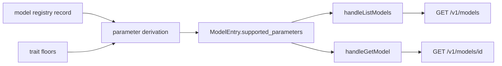
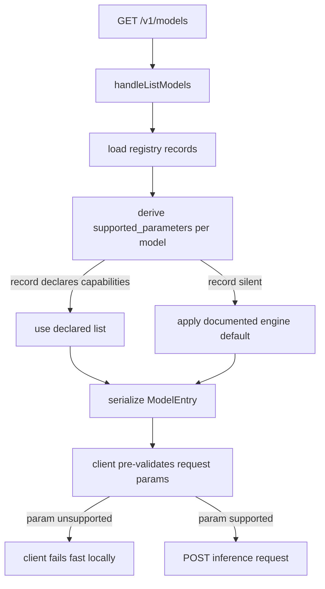

# ORP-073: `supported_parameters` in `/v1/models`

> Last updated: 2026-09-25 · commit `b6f9574ed`

Darkbloom's model catalog does not advertise which OpenAI request parameters each model honors, so consumers discover parameter support only by sending requests and watching them degrade or fail. Part of the OpenRouter-perspective review; see the [review index](../README.md).

## What

OpenRouter's models API returns a flat `supported_parameters` list per model (`tools`, `response_format`, `temperature`, `seed`, `stop`, …) so a client can pre-validate a request before sending it (OpenRouter models API, https://openrouter.ai/docs/api-reference/list-available-models). Darkbloom's `types.ModelEntry` (`coordinator/api/types/types.go`), served by `handleListModels` (`coordinator/api/models_endpoints.go`), carries `supported_sampling_parameters` and `supported_features`, but neither is a flat OpenAI-parameter list: `supported_sampling_parameters` covers sampling knobs only, and `supported_features` is a coarse capability vocabulary. A consumer asking "does this model accept `tools` and `response_format`?" cannot answer from the catalog. ORP-006's `require_parameters` hard gate needs exactly this data to be meaningful to clients.

## Why

Parameter probing produces the silent-degradation class of bugs: a client sends `response_format` to a model that ignores it, receives free text where it expected JSON, and the failure surfaces downstream as a parse error with no link back to the parameter. A flat, per-model parameter list turns this into a pre-flight check.

## Prompt

Add a `supported_parameters` field to the `/v1/models` response. Goal: every model entry returned by `handleListModels` and `handleGetModel` includes a flat list of OpenAI-compatible request parameters the model honors (e.g. `tools`, `tool_choice`, `response_format`, `temperature`, `top_p`, `seed`, `stop`, `max_tokens`, `presence_penalty`, `frequency_penalty`), derived from the same capability data that already feeds `supported_sampling_parameters`/`supported_features` and the trait floors used at admission — do not invent a second capability table. Constraints: (1) the field is additive and optional-compatible; existing clients see no change; (2) values come from the model's registry/catalog record, falling back to a documented per-engine default when the record is silent, and the fallback must be testable; (3) the list must stay consistent with what `providerEligibleForTraitsLocked` actually gates on — a parameter listed as supported must not be silently dropped by every eligible provider; (4) concrete quant builds hidden behind `?include_builds=1` expose the same field. Files to touch: `coordinator/api/types/types.go` (field on `ModelEntry`), `coordinator/api/models_endpoints.go` (population in `handleListModels`/`handleGetModel`), the registry/catalog source that supplies the values, plus tests. Acceptance criteria: `GET /v1/models` and `GET /v1/models/{id}` return `supported_parameters` per model; a model whose registry record declares no tools support does not list `tools`; tests pin the derivation and the fallback.

## Workflow

1. Read `ModelEntry` in `coordinator/api/types/types.go` and its population sites in `handleListModels`/`handleGetModel` (`coordinator/api/models_endpoints.go`).
2. Identify where `supported_sampling_parameters` and `supported_features` values originate in the model registry record.
3. Define the closed vocabulary of OpenAI parameters and the mapping from registry capability data to that vocabulary.
4. Add `SupportedParameters []string` with `json:"supported_parameters,omitempty"` to `ModelEntry`.
5. Populate it in both listing and single-model handlers, including the `?include_builds=1` build rows.
6. Cross-check the vocabulary against the trait floors in `coordinator/registry/request_traits.go` so listing and gating agree.
7. Add unit tests: derivation from registry record, fallback default, listing vs gating consistency.
8. Run `make coordinator-test`.

## Loop

Run `make coordinator-test` (or `go test ./coordinator/api/...` while iterating). Check: new field present and correct for a model with full registry data and for a model on the fallback default; existing listing tests pass unchanged; no parameter appears in the list that admission would fence for every provider. Definition of done: coordinator tests green, both endpoints emit the field, listing and trait gating provably agree on `tools`/`response_format`.

## Graph

## Layout

- Modify `coordinator/api/types/types.go` — `SupportedParameters` on `ModelEntry`.
- Modify `coordinator/api/models_endpoints.go` — populate in `handleListModels` and `handleGetModel`.
- Modify the model registry record/derivation that feeds the existing `supported_*` fields.
- Add/extend tests in `coordinator/api`.
- No UI surface.

## Flow

Severity: medium · Effort: S
