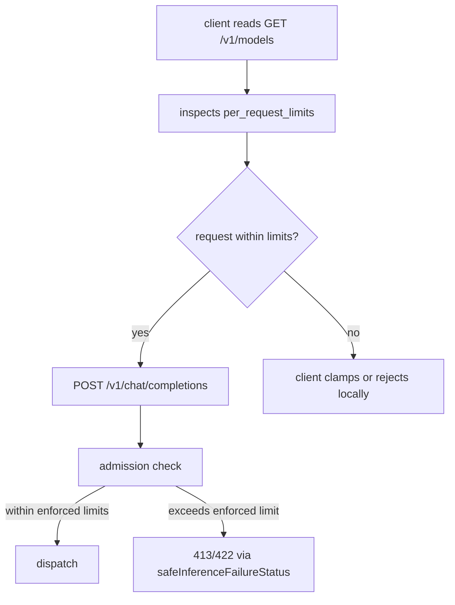

# ORP-074: `per_request_limits` in `/v1/models`

> Last updated: 2026-09-25 · commit `b6f9574ed`

Darkbloom's model catalog does not advertise per-request ceilings, so consumers learn token and image limits only from rejected requests. Part of the OpenRouter-perspective review; see the [review index](../README.md).

## What

OpenRouter's models API returns `per_request_limits` per model, letting clients clamp prompt size, output size, and image count before sending (OpenRouter models API, https://openrouter.ai/docs/api-reference/list-available-models). Darkbloom's `types.ModelEntry` (`coordinator/api/types/types.go`), served by `handleListModels` (`coordinator/api/models_endpoints.go`), carries `context_length` and `max_output_length`, but no explicit ceilings for max prompt tokens versus max completion tokens versus max images — and no `per_request_limits` object at all. Consumers discover the real ceilings through 413/422 rejections surfaced via `safeInferenceFailureStatus` (`coordinator/api/inference_error_sanitize.go`), i.e. after the request has been admitted and routed.

## Why

A request that exceeds a model's ceiling fails after admission: the caller burns a queue slot, waits through dispatch, and receives a generic rejection that client SDKs often retry. Pre-flight limits let integrators clamp or reject locally, which is strictly cheaper than a failed paid reservation.

## Prompt

Add a `per_request_limits` object to each entry in `/v1/models` and `/v1/models/{id}`. Goal: every model advertises its enforceable per-request ceilings — max prompt tokens, max completion tokens, and max images per request — as first-class catalog data, sourced from the same values admission actually enforces, so a client can validate before sending. Constraints: (1) the limits must equal what the admission and dispatch path enforces; if a limit is derived at dispatch time from provider capacity rather than a static model property, publish the model-level static portion and document the dynamic remainder rather than guessing; (2) where a model has no explicit limit, omit the key rather than inventing a number (`omitempty`); (3) `context_length` and `max_output_length` stay as-is for compatibility — `per_request_limits` is additive; (4) no per-provider data may leak: limits are model-level aggregates across the fleet, the tightest enforced value. Files to touch: `coordinator/api/types/types.go` (new limits type on `ModelEntry`), `coordinator/api/models_endpoints.go` (population), the registry/catalog source of the limit values, plus tests. Acceptance criteria: a model with known ceilings returns them in `per_request_limits`; a model without explicit ceilings omits the keys; a test asserts the published max completion tokens matches `max_output_length` when both are set; existing clients are unaffected.

## Workflow

1. Read `ModelEntry` in `coordinator/api/types/types.go` and the listing handlers in `coordinator/api/models_endpoints.go`.
2. Trace where prompt-length and image-count limits are enforced on the inference path (`coordinator/api/consumer.go`, admission in `coordinator/registry`).
3. Decide which limits are static model properties versus dynamic capacity; publish only the static portion.
4. Define a `PerRequestLimits` type with `omitempty` fields and add it to `ModelEntry`.
5. Populate it in `handleListModels` and `handleGetModel`.
6. Add unit tests: population, omission when unset, consistency with `max_output_length`.
7. Run `make coordinator-test`.

## Loop

Run `make coordinator-test` (or `go test ./coordinator/api/...` while iterating). Check: the field appears for models with known ceilings and is omitted otherwise; a rejected oversized request maps to the same 413/422 via `safeInferenceFailureStatus` as before — nothing about enforcement changes, only advertisement. Definition of done: tests green, published limits match enforced limits on every code path that has a static value.

## Graph

```mermaid
flowchart LR
  REG[registry model record] --> LIM[PerRequestLimits]
  ADM[admission enforcement] --> CHECK{consistency test}
  LIM --> CHECK
  LIM --> TYPE[ModelEntry]
  TYPE --> LIST[handleListModels]
  TYPE --> GET[handleGetModel]
  LIST --> RESP[/v1/models response]
  GET --> RESP
```

## Layout

- Modify `coordinator/api/types/types.go` — `PerRequestLimits` type, field on `ModelEntry`.
- Modify `coordinator/api/models_endpoints.go` — populate in listing and get handlers.
- Modify the registry/catalog source supplying limit values.
- Add/extend tests in `coordinator/api`.
- No UI surface.

## Flow



Severity: low · Effort: S
