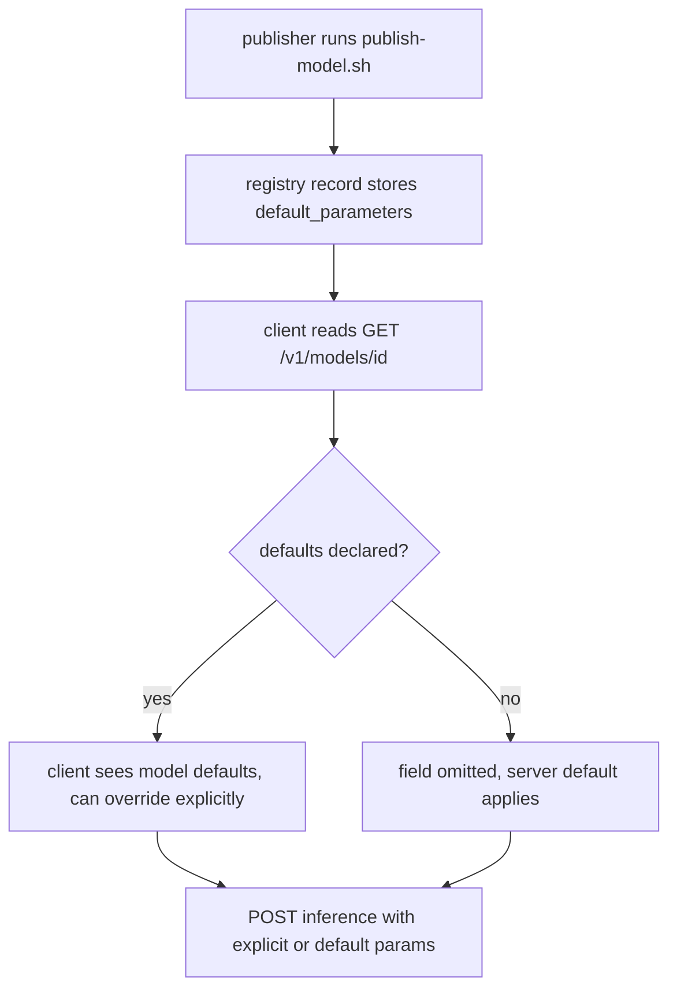

# ORP-075: `default_parameters` in `/v1/models`

> Last updated: 2026-09-25 · commit `b6f9574ed`

Darkbloom's model catalog does not publish per-model default sampling parameters, so clients cannot distinguish "the model's default temperature" from "the coordinator's fallback temperature". Part of the OpenRouter-perspective review; see the [review index](../README.md).

## What

OpenRouter's models API returns `default_parameters` per model — the sampling values (temperature, top_p, top_k, repetition penalty) the provider applies when the request omits them (OpenRouter models API, https://openrouter.ai/docs/api-reference/list-available-models). Darkbloom's `types.ModelEntry` (`coordinator/api/types/types.go`), served by `handleListModels` (`coordinator/api/models_endpoints.go`), lists `supported_sampling_parameters` but not the defaults applied when those parameters are absent. A consumer sending two identical requests without `temperature` to two different models gets whichever default each side applies, with no way to discover the difference short of experiment.

## Why

Silent default differences between models produce output drift that looks like a model quality problem: an integrator swaps model ids, keeps request bodies fixed, and sees generation behavior change for reasons invisible in the API surface. Published defaults make the drift explainable and controllable.

## Prompt

Add a `default_parameters` object to each entry in `/v1/models` and `/v1/models/{id}`. Goal: when the catalog/registry record for a model declares default sampling values (from the model's published configuration, e.g. its `generation_config`), those values appear in the model entry; when none are declared, the field is omitted and clients can assume the server-side default applies. Constraints: (1) publish only values actually applied on the serving path — if the provider engine overrides a declared default, the published value must be the effective one, not the file's; (2) the object is a map of parameter name to scalar, serialized with `omitempty` so models without declared defaults are unchanged; (3) only parameters in the existing `supported_sampling_parameters` vocabulary may appear — no new knob names; (4) the value source is the model registry record populated by the publish flow (`scripts/publish-model.sh`), not a coordinator hardcode. Files to touch: `coordinator/api/types/types.go` (field on `ModelEntry`), `coordinator/api/models_endpoints.go` (population), the registry record schema and `scripts/publish-model.sh` / manifest builder to carry the values, plus tests. Acceptance criteria: a model whose registry record declares defaults returns them; a model without declared defaults omits the field; a test pins that published defaults come from the registry record and not a hardcoded table.

## Workflow

1. Read `ModelEntry` in `coordinator/api/types/types.go` and its population in `coordinator/api/models_endpoints.go`.
2. Inspect the model registry record and `scripts/publish-model.sh` to find where per-model generation configuration could be carried.
3. Add a `default_parameters` map to the registry record schema and the publish flow.
4. Add `DefaultParameters` to `ModelEntry` with `omitempty`.
5. Populate it in `handleListModels` and `handleGetModel` from the registry record.
6. Verify with the provider engine path which declared defaults are actually applied; publish only effective values.
7. Add unit tests: population from record, omission when absent, vocabulary restriction.
8. Run `make coordinator-test`.

## Loop

Run `make coordinator-test` (or `go test ./coordinator/api/...` while iterating). Check: the field round-trips from registry record to JSON; absent record data yields no key in output; no parameter outside the `supported_sampling_parameters` vocabulary appears. Definition of done: tests green, publish flow carries the values, catalog output matches the registry record exactly.

## Graph

```mermaid
flowchart LR
  PUB[scripts/publish-model.sh] --> REC[registry record]
  REC --> STORE[(model registry DB)]
  STORE --> LIST[handleListModels]
  STORE --> GET[handleGetModel]
  LIST --> ENTRY[ModelEntry.default_parameters]
  GET --> ENTRY
  ENTRY --> RESP[/v1/models response]
```

## Layout

- Modify `coordinator/api/types/types.go` — `DefaultParameters` on `ModelEntry`.
- Modify `coordinator/api/models_endpoints.go` — populate in listing and get handlers.
- Modify the model registry record schema to carry declared defaults.
- Modify `scripts/publish-model.sh` and/or the manifest builder to accept and store defaults.
- Add/extend tests in `coordinator/api` and the registry store.
- No UI surface.

## Flow



Severity: low · Effort: S
