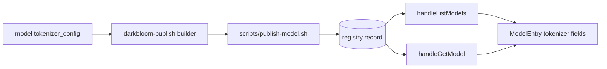
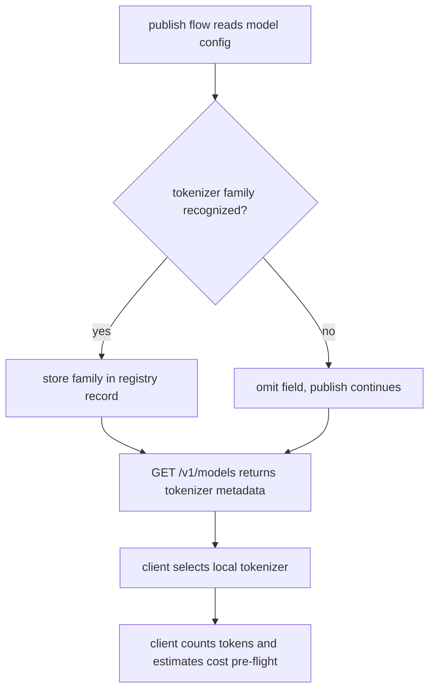

# ORP-076: Tokenizer/architecture metadata completeness

> Last updated: 2026-09-25 · commit `b6f9574ed`

Darkbloom's model catalog advertises modalities but not the tokenizer family, so clients cannot count tokens or estimate cost locally. Part of the OpenRouter-perspective review; see the [review index](../README.md).

## What

OpenRouter's models API returns an `architecture` object per model with `input_modalities`, `output_modalities`, `tokenizer`, and `instruct_type` (OpenRouter models API, https://openrouter.ai/docs/api-reference/list-available-models). Darkbloom's `types.ModelEntry` (`coordinator/api/types/types.go`), served by `handleListModels` (`coordinator/api/models_endpoints.go`), already carries `modalities`, but has no tokenizer family and no instruct/chat-template type. A client that wants to count tokens before sending — for cost estimation against the published `pricing` or for prompt-size pre-validation — must guess the tokenizer from the model name.

## Why

Client-side token counting is the foundation of cost estimation and prompt-size guardrails. Guessing the tokenizer family from a model name string is fragile (fine-tunes change chat templates; families share name prefixes), and a wrong guess produces wrong cost estimates that surface as billing surprises.

## Prompt

Add tokenizer and instruct-type metadata to the model catalog. Goal: each model entry in `/v1/models` and `/v1/models/{id}` exposes the tokenizer family (e.g. `llama`, `qwen`, `mistral`) and, where meaningful, the chat-template/instruct type, alongside the existing `modalities`, so a client can pick a local tokenizer and count tokens accurately. Constraints: (1) the value comes from the model registry record populated by the publish flow (`scripts/publish-model.sh`) — derived from the model's `tokenizer_config` / chat template at publish time, not hardcoded per model in the coordinator; (2) additive field with `omitempty`; unknown tokenizer family is omitted rather than guessed; (3) the closed vocabulary of tokenizer families is defined in one place and validated at publish; (4) hugging_face_id remains the authoritative pointer to the full tokenizer files — the new field is a hint for choosing a local counter, not a replacement. Files to touch: `coordinator/api/types/types.go` (fields on `ModelEntry` or a nested architecture-style object), `coordinator/api/models_endpoints.go` (population), the registry record schema, `scripts/publish-model.sh` / the publish-side manifest builder (`provider-swift/Sources/darkbloom-publish`), plus tests. Acceptance criteria: a published model carries its tokenizer family through to `GET /v1/models`; publish rejects or omits an unrecognized family per the validation rule; tests pin the publish-to-catalog round trip.

## Workflow

1. Read `ModelEntry` in `coordinator/api/types/types.go` and the registry record schema.
2. Inspect `scripts/publish-model.sh` and the manifest builder in `provider-swift/Sources/darkbloom-publish` for where tokenizer metadata can be extracted at publish time.
3. Define the closed tokenizer-family vocabulary and its validation.
4. Extend the registry record and publish flow to carry tokenizer family and instruct type.
5. Add the field(s) to `ModelEntry` and populate in `handleListModels`/`handleGetModel`.
6. Add unit tests: round trip publish → record → catalog JSON; unknown-family handling.
7. Run `make coordinator-test` and the provider publish tests (`cd provider-swift && swift test`).

## Loop

Run `make coordinator-test` for the coordinator side and `swift test` in `provider-swift` for the publish-builder side. Check: catalog JSON shows the tokenizer family for a model whose record has one; publish output includes the derived family; existing listing and publish tests pass unchanged. Definition of done: both test suites green, tokenizer family flows from publish to `/v1/models` with no coordinator-side hardcoding.

## Graph

## Layout

- Modify `coordinator/api/types/types.go` — tokenizer/instruct metadata on `ModelEntry`.
- Modify `coordinator/api/models_endpoints.go` — populate in listing and get handlers.
- Modify the registry record schema to carry the metadata.
- Modify `scripts/publish-model.sh` and `provider-swift/Sources/darkbloom-publish` to extract and store it.
- Add/extend tests in `coordinator/api` and `provider-swift/Tests`.
- No UI surface.

## Flow

Severity: low · Effort: S
