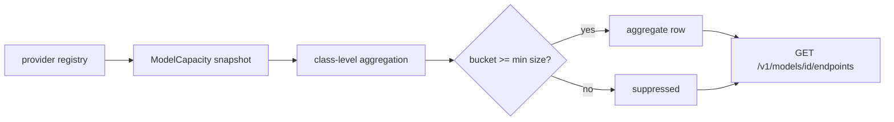
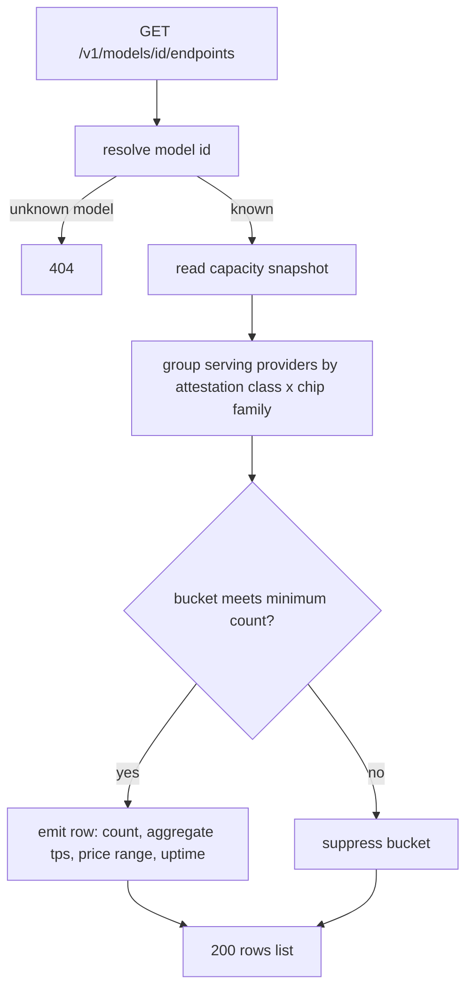

# ORP-077: Privacy-preserving per-model endpoints listing

> Last updated: 2026-09-25 · commit `b6f9574ed`

Darkbloom has no per-model view of serving capacity composition, so integrators cannot tell whether a model is served by a diverse fleet or a single point of failure. Part of the OpenRouter-perspective review; see the [review index](../README.md).

## What

OpenRouter's `GET /api/v1/models/{author}/{slug}/endpoints` lists every serving endpoint for a model with provider name, quantization, context length, pricing, status, and `uptime_last_30m` (OpenRouter model endpoints API, https://openrouter.ai/docs/api-reference/list-endpoints-for-a-model). Darkbloom cannot expose provider identity — that is a core privacy constraint — so a literal port is off the table. The closest existing surfaces are `GET /v1/models/capacity` (`coordinator/api/capacity.go`, `handleModelsCapacity`), which reports live capacity per model via `coordinator/registry/model_capacity.go` (`ModelCapacity`), and the `metadata` block on `types.ModelEntry` (`coordinator/api/types/types.go`) with `provider_count`, `attested_providers`, `trust_level`, and `warm_providers` — model-level scalars, not a breakdown. What is missing is the aggregate equivalent of an endpoints listing: per model, class-level rows keyed by attestation class and chip family, each with provider count, aggregate tps, price range, and uptime.

## Why

Integrators choosing a model for production need to know whether capacity is diverse — multiple independent hardware/attestation classes that can absorb a failure — without learning who the providers are. A single `provider_count` scalar cannot distinguish "eight identical Mac minis from one class" from "eight providers across three classes", which is the difference between fragile and resilient capacity.

## Prompt

Add a per-model aggregate endpoints endpoint. Goal: `GET /v1/models/{id}/endpoints` returns class-level rows for the model — one row per (attestation class × chip family) combination currently serving the model — with each row carrying provider count, aggregate throughput (tps), the price range across the class, and an uptime measure; no provider identity, no per-provider rows, ever. Constraints: (1) aggregation is mandatory and enforced in code: rows are emitted only when the class bucket meets a minimum provider count (suppress buckets below the threshold to prevent de-anonymization of small classes); (2) build the aggregation on the existing capacity snapshot (`coordinator/registry/model_capacity.go`, `ModelCapacity`) and the model metadata already computed for `types.ModelMetadata`, extending them rather than duplicating registry reads; (3) uptime comes from the uptime tracking work in ORP-038 — if that is not landed, omit the uptime key rather than faking it; (4) the route is public-consistent with the rest of the catalog: same auth and CORS posture as `GET /v1/models/capacity` wired in `coordinator/api/server.go`. Files to touch: `coordinator/api/models_endpoints.go` or a new `coordinator/api/model_endpoints.go` (handler), `coordinator/api/server.go` (route), `coordinator/registry/model_capacity.go` (class-level aggregation), `coordinator/api/types/types.go` (response types), plus tests. Acceptance criteria: the endpoint returns one row per qualifying class bucket; a class below the minimum count is folded or suppressed; the response contains no field from which an individual provider could be identified (tested explicitly); models with no serving capacity return an empty rows list.

## Workflow

1. Read `handleModelsCapacity` in `coordinator/api/capacity.go` and `ModelCapacity` in `coordinator/registry/model_capacity.go`.
2. Read `types.ModelMetadata` in `coordinator/api/types/types.go` to see how class/trust aggregates are already computed.
3. Define the row type: attestation class, chip family, provider count, aggregate tps, price min/max, optional uptime.
4. Implement class-level aggregation over the capacity snapshot with a minimum-bucket-size suppression rule.
5. Add the handler and wire the route in `coordinator/api/server.go`.
6. Add unit tests: aggregation correctness, bucket suppression below threshold, no-identity-leak field audit, empty-capacity model.
7. Run `make coordinator-test`.

## Loop

Run `make coordinator-test` (or `go test ./coordinator/api/... ./coordinator/registry/...` while iterating). Check: a synthetic registry with mixed classes yields the right buckets; a two-provider class is suppressed when the threshold is three; grep the response type for any field that could carry provider identity and assert its absence in tests. Definition of done: tests green, aggregation provably class-level only, suppression rule covered by tests.

## Graph

## Layout

- Add `coordinator/api/model_endpoints.go` — handler for the per-model aggregate listing.
- Modify `coordinator/api/server.go` — route wiring.
- Modify `coordinator/registry/model_capacity.go` — class-level aggregation with bucket suppression.
- Modify `coordinator/api/types/types.go` — response row type.
- Add/extend tests in `coordinator/api` and `coordinator/registry`.
- No UI surface.

## Flow

Severity: medium · Effort: M
