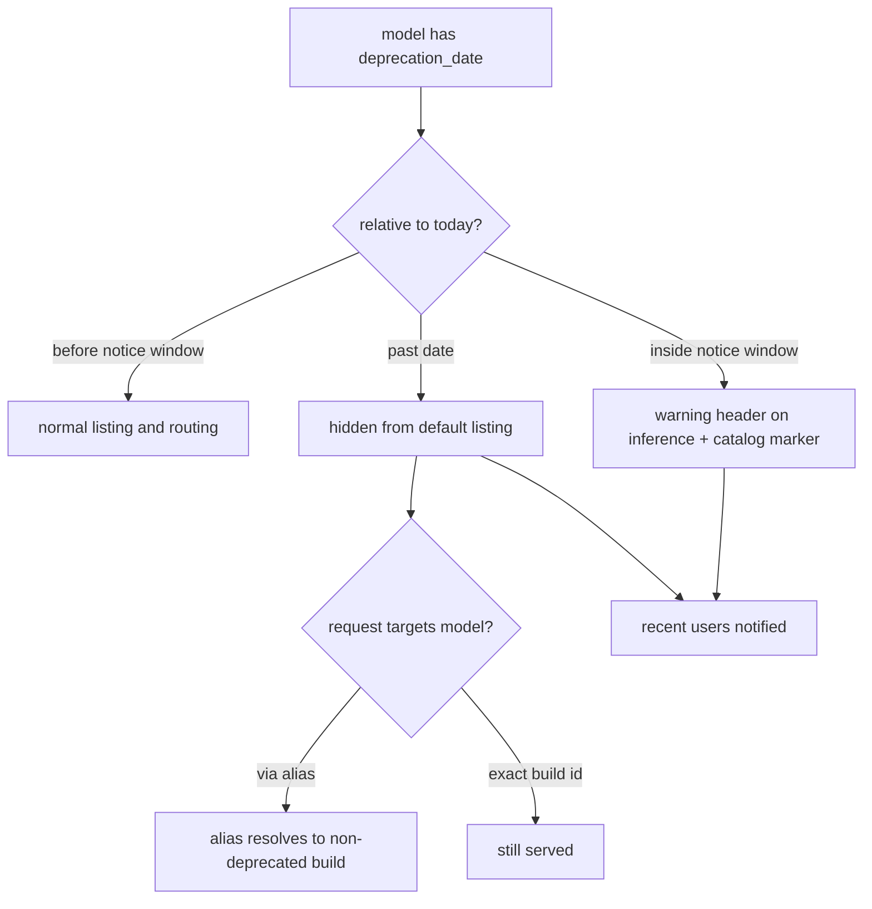

# ORP-078: Model deprecation workflow

> Last updated: 2026-09-25 · commit `b6f9574ed`

Darkbloom's `deprecation_date` is a dead field: it is serialized in the catalog but nothing warns, hides, or notifies around it. Part of the OpenRouter-perspective review; see the [review index](../README.md).

## What

OpenRouter's deprecation lifecycle has three enforced stages: providers supply a `deprecation_date`, models past the date are hidden from the marketplace listing, and deprecation alerts notify recent users ahead of removal (OpenRouter models API, https://openrouter.ai/docs/api-reference/list-available-models). Darkbloom's `types.ModelEntry` (`coordinator/api/types/types.go`) already carries `deprecation_date`, and it flows through `handleListModels` (`coordinator/api/models_endpoints.go`) — but there is no workflow: no warning headers or metadata in the notice window, no hiding of past-date models from the listing, no notification to consumers who recently used the model. Inference admission (`coordinator/api/consumer.go`, `resolveRequestedModel`) treats a past-date model identically to any other.

## Why

A model that disappears without notice breaks production workloads: pinned integrations start failing with model-not-found errors and no migration path. And a date field that nobody enforces is worse than none — consumers who see `deprecation_date` trust it as a contract, and the trust is currently unfounded.

## Prompt

Build the model deprecation lifecycle around the existing `deprecation_date` field. Goal: (1) notice window — for a configurable period before the date (default 14 days), inference responses for the model carry a deprecation warning header and the model entry carries a `deprecation_notice` marker; (2) post-date hiding — models past their date are excluded from `handleListModels` default output (still reachable via an explicit `?include_deprecated=1` flag) and from alias resolution targets; (3) notification — accounts that used the model within a recent window (default 30 days) receive a deprecation alert through the notification channel built in ORP-071; if that work is not landed, record the intended audience in a table the notification system can consume later. Constraints: (1) a past-date model must still serve requests from clients that pin it explicitly by build id — hiding affects listing and alias retargeting, not hard removal; removal is a separate, later operation; (2) warnings must not break OpenAI-compatible response shapes — header-based for HTTP, metadata field for the catalog; (3) all date comparisons are UTC and the notice window is a coordinator config value, not a hardcode; (4) builds hidden behind `?include_builds=1` follow the same rules per build. Files to touch: `coordinator/api/models_endpoints.go` (listing filter, notice marker), `coordinator/api/consumer.go` (warning header on inference, alias-resolution exclusion), `coordinator/api/types/types.go` (notice marker field), the registry/store layer (recent-users query), plus tests. Acceptance criteria: a model inside its notice window returns the warning header on inference and the marker in the catalog; a past-date model is absent from default listing, present with the flag, and unreachable via its alias while still reachable by exact build id; a test pins the recent-users audience query.

## Workflow

1. Read `deprecation_date` handling in `coordinator/api/types/types.go` and `handleListModels`/`handleGetModel` in `coordinator/api/models_endpoints.go`.
2. Read `resolveRequestedModel` and `maybeFallbackAlias` in `coordinator/api/consumer.go` for alias retargeting behavior.
3. Add coordinator config for the notice window and recent-user window.
4. Implement the listing filter plus `?include_deprecated=1` flag and the catalog notice marker.
5. Implement the inference warning header during the notice window.
6. Exclude past-date builds from alias resolution targets while keeping exact build-id dispatch.
7. Implement the recent-users audience query for notifications (feed ORP-071 when available).
8. Add unit tests covering each stage and the boundary dates.
9. Run `make coordinator-test`.

## Loop

Run `make coordinator-test` (or `go test ./coordinator/api/...` while iterating). Check with fixtures at three dates — before notice window, inside it, past the date — asserting header presence, listing visibility, and alias behavior at each. Definition of done: tests green at all three stages, `deprecation_date` is enforced end to end, and no default client sees a past-date model.

## Graph

```mermaid
flowchart LR
  REG[registry deprecation_date] --> LIST[handleListModels filter]
  REG --> CONS[consumer handler]
  CONS --> HDR[deprecation warning header]
  CONS --> ALIAS[alias resolution excludes past-date builds]
  REG --> AUD[recent-users audience query]
  AUD --> NOTIFY[notification feed ORP-071]
  LIST --> CAT[/v1/models output]
```

## Layout

- Modify `coordinator/api/models_endpoints.go` — hiding filter, `?include_deprecated=1`, notice marker.
- Modify `coordinator/api/consumer.go` — warning header, alias-target exclusion.
- Modify `coordinator/api/types/types.go` — deprecation notice field.
- Modify the registry/store layer — recent-users audience query.
- Add coordinator config for the notice and recent-user windows.
- Add/extend tests in `coordinator/api`.
- No UI surface.

## Flow



Severity: medium · Effort: M
