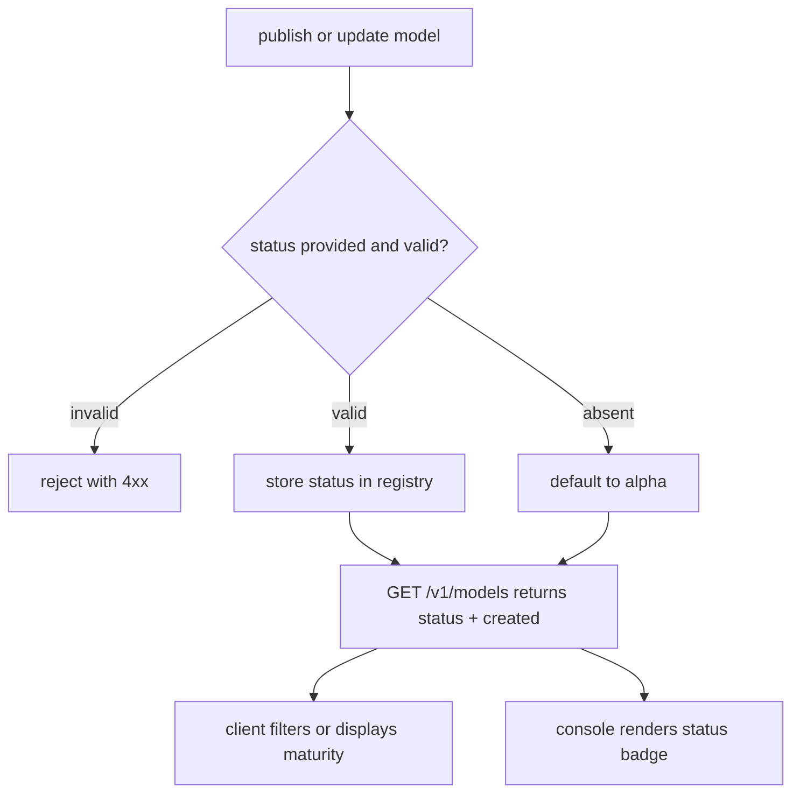

# ORP-079: Model status lifecycle surfaced

> Last updated: 2026-09-25 · commit `b6f9574ed`

Darkbloom has no per-model maturity signal, so consumers cannot tell a battle-tested model from one added yesterday. Part of the OpenRouter-perspective review; see the [review index](../README.md).

## What

Darkbloom's `types.ModelEntry` (`coordinator/api/types/types.go`), served by `handleListModels` (`coordinator/api/models_endpoints.go`), has no lifecycle/status field: every model in `/v1/models` looks equally production-ready. The repository README already carries a network-wide "Public Alpha" warning, but that is a blanket statement — there is no per-model granularity distinguishing a model that has served millions of tokens from one registered this morning. OpenRouter communicates model maturity implicitly through `created` timestamps and endpoint `status`/`uptime_last_30m` (OpenRouter models API, https://openrouter.ai/docs/api-reference/list-available-models). Darkbloom exposes neither a creation date in the catalog nor an explicit status.

## Why

Consumers sizing production risk need per-model maturity: a model silently promoted from experimental to generally available, or a fresh model treated as stable, both produce misallocated trust. The network-level alpha warning cannot carry that signal per model.

## Prompt

Add a per-model status field to the catalog and surface it in the console. Goal: each entry in `/v1/models` and `/v1/models/{id}` carries a `status` from a closed enum (e.g. `alpha`, `beta`, `ga`) plus the model's `created` timestamp, so clients can display and filter on maturity; the console models page (`console-ui/src/app/models/page.tsx`) renders the status alongside each model. Constraints: (1) the status is registry data set at publish and updated by an explicit operation — it is not auto-derived from age or traffic in this change (auto-promotion rules are a separate decision); (2) the closed enum is defined once in `coordinator/api/types/types.go` and validated at the registry write path; (3) existing models without a recorded status default to `alpha` — the honest value for a public-alpha network — via the read path, not a data migration requirement; (4) `created` comes from the registry record's existing creation timestamp if present. Files to touch: `coordinator/api/types/types.go` (enum + fields), `coordinator/api/models_endpoints.go` (population), the registry record schema and write path, `scripts/publish-model.sh` (accept a status), `console-ui/src/app/models/page.tsx` (display), plus tests. Acceptance criteria: models default to `alpha`; a model published with `beta` shows `beta` in the API and console; the write path rejects an unknown status value; tests pin the defaulting rule.

## Workflow

1. Read `ModelEntry` in `coordinator/api/types/types.go` and the registry record schema.
2. Define the status enum and the defaulting rule (`alpha` when unset).
3. Extend the registry record and write-path validation.
4. Add `status` and `created` to `ModelEntry`; populate in `handleListModels`/`handleGetModel`.
5. Accept a status in `scripts/publish-model.sh`.
6. Render status in `console-ui/src/app/models/page.tsx`.
7. Add unit tests: enum validation, defaulting, catalog output.
8. Run `make coordinator-test` and `make ui-lint`.

## Loop

Run `make coordinator-test` (or `go test ./coordinator/api/...` while iterating) and `make ui-lint` for the console change. Check: a model with no recorded status returns `alpha`; an invalid status is rejected at write; the console page compiles and displays the badge. Definition of done: coordinator tests and UI lint green, status flows publish → registry → API → console.

## Graph

```mermaid
flowchart LR
  PUB[scripts/publish-model.sh] --> REC[(registry record)]
  REC --> VAL{status enum valid?}
  VAL -->|no| REJ[reject write]
  VAL -->|yes| LIST[handleListModels]
  LIST --> API[/v1/models with status, created]
  API --> UI[console models page]
```

## Layout

- Modify `coordinator/api/types/types.go` — status enum, `status`/`created` on `ModelEntry`.
- Modify `coordinator/api/models_endpoints.go` — population in listing and get handlers.
- Modify the registry record schema and write path — status storage and validation.
- Modify `scripts/publish-model.sh` — accept a status value.
- Modify `console-ui/src/app/models/page.tsx` — status display.
- Add/extend tests in `coordinator/api`.

## Flow



Severity: low · Effort: S
